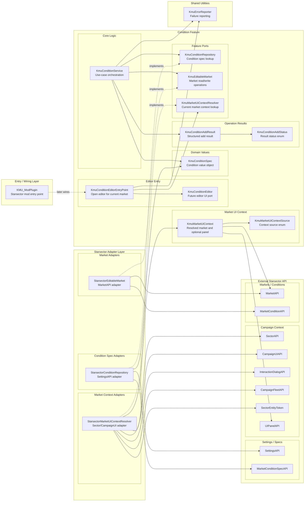

# KMU Architecture

This document tracks the current Java structure and should be updated whenever
new feature layers or runtime boundaries are added.

## Condition Feature Layers



## Layer Notes

### Entry / Wiring Layer

- `KMU_ModPlugin`
- Should stay thin.
- Later it should create services and connect them to UI/runtime hooks.
- `KmuConditionEditorEntryPoint` is the feature-level opening contract for the
  future editor UI.

### Core Feature Layer

- `KmuConditionService`
- `KmuConditionEditorEntryPoint`
- `KmuConditionEditor`
- `KmuMarketUiContext`
- `KmuMarketUiContextResolver`
- `KmuMarketUiContextSource`
- `KmuConditionSpec`
- `KmuConditionAddResult`
- `KmuConditionAddStatus`
- Contains KMU's condition behavior and rules.
- Should avoid direct Starsector API dependency where practical.

### Ports / Interfaces

- `KmuConditionRepository`
- `KmuEditableMarket`
- `KmuMarketUiContextResolver`
- These are KMU-owned contracts.
- They keep core logic testable without launching Starsector.

### Starsector Adapter Layer

- `StarsectorConditionRepository`
- `StarsectorEditableMarket`
- `StarsectorMarketUiContextResolver`
- Converts Starsector APIs into KMU ports.
- This is where `SettingsAPI`, `SectorAPI`, `CampaignUIAPI`, `MarketAPI`,
  `MarketConditionAPI`, and `MarketConditionSpecAPI` are allowed.

### Shared Utilities

- `KmuErrorReporter`
- Used by feature services and adapters to report recoverable runtime failures.

### External Starsector API

- Not owned by KMU.
- Should remain at the boundary.
- Runtime failures from this layer should not crash campaign UI actions.

## Dependency Rule

The intended dependency direction is:

```text
UI / ModPlugin
    -> Service
        -> KMU ports
            <- Starsector adapters
```

Feature behavior should stay in KMU-owned core classes. Starsector-specific
objects should be wrapped by adapters before they reach core services.
