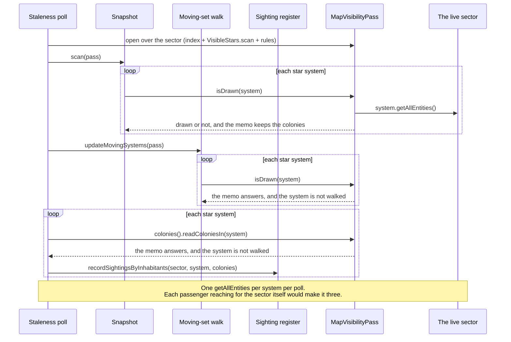

# Caching in KMU

What KMU keeps between frames, what makes each piece of it stale, and how narrowly
each rebuild is scoped. Almost all of it belongs to the political map, which is
the one feature that derives an expensive drawing from live campaign state and
then repaints it every frame.

The shared library's caches are a separate and much simpler problem (font assets
and pure derivations, none of which can go stale); they are documented in
[KMLib's caching notes](https://github.com/Klark-Morrigan/Starsector-Mod-KMLib/blob/master/docs/dev/caching.md),
including the `Fingerprints` primitive this document's revision counters fold
through.

## Index

- [The shape of the problem](#the-shape-of-the-problem)
- [Layer 1: what notices a change](#layer-1-what-notices-a-change)
- [Layer 2: the signals](#layer-2-the-signals)
- [Layer 3: the caches](#layer-3-the-caches)
  - [The overlay cache](#the-overlay-cache)
  - [Cell geometry](#cell-geometry)
  - [Territories and draw lists](#territories-and-draw-lists)
  - [Cluster-label placements](#cluster-label-placements)
  - [Hover lookups](#hover-lookups)
  - [Sidebar pickers](#sidebar-pickers)
  - [Per-rebuild memos](#per-rebuild-memos)
- [The four rebuild paths](#the-four-rebuild-paths)
- [Persistence: none of it is saved](#persistence-none-of-it-is-saved)
- [Rules](#rules)
- [Related reading](#related-reading)

## The shape of the problem

Drawing the political map from scratch means partitioning every drawn system into
Voronoi cells, resolving who dominates each system out of the economy, classifying
every cell edge as an interior seam or a national border, shaping each cell into
its cluster polygon, tracing the cluster border rings, and fitting a name into
each cluster. The partition alone is O(n^3) in the number of systems.

The map is repainted every frame it is open, and the layer renderer's refresh runs
on that same per-frame cadence. So the design is the inverse of "recompute what is
shown": everything drawn is held, and the work per frame is deciding which small
part of it - usually none - has to be built again.

Three properties make that safe:

- **System positions are fixed for the life of a save.** So the cell partition is
  built once and only reconciled when the *set* of drawn systems changes. Systems
  that move are the exception, and are excluded from the partition rather than
  chased (see `MovingSystems`, one tracker per sector held by that sector's
  installation, since an observation is keyed by system id).
- **Ownership changes are local.** Dominance is decided per system from the
  colonies seated in it, so a colony event can only shift its own system - which
  makes a targeted re-shape of that system and its neighbours possible instead of
  a whole-map rebuild.
- **Every input that can change announces itself as a counter.** So checking
  whether anything is stale is a handful of int compares, never a scan.

## Layer 1: what notices a change

Two mechanisms, deliberately overlapping.

**Event listeners** ([`refresh/listeners/`](../../src/main/java/kmu/maplayers/politicalmap/base/refresh/listeners/))
react to the economy events the engine does fire: colonisation, colony resize,
decivilisation, market discovery, market transfer. Each resolves the market's
seated system and marks exactly that system stale, through the one shared
translation in `MarketPoliticsRefresh` so every listener applies the same guard and
emits the same log line.

**The sector watcher** catches everything the engine fires no event for - a gate
activating, a system being cut off, a decivilised world surveyed, an AI faction quietly
capturing a colony. It is split across the framework/layer line:
[`MapLayerSectorWatcher`](../../src/main/java/kmu/maplayers/base/refresh/MapLayerSectorWatcher.java)
owns only the throttled campaign-thread loop, and asks a
[`MapLayerStalenessSource`](../../src/main/java/kmu/maplayers/base/refresh/MapLayerStalenessSource.java)
what has changed since it last asked, so what counts as a change never has to be
named by the framework.

The political map answers through
[`PoliticalMapStalenessSource`](../../src/main/java/kmu/maplayers/politicalmap/base/refresh/PoliticalMapStalenessSource.java),
which takes one cheap snapshot per poll
([`PoliticalMapSectorSnapshot`](../../src/main/java/kmu/maplayers/politicalmap/base/refresh/PoliticalMapSectorSnapshot.java))
holding a scalar fingerprint of *which* systems are drawn and a map of *who* holds
each, then reacts to each half on its own axis: the fingerprint moving means the
geometry is stale (whole-map, since the partition depends on every site), while the
owner map is diffed to mark exactly the systems whose owner changed. It also tracks
the moving-system set and fingerprints the live alliance set. All four baselines are
its own, so nothing about the diff lives in the loop.

The poll is a pass, and is read as one. Each of its passengers - the snapshot, the
moving-set walk, and the write that records what a system's own inhabitants can see -
asks every system who lives there, so the poll opens one
[`MapVisibilityPass`](../../src/main/java/kmu/maplayers/base/visibility/systems/MapVisibilityPass.java)
- a KMLib `SystemColoniesIndex`, a hyperspace scan, and the rules the three are read under - and
hands it down. That is what keeps the cost at one selection per system per poll: a passenger
given the sector instead would walk every entity in every system again, and there are three of
them. The pass is discarded with the poll, a kept one being a reading of the sector the
*previous* poll saw.

The pass answers rather than merely carrying: `isDrawn(system)` is the drawn-set rule applied
over its own reading, so the geometry sites, the motion tracker and the fingerprint scan share
one statement of it instead of each re-deriving it off the same three values.

Two shapes in that picture are the arrangement rather than incidental. The register is
handed a place and its colonies instead of the pass, because `SystemColoniesIndex` reads
the colonies package and a register living in it could not take one without the layering
gate refusing the cycle - so the sector loop is the poll's, which is where the cadence was
decided anyway. And the membership rule takes an inhabitation *answer* rather than a sector
to read one from, which is what keeps a second walk from hiding inside the drawn-set test
the moving-set walk applies per system.

The decivilised-world read used to sit outside that index, walking a system's *planets* rather
than its entities, with a survey-based reveal of its own - so the pass carried a second memo
beside the index to keep that walk to one per system. It no longer does. A collapsed colony is a
colony kind (`ColonyKind.UNGOVERNED_COLONY`), admitted to the set on the decivilised condition and
fogged by the survey read, so it comes off the one walk everything else does and the second memo
is gone. The fingerprint scan still needs the flag on its own, to salt a drawn system's
contribution when a governed-to-collapsed flip leaves the drawn set unchanged; it asks the pass,
which answers off the same set membership was composed from.

The overlap is intentional. Both feed the same stale-system set, so a change a
listener already marked and one the watcher's diff re-discovers collapse into a
single re-shape - and a change no listener ever saw is still caught, just one poll
later.

## Layer 2: the signals

Every producer above writes into one of these; every cache below reads them. None
of them is a boolean - a counter composes and cannot be cleared out from under a
second reader.

[`MapLayerRefreshBoard`](../../src/main/java/kmu/maplayers/base/refresh/MapLayerRefreshBoard.java)
holds one counter per
[`MapLayerRefreshSignal`](../../src/main/java/kmu/maplayers/base/refresh/MapLayerRefreshSignal.java)
raised on it, keyed on the open signal type rather than on a fixed set of accessors.
The framework declares the signals any painting layer could raise
([`MapLayerCommonRefreshSignal`](../../src/main/java/kmu/maplayers/base/refresh/MapLayerCommonRefreshSignal.java));
a layer declares its own beside itself
([`PoliticalMapRefreshSignal`](../../src/main/java/kmu/maplayers/politicalmap/base/refresh/PoliticalMapRefreshSignal.java))
and reaches the same board for them.

One board per sector, held by that sector's
[`MapLayerInstallation`](../../src/main/java/kmu/maplayers/base/installation/MapLayerInstallation.java):
every signal on it is a fact about one sector, and the stale set names that sector's
systems by bare id. Why that has to be a sector's rather than the process's, and how the
installation holding it is made and released, are
[the installed machinery](../../src/main/java/kmu/maplayers/base/installation/README.md).
A producer or consumer holding a sector - or the installation over one - reaches that
sector's board directly. The one seam vanilla hands no sector is a settings change
moved on a sidebar control, and it goes through
[`MapLayerRefresh`](../../src/main/java/kmu/maplayers/base/refresh/MapLayerRefresh.java),
which resolves the running sector's.

| Signal | Home | Raised by | Read by |
| --- | --- | --- | --- |
| `MapLayerCommonRefreshSignal.GEOMETRY` | `MapLayerCommonRefreshSignal` | the drawn-system set or moving-system set changing | the geometry cache |
| `groupingStaleSystemIds` | `MapLayerRefreshBoard` | colony events + the watcher's owner diff | the incremental politics refresh |
| `PoliticalMapRefreshSignal.ALLIANCES` | `PoliticalMapRefreshSignal` | the alliance-set fingerprint moving | the alliances view only |
| `MapLayerCommonRefreshSignal.RECEDE_STYLE` | `MapLayerCommonRefreshSignal` | the Mute / Desaturate sidebar toggles | the pipeline, under any view (the receded blocs and decivilised cells), plus the alliances view for its own non-allied recede |
| `MapLayerCommonRefreshSignal.FILTER` | `MapLayerCommonRefreshSignal` | picking or clearing the spotlight bloc | the pipeline, under any view |
| `MapLayerCommonRefreshSignal.MAP_STYLE` | `MapLayerCommonRefreshSignal` | the uninhabited-outline and name-format toggles | the pipeline, under any view |
| `settingsRevision` | [`KmuLunaSettings`](../../src/main/java/kmu/settings/KmuLunaSettings.java) | any LunaLib settings change | the territories rebuild |
| content revision | each `PoliticalMapView` | the view's own live inputs, folded via `Fingerprints` | the territories rebuild |

Three of those deserve their reason stated.

The **alliance signal** is the political map's own rather than the framework's,
because who is allied with whom is this layer's vocabulary and no other layer would
mean anything by it. A layer declares its signals and raises them on the counters of
the board it was handed all the same, so a second layer's arrival does not split the
mechanism in two.

The **sidebar toggles** (recede, filter, spotlight, outline, name format) live in
sector memory rather than as LunaLib fields, so flipping one does *not* bump
`settingsRevision`. Each setter raises its own signal instead, which is what makes
those toggles repaint the overlay live despite never touching the settings screen.

The **content revision** is the seam that keeps the shared pipeline from naming any
concrete view: a view folds its own live inputs into one int, so each invalidates on
what it actually reads. All three political views fold the alliance revision, for
different reasons - the alliances view because membership decides what it paints, the
faction and claims views because their bands judge a contest against it - while a view
that samples nothing live folds no sources and never forces a rebuild on its own.

## Layer 3: the caches

### The overlay cache

[`PoliticalMapCache`](../../src/main/java/kmu/maplayers/politicalmap/base/render/PoliticalMapCache.java)
is the owner: the political map's painter holds one - one per sector, the painter itself
belonging to that sector's installed machinery - and asks it to `refresh` each
frame the map is open. It holds both halves (geometry and built draw lists) plus what each
half was built against, and rebuilds only the stale half. The geometry's revision is not a
field beside the cells but rides with them, for the same reason the placements ride with
their fingerprint below: a revision naming cells other than the ones in hand reads as
permission to reuse work fitted inside a partition that has since been recut. It **counts
cuts** rather than echoing the reachable-set signal, since that signal is only one of the four
things that recut them - see below.

It is also where rebuild faults are contained: a failing rebuild is logged once
rather than per frame, leaves the cached revisions un-advanced so the next frame
retries, and installs an empty placeholder so the renderer never dereferences a
null draw list. The last good draw lists stay on screen in the meantime.

**A rebuild is a pass too**, on the same terms the poll is and for the heavier reason: a poll
runs every four to five campaign seconds, while a rebuild runs whenever the drawn set moves, a
toggle flips, a view switches or a colony changes hands. Its three stages each ask every system
who lives there - the cell cut deciding what is drawn, the fills resolving who holds each, and
the band bake counting how each splits - so the rebuild opens **one** `SystemColoniesIndex` and
builds each stage's pass over it: a `MapVisibilityPass` for the geometry, a `HolderPass` under
the view's grouping for the fills and the bands. Two pass types over one walk; the types stay
apart because the render side has no use for the star scan and the membership side none for the
grouping, which was never a claim about the walk beneath them.

The rules are sampled once for the whole rebuild, into the same `CellCutInputs` the staleness
test is taken on. That is not only a saving: three samplings let a gate flipped mid-rebuild cut
the cells under one rule, paint the fills under a second and count the bands under a third, with
nothing on screen reporting which half was which.

Both staleness questions are settled **before** the index is opened, and that ordering is the
arrangement rather than an accident. `refresh` runs every frame the map is open and nearly every
frame rebuilds nothing, so a reading opened first would put a walk of every system into every
idle frame - worse than the three walks per rebuild it was opened to collapse. The incremental
re-shape below therefore opens a reading of its own, there being none for that frame to share.

Whose reading the band bake counts off is its **caller's** choice, for the same reason. A bake in
the same frame as the build before it takes that build's reading, the sector being unable to move
between the two; a bake on its own cadence - a name may have moved, long after some rebuild began
- opens a fresh one rather than report a sector as it stood some flips ago. The shared condition
is the grouping: a pass folded by another would plan bands against blocs the fills never drew.

### Cell geometry

[`CellGeometryCache`](../../src/main/java/kmu/maplayers/base/geometry/CellGeometryCache.java)
holds the raw Voronoi cells keyed by system id. It is updated by *diffing* the
reachable set against what it holds and rebuilding only the affected cells: adding
or removing one site changes that site's cell and the cells within twice the cell
radius, and every farther cell is provably untouched.

Two seed inputs bypass the diff and force a full reseed, because each changes every
cell: the frontier resolution and the cell reach. So do the dev reveal toggles,
which change *which* systems seed a cell at all.

Those four - the reachable-set revision plus those three settings - are one value,
[`CellCutInputs`](../../src/main/java/kmu/maplayers/politicalmap/base/render/CellCutInputs.java),
because the question asked of them is the single one they answer together: would the cells be
cut differently now. Only the first raises a framework signal; the other three move without it,
so a staleness test taken on the signal alone reads a settings recut as no change at all.

The cache holds raw cells, not shaped outlines. The inset that gives a cluster its
border channel is ownership-dependent, so it belongs to the render pass - which is
what lets ownership change without touching this cache at all.

What travels to a consumer is
[`RevisedCellGeometry`](../../src/main/java/kmu/maplayers/base/geometry/RevisedCellGeometry.java):
the cells together with the revision they were cut at. The cells are the live cache rather
than a copy, so a consumer reads whatever they hold now; the revision fixes which reading
anything derived and cached downstream is answerable to.

### Territories and draw lists

[`PoliticalMapTerritories`](../../src/main/java/kmu/maplayers/politicalmap/base/render/territories/PoliticalMapTerritories.java)
holds what a full rebuild produced: the styled cells and faction territories the
renderer paints, plus the derivation inputs an incremental re-shape needs - the
styling, the view grouping, the filter snapshot, and who holds each system.

Each drawn cell's presence band is baked into it too, and baked rather than emitted
because every size in it is a world quantity: the ring it runs along, the width it is
stroked at, and how far each run reaches all resolve at rebuild, so a frame draws a
triangle list rather than laying one out.

The bands are baked in a stage of their own after the rest of a rebuild, because a band keeps
clear of the cluster names by default and the names are placed only once every cell has been
shaped - each is fitted inside the border its cluster's cells trace. So the cells' shapes go in
first and the bands follow, over the shapes the territories already hold. A player who would
rather keep the whole band can switch that clearance off, which leaves the ordering doing
nothing rather than making it wrong: the stage still runs last, and simply carves nothing.
Recording a shape drops whatever band that cell was carrying, which is what keeps a band from
outliving the ring it was laid in; the band stage then fills it back in.

The ring a band is laid along is kept beside the shape it was walked inside, in a
[`CellRingPathCache`](../../src/main/java/kmu/maplayers/politicalmap/base/render/ribbon/CellRingPathCache.java)
the territories hold and the bake asks before it walks anything. A bake runs whenever a
cluster name may have moved, while a cell's ring changes only when the cell is cut again, so
without it a cell re-baked because a re-fitted name landed on it would re-walk the outline it just
discarded. The cells the flip re-shaped walk again either way - their paths went with their shapes
- so what the cache saves is every other cell in the bake. It is dropped by the same two writes as
the band, which is what lets it carry no key of its own: a cache living inside the object whose
lifetime it must match is correct by construction, where a keyed one is a rule someone has to keep
true. A slider bumps the settings revision, which rebuilds the territories, which takes the paths
with them.

That pass also traces each cell's band *path* when the band-path diagnostic is on - the ring a
band would run along, held per cell and dropped by the same writes as the band. A cell drawing no
band is the sector's ordinary state and also every one of the band's refusals, and the two are the
same picture without it. Held only while the toggle is on: the bake hands over nothing per cell
while it is off, and a settings change rebuilds every cell, so switching it off is what clears
what an earlier pass left behind. That trace walks its own ring rather than reading the cache
above, deliberately: the cells it exists to explain are the ones the bake has no path for.

A frame measures nothing about a band at all: every size in one is a world size, so how
large it lands on screen is the map's own scaling of the triangle list and no question
the pass has to answer.

Retaining those inputs is what makes the incremental path *correct* rather than
merely cheap:
[`IncrementalPoliticsRefresh`](../../src/main/java/kmu/maplayers/politicalmap/base/render/IncrementalPoliticsRefresh.java)
re-classifies a handful of cells against exactly the ownership and styles the full
build used, through the same builder primitives, so an incrementally-updated map is
indistinguishable from a rebuilt one. Which is also why the holder map, the inhabited set and
the spotlit-presence set are retained *live*, as one
[`SystemOccupancy`](../../src/main/java/kmu/maplayers/politicalmap/base/render/territories/SystemOccupancy.java):
a cell is classified from all three at once, so one of them fixed where the rebuild began would
have the refresh styling a cell from two different readings of the sector. The type owns its
collections and reports what each fold moved, which is what the refresh redraws a cell on.

### Cluster-label placements

The one cache here that survives a rebuild rather than being replaced by it. Fitting a
label box is a search over hundreds of candidate placements per cluster and dominates
the rebuild, so a pass hands the standing placements back into the next one and each is
carried over for the cluster it still names instead of being searched again.

What makes that safe is two facts travelling with the list rather than any cluster being
asked to notice a change:
[`ClusterIdentity`](../../src/main/java/kmu/maplayers/base/labels/anchor/ClusterIdentity.java)
on each placement says which cluster it was fitted to, so a split or a merge matches
nothing and re-fits by construction, and
[`AnchorFitFingerprint`](../../src/main/java/kmu/maplayers/base/labels/anchor/AnchorFitFingerprint.java)
says what the whole pass ran under. The second is the one to keep in mind when adding an
input: the keep-out sites every box is trimmed clear of are the *whole sector's*, so a
change no membership reflects still moves every fit, and only the fingerprint can catch
it. A mismatch discards the carry-over whole and the rebuild is total, which is what it
was before any of this existed.

What this cache holds is therefore one
[`StandingClusterAnchors`](../../src/main/java/kmu/maplayers/base/labels/anchor/StandingClusterAnchors.java)
and not a list beside a fingerprint - it goes into a rebuild whole and comes back the same
value.

The mechanics - what is re-resolved on a carried placement, and why a collapsed one is
never carried - are [the overlay's own README](../../src/main/java/kmu/maplayers/base/labels/README.md).

### Hover lookups

[`SystemClusterIndex`](../../src/main/java/kmu/maplayers/base/geometry/SystemClusterIndex.java)
indexes each cluster by its members once per rebuild, so the hover highlight
resolves a hit system to its whole contiguous territory with a lookup instead of
re-running the cluster search per frame. Deriving it from the same clustering the
map drew is what keeps the highlighted region identical to the region that carries
the name.

### Sidebar pickers

`RevisionMemo` is the memo any layer's sidebar holds its resolved picker in, keyed on
the scope and a revision the caller supplies. A body build runs twice
a frame (render and hit-test), so without a memo every picker would re-resolve its
list several times a frame. It is KMLib's (`kmlib.starsector.ui.widgets.lists`), like
the picker it feeds; [KMLib's caching
notes](https://github.com/Klark-Morrigan/Starsector-Mod-KMLib/blob/master/docs/dev/caching.md) file it as an
invalidation primitive rather than a cache, since what it holds, when it goes stale,
and how long it lives are entirely the consumer's declaration - including the discard
a consumer calls when whatever the value belonged to is released.

[`SelectableBlocCache`](../../src/main/java/kmu/maplayers/politicalmap/base/sidebar/SelectableBlocCache.java)
is the political map's use of it: what it adds is the revision, the one thing the
memo cannot know. What it holds is the selected view's whole `ListPicker` - the blocs
on offer and the vocabulary that ranks them - since a view answers both together and
neither means anything without the other. Each of its resolves is a full grouped
dominance pass over the sector, so it is the layer that most needs the memo to hold.
That revision is the economy-weighting settings plus the view's own grouping inputs,
and it deliberately **excludes** the filter selection. The picker is which blocs are
selectable, not which one is spotlighted, so picking or clearing a filter moves the
lit row without invalidating the list.

One memo per sector, not one for the process: the list is a walk of one sector's
economy memoised against that sector's revisions, so a shared memo would serve one
sector's rows under another's revision - a wrong list rather than a stale one - and two
sectors' sidebars would evict each other's single entry on every alternation. It is
therefore held by the sector's
[installed machinery](../../src/main/java/kmu/maplayers/base/installation/README.md)
and goes when that does, which is also what replaces the discard it would otherwise
need on load.

Because the economy can drift between rebuild triggers, a displayed metric can lag
until the next settings, view, or alliance change - the same cadence the overlay's
own rebuild reconciles on, so the picker's numbers and the painted map stay in step
with each other even when both lag the economy slightly.

### Per-rebuild memos

Smaller memos live for one rebuild and die with it - unlike the placements above,
which are the one derived thing deliberately handed forward. `ClusterLabelStyling` resolves
each bloc's style decision, label colour, and name estimator once per bloc id rather
than once per cluster, since every cluster of a bloc shares one name, one shade, and
one style - a bloc with a homeland and three colonies is asked four times and answers
once. The label font and the name-format choice are likewise read once per rebuild
rather than per label.

The map's name labels are the one place KMU mints its own GL text. Each
[`Label`](../../src/main/java/kmu/maplayers/base/labels/Label.java)
owns a `DrawableString` and its vertex buffer, and `LabelsBuilder` **disposes** the
standing list whenever it rebuilds. This is the opposite lifetime to KMLib's
process-lifetime glyph cache, and the two must not be crossed: text that a rebuild
disposes has to be minted by the builder that disposes it, never fetched from a
shared cache that would keep handing out the disposed buffer.

## The four rebuild paths

Per frame, in increasing cost:

1. **Nothing changed** - a few int compares against the cached revisions, no reading of the
   sector opened at all, and the standing draw lists are handed to the renderer. This is the
   overwhelmingly common path, which is why both staleness questions are settled before any
   reading is opened.
2. **Systems marked stale** - the stale set is drained and only those systems and
   their neighbours are re-derived and re-shaped, with the two affected factions'
   territories rebuilt. Reading the sector back is
   [`MarkedSystemRederive`](../../src/main/java/kmu/maplayers/politicalmap/base/render/MarkedSystemRederive.java)'s
   and redrawing what that disturbed is the refresh's, so what a change costs is decided apart
   from what changed. Three facts are re-derived per marked system, over one reading of
   the sector opened for the whole batch: who holds it, whether anything stands in it, and
   whether the spotlit bloc is one of the things standing in it. The last two are what a
   cell that no bloc holds is drawn from, and they move without any holder moving - a system
   settled or emptied on a layer whose holding cannot account for whoever is there flips
   nothing, so its own cell is the only surface the change reaches. Such a cell is redrawn
   alone: neither fact moves a seam, so no neighbour re-shapes and no territory is retraced.
   The marked systems' presence bands are re-baked whether or not
   anything flipped: the colonisation and transfer events that mark a system are exactly
   the events that change how many colonies are in it, and a band counts colonies where
   the fills only weigh them. A flip widens that beyond the cells it re-shaped, because it
   re-fits the names: a re-fitted name is placed wherever its new cluster is roomiest,
   which can be over a cell this batch never touched, and a band that kept clear of where
   that name used to sit is no longer clear of it. Those cells are named rather than
   guessed at - the re-fit reports which names it moved, and the cells their boxes reach
   are re-baked with the marked and re-shaped ones. The widening is unconditional rather
   than asked of the name-clearing setting, since a band that keeps clear of nothing is
   re-baked to the same triangles either way - and a gate here would trade a rebuild the
   flip already pays for against a wrong map the moment the setting is switched back on.
   What that widening costs is the carve, the count and the stroke rather than the ring
   walk: the cells the flip re-shaped drop their kept paths with their shapes, and every
   other cell's band is laid along the ring it was already laid along.
3. **Content changed** (a setting, a sidebar toggle, a view's own live input) - the
   territories are rebuilt in full over the standing geometry. The cells are
   untouched, since ownership and styling do not move a border. The label placements
   are the exception to the "in full": they are matched against the standing ones and
   only the clusters that actually moved are re-fitted, which is what keeps a filter
   switch off the whole search.
4. **Geometry changed** (the drawn set, a seed input, a reveal override) - the
   partition is reconciled, which forces a full territories rebuild after it.

Paths 2 to 4 each open exactly one reading of the sector and hand it to every stage of that
path - see [the overlay cache](#the-overlay-cache) for what the rebuild's covers and why the
band bake takes its caller's rather than opening one.

## Persistence: none of it is saved

Everything described here is derived from the sector and holds record types
XStream cannot serialise. None of it can reach a save: the cache hangs off the
political map's layer renderer, which the sector's installed map machinery holds
and no terrain entity carries - no transient marking required.

That lifetime is exactly a sector's, and it has to be. Nothing else would notice a
change of sector: the geometry cache reconciles by diffing system *ids*, so a
system present in both saves at a different position reads as unchanged. So a
cache serves one sector and one only - it is made when the layers are installed on
that sector and released when they are removed, which a load does for every
standing installation before installing the loaded one
([the installed machinery](../../src/main/java/kmu/maplayers/base/installation/README.md)
sets out that lifetime). Every revision starts at a
rebuild-forcing seed, so the first frame after an install rebuilds both halves from
scratch, and there is nothing of a previous sector's for it to be told about.

Release is not merely dropping. The cached faction names each own a GL buffer, so
they are freed at the moment the installation goes rather than left to LazyLib's
finalizer sweep - which is what a sector removed mid-session would otherwise leak.

What *is* persisted is only the player's choices that feed it - the active layer,
the sidebar fold, the spotlight selection, the shared toggles - and those live in
sector memory as small scalars. Each key is frozen once shipped: nothing carries an
old spelling forward, so renaming one resets every existing save's choice under it
to the default. A stored value the current build cannot resolve - a layer id no
longer registered, a spotlight on a bloc that has lapsed - falls back to the default
rather than stranding the reader, and
[`FilterSelectionHeal`](../../src/main/java/kmu/maplayers/politicalmap/base/FilterSelectionHeal.java)
clears the spotlight case outright, on load and on every settings change.

## Rules

- Derived state is transient. If it can be rebuilt from the sector, it must not be
  written into the save - a persisted class name is a migration liability, and a
  persisted derivation is a stale one.
- Announce a change with a monotonic counter, never a boolean flag. Several
  consumers read at different cadences, and the first reader must not be able to
  clear the signal for the rest.
- Mark the narrowest thing that changed. A colony event names its own system; only
  a change to the drawn *set* is allowed to invalidate the partition.
- The per-frame path must stay int compares. Any new live input needs a revision
  of its own folded into a fingerprint - never a per-frame scan to detect change.
- An incremental update must read back the same inputs the full build used, and go
  through the same primitives, so the two cannot diverge.
- Whoever mints a GL buffer disposes it. Do not route disposable text through a
  shared, never-evicting cache.

## Related reading

- [KMLib caching notes](https://github.com/Klark-Morrigan/Starsector-Mod-KMLib/blob/master/docs/dev/caching.md) -
  the font and glyph caches KMU draws through, and the `Fingerprints` primitive.
- [Political map](../../src/main/java/kmu/maplayers/politicalmap/README.md) - what
  the overlay shows and how it is drawn.
- [Cell geometry](../../src/main/java/kmu/maplayers/base/geometry/README.md) -
  the cells, edges, and clusters the geometry cache holds.
- [Territory fills and borders](../../src/main/java/kmu/maplayers/politicalmap/base/render/territories/README.md) -
  what a territories rebuild actually produces.
