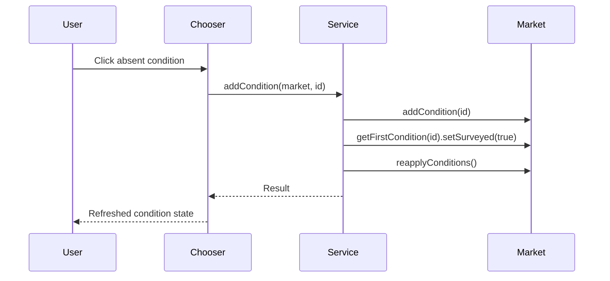
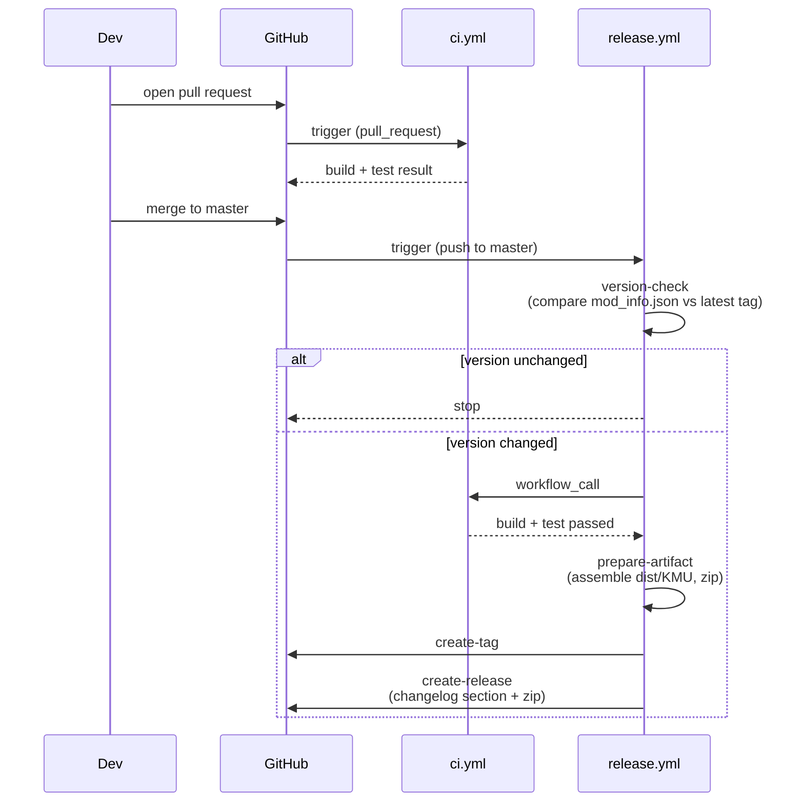

# Planetary Condition Editor Plan

## Index

- [Research Baseline](#research-baseline)
- [Step 1 - Mod Scaffold](#step-1---mod-scaffold)
- [Step 2 - Condition Service](#step-2---condition-service)
- [Step 3 - Editor Entry Point And Market Context](#step-3---editor-entry-point-and-market-context)
- [Step 4 - Condition Chooser UI](#step-4---condition-chooser-ui)
- [Step 5 - Condition Add Action](#step-5---condition-add-action)
- [Step 6 - Console Command Entry Point](#step-6---console-command-entry-point)
- [Step 7 - Console Entry Verification](#step-7---console-entry-verification)
- [Step 8 - Release Automation](#step-8---release-automation)
- [Step 9 - Injected Market UI Button](#step-9---injected-market-ui-button)
- [Step 10 - Injected UI Verification](#step-10---injected-ui-verification)

## Research Baseline

Detailed research lives in
`docs/dev/research/planetary-condition-editor-reference.md`.

Decisions from that research:

- Do not add a hard library dependency for this feature yet.
- Do not depend on AshLib for this feature yet. Current KMU needs are covered
  by Starsector's public API and small local adapters; use AshLib as code
  reference unless a later step finds a concrete dependency benefit.
- Use Starsector's public API for condition data and mutation:
  `getAllMarketConditionSpecs`, `getMarketConditionSpec`, `MarketAPI.addCondition`,
  `MarketAPI.removeCondition`, `MarketAPI.hasCondition`, `MarketAPI.getCondition`,
  `MarketAPI.getFirstCondition`, and `MarketAPI.reapplyConditions`.
- Treat LunaLib as a later settings option, not as part of the core condition
  editor.
- Treat MagicLib, LazyLib, BoxUtil, ParticleEngine, GraphicsLib, NebuLib, and
  RetroLib as reference or unrelated for this feature unless a later step finds
  a concrete need.
- Use Random Assortment of Things and AOTD/VOK as UI-architecture references:
  RAT has loose source for reflection helpers and UI tree crawling; AOTD/VOK has
  a useful interceptor/listener shape visible from its jar classes.

Implementation posture:

- Keep condition mutation isolated from UI code so it can be tested.
- Prefer public UI APIs for our own panels and dialogs.
- Use reflection only for discovering or attaching to existing Starsector UI
  panels, and keep that reflection behind small KMU-owned helpers.
- All KMU modded-code boundaries should fail closed instead of crashing the
  campaign UI: catch expected `RuntimeException` failures from Starsector or
  third-party mod APIs, return explicit failure results or empty safe state, and
  preserve enough error detail for logging or UI feedback.

## Step 1 - Mod Scaffold

Create the `KMU` mod identity, build layout, and runtime entry point.

Reason: the feature needs a stable mod id and a small runtime hook before any UI
can be attached. This step also establishes the repository release shape in
`docs/dev/release.md`: production code in `src/main/java`, tests in
`src/test/java`, and compiled runtime code in `jars/KMU.jar`.

Tests:

- confirm the production Java compiles into `jars/KMU.jar` against the local
  Starsector API jar;
- compile and run repository test classes in `src/test/java`;
- verify Gradle uses Java 17 and reads the mod version from `mod_info.json`.

## Step 2 - Condition Service

Implement KMU-owned Java services for listing condition specs and applying a
condition to a market.

Reason: the research found that Starsector's public condition APIs are enough.
This logic should not live inside the UI hook, because UI reflection will be the
fragile part and condition mutation should remain independently testable.

Implementation:

- create a condition spec query class that reads
  `Global.getSettings().getAllMarketConditionSpecs()`;
- filter to planetary specs with `MarketConditionSpecAPI.isPlanetary()`;
- expose the current market condition ids from `MarketAPI.getConditions()`;
- validate target condition ids with `Global.getSettings().getMarketConditionSpec(id)`;
- add only if absent, using `MarketAPI.addCondition(id)`;
- mark newly added conditions surveyed with
  `market.getFirstCondition(id).setSurveyed(true)` when available;
- call `MarketAPI.reapplyConditions()` after mutation;
- do not remove conflicts, incompatible conditions, or same-group conditions;
- do not check ownership;
- return structured failure results instead of allowing Starsector API
  exceptions to crash the UI action.

Tests:

- unit test candidate filtering with test doubles for condition specs;
- unit test duplicate prevention;
- unit test invalid condition handling;
- unit test that adding a valid absent condition calls add, surveyed, and
  reapply in that order;
- unit test repository and market adapter boundaries with dynamic proxies;
- unit test failure handling for repository and market API exceptions.

## Step 3 - Editor Entry Point And Market Context

Find or create a stable way to open the editor for the market the player is
inspecting.

Reason: the product goal is an in-context colony editor, but the research found
no clean public API for injecting controls into the vanilla colony or survey UI.
This step isolates market detection and UI attachment behind KMU-owned code.

Implementation:

- start with a KMU market-context abstraction that contains the `MarketAPI` and,
  when available, the discovered `UIPanelAPI`;
- support the player-present-at-market case through interaction dialog target
  and player fleet interaction target lookup;
- support the remote colony/outposts ledger case through
  `SectorAPI.getCurrentlyOpenMarket()`;
- support markets opened from intel/notification flows by registering a small
  KMU core-UI market tracker on game load and using its tracked market only
  after direct public context sources fail;
- keep ownership out of the detection logic;
- add a target-eligibility abstraction before opening the editor:
  - allow markets with a planet entity or planet-condition-only market;
  - allow a resolved `CURRENTLY_OPEN_MARKET` source so the colony/outposts
    ledger can open a remote market;
  - reject generic campaign, fleet, station, and dialog contexts that do not
    support planetary conditions;
  - fail closed and report a user-facing reason when eligibility checks throw;
- prefer opening a KMU custom dialog/panel through public APIs when possible;
- keep reflected `UIPanelAPI` discovery optional and behind
  `KmuMarketUiContext` for a later UI-injection step;
- if a vanilla screen button is required, implement a small reflection layer:
  - `KmuReflection`;
  - `KmuCoreUiLocator`;
  - `KmuMarketUiContext`;
  - `KmuMarketUiListener`;
  - `KmuMarketUiInterceptorScript`.

Reference patterns:

- RAT: `ArtifactUIScript.kt`, `MinimapUI.kt`, `UIExtensions.kt`,
  `ReflectionUtils.kt`, and `AtMarketListener.kt`.
- AOTD/VOK: `CoreUiInterceptor`, `ColonyUIListener`, `MarketUIListener`, and
  `SurveyPanelContextUI` as architecture reference only.

Tests:

- compile-time coverage for the market-context classes;
- unit test currently-open market, interaction-dialog target, and player-fleet
  interaction target resolution;
- unit test tracked core-UI market resolution for notification/open-tab paths;
- unit test game-load registration of the context tracker without installing
  duplicate listeners;
- unit test eligibility for planet markets, planet-condition-only markets, and
  currently-open market/ledger contexts;
- unit test rejection for non-planet markets and missing market context;
- unit test fail-closed behavior when one market context source throws;
- unit test fail-closed behavior when target-eligibility checks throw;
- in-game smoke test while present at a colony;
- in-game smoke test from the outposts ledger;
- in-game smoke test from a market opened by an industry construction
  completion notification;
- in-game smoke test on a non-player-owned colony.

## Step 4 - Condition Chooser UI

Add a `Planetary Conditions` editor surface and a scrollable icon-grid chooser
listing all planetary condition specs.

Reason: the editor should be visual, discoverable, and usable with long modded
condition lists.

Implementation:

- build the chooser with Starsector `CustomPanelAPI` and `TooltipMakerAPI`;
- show the resolved market/colony name, star system name, and constellation name
  in the picker summary;
- show total, present, hidden, and suppressed condition counts in the picker
  summary;
- highlight market/system/constellation names and total/present/hidden counts
  with the standard Starsector highlight color;
- highlight the suppressed count with the negative/red highlight color;
- list every planetary condition spec returned by the condition service;
- present the picker as a grid of condition icons, not as text rows;
- preserve each condition image's aspect ratio and render every condition icon
  at the vanilla colony condition icon height;
- scale smaller condition icons up and larger condition icons down to that
  height, while allowing wide condition icons to keep their proportional width;
- let each button take its shape from its image, including wide 2:1-style
  icons instead of forcing every condition into a square cell;
- pack variable-size icon buttons into rigid rows, with as many buttons in each
  row as fit the available width;
- start with a 12-column square-condition-cell constant for the default
  dialog/grid width, calculate container width from that value, and leave it
  ready to become a LunaLib setting later;
- add a faint low-noise button backdrop and margin so button boundaries are
  detectable without making the grid visually busy;
- keep the dialog surface opaque enough that greyed-out icons remain readable;
- put condition names in tooltips (if tooltips don't provide one yet), not as
  always-visible grid labels;
- use grey-out filtering as the only visible present/absent state indicator;
- detect present suppressed conditions with `MarketAPI.isConditionSuppressed(id)`;
- detect present hidden conditions from the live condition plugin when
  `MarketConditionPlugin.showIcon()` returns false;
- show suppressed-present conditions with a light red button backdrop and red
  border, while keeping the condition icon legible and not greyed out;
- show visible, unsuppressed present conditions with a positive green button
  backdrop and border, while keeping the condition icon legible and not greyed
  out;
- do not apply a special color treatment to hidden conditions; explain hidden
  state in the tooltip instead;
- if a condition is suppressed, prefer the suppressed visual treatment over
  other visual states because it is the stronger behavioral warning;
- do not show `Present`, `Absent`, `Add`, ids, or other state text directly in
  the grid;
- clicking an absent icon is the add action;
- clicking a present icon does not mutate the market;
- for present conditions, render icons and tooltips through the live
  `MarketConditionAPI` / `MarketConditionPlugin` path so they match the planet
  condition UI;
- append a metadata footer to every tooltip, after the primary live-plugin or
  spec/Codex-style content, using a standard Starsector-style section banner
  and low-visibility body text;
- use a scoped tooltip section helper for reusable tooltip banners and body
  text;
- show a red `Suppressed` tooltip banner for present suppressed conditions with
  fallback text explaining that KMU has not detected the exact reason yet and
  asking the player to report the case to the KMU mod developer;
- show a red `Hidden` tooltip banner for present hidden conditions with generic
  text explaining that the live plugin hides the condition from the vanilla
  condition row, that KMU has not detected the exact reason yet, and asking the
  player to report the case to the KMU mod developer;
- the tooltip metadata footer may include source mod, internal condition id,
  icon path, and present-only hidden/suppressed status;
- use a spec-based tooltip fallback only for absent conditions whose plugin
  tooltip requires a live market condition.

Tests:

- unit test chooser view-model construction from specs and current market ids;
- unit test chooser model location extraction from Starsector market metadata;
- unit test summary text and highlights for market/system/constellation, total,
  present, hidden, and suppressed values;
- unit test chooser editor handoff from resolved `MarketAPI` to dialog delegate;
- unit test present conditions render icon and tooltip data through the live
  condition plugin path;
- unit test present and absent tooltips both append source mod, id, and icon
  path in footer metadata with low-visibility body text;
- unit test absent tooltip metadata does not show hidden or suppressed fields;
- unit test present and absent state is exposed to rendering as icon grey-out
  state, not visible text;
- unit test suppressed and hidden state detection from Starsector market/plugin
  adapters;
- unit test suppressed-present conditions are not greyed out;
- unit test visible unsuppressed conditions use the positive green button
  treatment and are not greyed out;
- unit test hidden conditions do not receive the positive green treatment;
- in-game smoke test with vanilla and modded conditions loaded;
- compare present condition icons and tooltips against the same conditions on
  the planet condition row;
- confirm condition names are visible in tooltips and not as permanent grid
  labels;
- confirm long lists remain scrollable and selectable.
- confirm mixed square and wide icons do not stretch, render at vanilla
  condition icon height, and row-pack correctly;
- confirm square vanilla icon rows end cleanly at the right edge of the grid;
- confirm the button backdrop is visible but not visually dominant.

## Step 5 - Condition Add Action

Wire each chooser entry to add its condition to the active market.

Reason: this is a utility/editor feature, so it should preserve deliberate
invalid test states and allow direct editing of non-player faction colonies.

Implementation:

- clicking an absent condition icon calls the condition service;
- clicking a present condition icon does not add a duplicate;
- after mutation, refresh the chooser state from the market model but update the
  affected button and header in place instead of rebuilding the scroll body;
- do not refresh the grid, reset scroll position, or recreate clickable icon
  panels for present-condition clicks;
- after mutation, the newly present condition uses the live condition plugin icon
  and tooltip path when Starsector exposes them;
- show success/failure feedback through Starsector's campaign message/event-log
  channel, not as permanent text inside the grid or dialog body;
- leave removal for a later feature.

Tests:

- unit test that an absent entry adds the condition, marks it surveyed, reapplies
  conditions, refreshes the model, updates only the affected button/header, and
  records success feedback;
- unit test that a present entry does not mutate the market, does not rebuild the
  grid, and does not emit feedback;
- unit test that failed add attempts refresh the model, update the affected
  button if the market changed before failure, and record failure feedback;
- unit test that action feedback is reported through the campaign message sink
  rather than rendered inside the grid body;
- add two normally incompatible conditions and confirm both remain present after
  reapply;
- repeat on a non-player-owned colony;
- save, reload, and confirm the added condition remains.

## Step 6 - Console Command Entry Point

Add a developer-facing Console Commands entry point for opening the condition
editor.

Reason: the chooser and mutation path need an in-game entry point before full
vanilla UI injection is worth implementing. Console Commands gives KMU a stable
manual smoke-test route and will also support future KMU developer utilities.
The console command and the later injected button must call the same
`KmuConditionEditorEntryPoint`.

Implementation:

- do not declare Console Commands (`lw_console`) as a hard dependency in
  `mod_info.json`;
- add the Console Commands jar as a compile-only Gradle dependency from the
  local Starsector `mods` folder;
- add `data/console/commands.csv`;
- reserve the `kmu` console tag/category for KMU commands;
- prefix every KMU console command with `kmu_`;
- name every KMU console command with at least one verb and one noun;
- add the first command as `kmu_open_conditions`;
- implement the command outside `data/scripts` so Starsector does not try to
  compile it when Console Commands is not active;
- have `kmu_open_conditions` require campaign/market context, then rely on the
  shared editor entry point to reject unsupported locations before opening the
  chooser;
- report wrong context or open failures through Console Commands output instead
  of crashing.

Tests:

- unit test the command rejects non-campaign contexts;
- unit test the command calls the editor entry point in campaign market context;
- unit test the command surfaces unsupported-location failures from the shared
  entry point without bypassing the eligibility gate;
- unit test command failure handling when the entry point returns false or
  throws;
- compile against the local Console Commands jar and Starsector API jar.

## Step 7 - Console Entry Verification

Compile the production jar and smoke test the console entry in game.

Reason: Starsector UI hooks rely on runtime behavior and, if vanilla panel
injection is later used, internal classes. Runtime verification is required in
addition to compilation, and the console entry is the first reachable in-game
path.

Tests:

- run `gradlew test jar` against the local Starsector API jar;
- enable KMU and Console Commands in the Starsector launcher for this smoke
  test;
- open Console Commands with its configured keybind;
- run `kmu_open_conditions` while no market context is active and confirm a clear
  wrong-context/failure message;
- run `kmu_open_conditions` while a colony or market context is active;
- run `kmu_open_conditions` from a market opened through an industry
  construction completion notification and confirm the shared context resolver
  permits the picker when the market supports planetary conditions;
- add a condition;
- confirm condition color/state updates in the chooser;
- save and reload;
- confirm the condition persists.

## Step 8 - Release Automation

Add two GitHub Actions workflow files and a `CHANGELOG.md`.

Reason: releases should be repeatable and not depend on manually mixing source
files, tests, generated classes, and runtime assets. CI is separated from
release packaging so pull requests get the same build gate as releases without
duplicating the build logic. The release pipeline detects version bumps
automatically and produces a player-facing GitHub release with a curated
changelog section as its body.

Both workflows run on a self-hosted VM registered with the `kmu-runner` label.
Game jars live on the VM's filesystem and are never committed or uploaded to any
external service. `build.gradle` resolves them via `STARSECTOR_HOME`, set once
in the runner environment.

One-time runner VM setup:

1. Provision a Ubuntu VM using the Hyper-V provisioner.
2. Install the GitHub Actions runner and register it with the KMU repository,
   adding the `kmu-runner` label.
3. Place a Starsector installation (or at minimum its required jars) on the VM
   at any path, then set `STARSECTOR_HOME` to that path in the runner's
   environment so it persists across jobs.
4. Confirm `$STARSECTOR_HOME/starsector-core/starfarer.api.jar` and
   `$STARSECTOR_HOME/mods/lw_Console/jars/lw_Console.jar` exist.

When Starsector or Console Commands updates, copy the new jars to the VM - no
workflow changes needed.

Implementation:

- add `.github/workflows/ci.yml`:
  - triggers on pull requests and via `workflow_call` (called by the release
    workflow; not triggered independently on pushes to master);
  - single job: set up Java 17, make `gradlew` executable, run
    `./gradlew test jar`;

- add `.github/workflows/release.yml`:
  - triggers on push to master;
  - five jobs chained with `needs:`, all running on `[self-hosted, kmu-runner]`:
    1. `version-check` - reads `mod_info.json` version, compares it to the
       latest git tag; sets a `version_updated` output; all downstream jobs
       gate on `version_updated == 'true'`;
    2. `ci` - calls `ci.yml` via `workflow_call`; needs `version-check`;
    3. `prepare-artifact` - needs `ci`; assembles `dist/KMU/` from runtime
       payload only, zips as `KMU-<version>.zip`, uploads as workflow artifact;
    4. `create-tag` - needs `prepare-artifact`; pushes a `v<version>` git tag
       to origin;
    5. `create-release` - needs `create-tag`; extracts the current version's
       section from `CHANGELOG.md` using `awk` (reads from the matching
       `## [<version>]` header to the line before the next `## [` header);
       creates a GitHub release on the new tag with that text as the body and
       the zip attached;

- version numbers in `mod_info.json` follow `major.minor.revision`:
  - `major` - declared arbitrarily for significant milestones;
  - `minor` - incremented for each new feature;
  - `revision` - incremented for bug fixes and minor changes;
  - git tags match the version exactly (e.g. `0.1.0`), no prefix;

- add `CHANGELOG.md` in [Keep a Changelog](https://keepachangelog.com) format:
  - top-level `## [Unreleased]` section for ongoing work;
  - one `## [<version>] - <date>` section per release;
  - subsections: `Added`, `Changed`, `Fixed`, `Removed` as needed;
  - the `prepare-artifact` step copies `CHANGELOG.md` into `dist/KMU/` so it
    ships with the mod.

Acceptance checks:

- merge a pull request and confirm `ci.yml` runs and passes;
- merge a master commit with no version change and confirm `release.yml` stops
  after `version-check` without tagging or releasing;
- bump the version in `mod_info.json`, merge to master, and confirm all five
  jobs run in sequence;
- confirm the zip has `KMU/` as its top-level folder;
- confirm the zip includes `mod_info.json`, `jars/KMU.jar`, and `CHANGELOG.md`;
- confirm the zip excludes `src/`, `docs/dev/`, tests, `.git`, and build caches;
- confirm the GitHub release body contains only the current version's changelog
  section and not adjacent version sections.

Release process (each version):

1. Add release notes under `## [Unreleased]` in `CHANGELOG.md` as work
   progresses.
2. Smoke test the mod in Starsector locally.
3. Update `mod_info.json` version and dependency metadata.
4. Move `CHANGELOG.md` entries from `## [Unreleased]` to a new
   `## [<version>] - <date>` header.
5. Merge to master - the release workflow detects the version bump and handles
   artifact assembly, tagging, and GitHub release creation automatically.
6. Install-test the zip from the GitHub release by extracting it into a clean
   Starsector `mods` directory.

## Step 9 - Injected Market UI Button

Add the intended in-game button on the relevant market/colony UI surface.

Reason: Console Commands is the developer and smoke-test route, but the feature
should be discoverable from the market UI. The injected button must be a thin
adapter over the same editor entry point used by `kmu_open_conditions`.

Implementation:

- implement a small reflection layer only for locating and attaching to the
  relevant Starsector UI panels;
- keep reflection behind KMU-owned helpers;
- add a listener or script that detects the active colony/survey/market panel;
- attach a `Planetary Conditions` button once per relevant panel instance;
- route the button click to `KmuConditionEditorEntryPoint`;
- fail closed if the expected panel tree is unavailable.

Tests:

- unit test reflection helpers against simple proxy/dummy objects where
  possible;
- unit test that listener state prevents duplicate button insertion;
- unit test that button action calls the same editor entry point as the console
  command;
- unit test fail-closed behavior when panel lookup fails.

## Step 10 - Injected UI Verification

Smoke test the injected UI path in game.

Reason: the injected button is the highest-risk part because it depends on
runtime UI structure. It needs a separate verification pass after the console
route is already proven.

Tests:

- run `gradlew test jar` against the local Starsector API jar;
- open each target market or colony screen in game;
- confirm the `Planetary Conditions` button appears once;
- click the button and confirm it opens the same chooser as
  `kmu_open_conditions`;
- add a condition;
- confirm condition color/state updates in the chooser;
- confirm incompatible conditions remain present after reapply;
- repeat on a non-player-owned colony;
- save and reload;
- confirm the condition persists.
