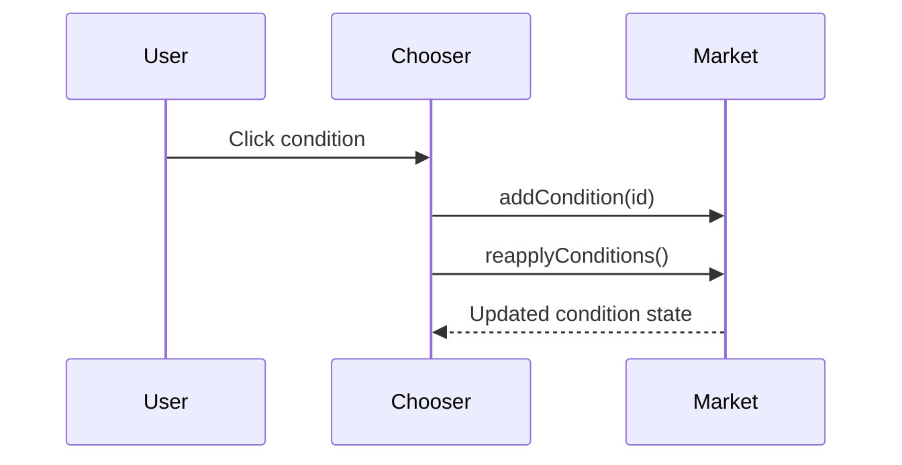

# Planetary Condition Editor Plan

## Index

- [Step 1 - Mod Scaffold](#step-1---mod-scaffold)
- [Library Candidates](#library-candidates)
- [Step 2 - Colony Screen Detection](#step-2---colony-screen-detection)
- [Step 3 - Condition Chooser UI](#step-3---condition-chooser-ui)
- [Step 4 - Condition Add Action](#step-4---condition-add-action)
- [Step 5 - Verification](#step-5---verification)
- [Step 6 - Release Automation](#step-6---release-automation)

## Step 1 - Mod Scaffold

Create the `KMU` mod identity, build layout, and runtime entry point.

Reason: the feature needs a stable mod id and a small runtime hook before any UI
can be attached. This step also chooses and records any helper libraries that
will reduce implementation complexity. The implementation should follow the
repository release shape in `docs/dev/release.md`: production code in
`src/main/java`, tests in `src/test/java`, and compiled runtime code in
`jars/KMU.jar`.

Tests:

- confirm the production Java compiles into `jars/KMU.jar` against the local
  Starsector API jar;
- compile and run any repository test classes in `src/test/java`;
- if helper libraries are later declared for this feature, extend the compile
  classpath and re-run the same verification against those jars as well.

## Library Candidates

Use libraries when they make the implementation smaller, safer, or easier to
maintain. Candidate references from the local mod set:

- AOTD has a colony/core-UI listener style around `CoreUiInterceptor`,
  `ColonyUIListener`, and `SurveyPanelContextUI`. Its source is not loose here,
  but its class structure is a useful model for separating UI detection from
  feature injection.
- Random Assortment of Things has source for reflection helpers and button
  callbacks, including `UIExtensions.kt` and `AtMarketListener.kt`. Its patterns
  are useful, though adopting its Kotlin/LunaLib shape should be a deliberate
  dependency decision.
- UAF shows compiled examples of `EveryFrameScript` UI hooks,
  `CustomVisualDialogDelegate`, `CustomUIPanelPlugin`, and
  `BaseIndustryOptionProvider` usage. These are good references for full custom
  UI and later industry-option features.
- LunaLib, LazyLib, and MagicLib are acceptable dependencies if one materially
  reduces reflection boilerplate, custom panel code, or UI callback wiring.

## Step 2 - Colony Screen Detection

Detect the active colony market from the local colony screen and from the
outposts ledger.

Reason: the same editor button must work whether the player is present at the
planet or inspecting it remotely. Ownership is intentionally not checked at this
stage because this is an editor/debug utility.

Tests: verify detection while present at a colony and while selecting a colony
from the ledger, including a non-player-owned colony.

## Step 3 - Condition Chooser UI

Add a `Planetary Conditions` button and a scrollable chooser listing all
planetary condition specs.

Reason: the editor should be visual, discoverable, and usable with modded
condition lists that may be long.

Tests: confirm all planetary specs appear, present entries are normal color, and
absent entries are darkened.

## Step 4 - Condition Add Action

Make each condition entry add its condition to the active market without
removing conflicts or same-group conditions, regardless of market ownership.

Reason: this is a utility/editor feature, so it should preserve deliberate
invalid test states and allow direct editing of non-player faction colonies.

Tests: add two normally incompatible conditions and confirm both remain present
after the market reapplies conditions. Repeat once on a non-player-owned colony.

## Step 5 - Verification

Compile the production jar and smoke test in game.

Reason: Starsector UI hooks rely on internal classes, so runtime verification is
required in addition to compilation.

Tests: compile against `starfarer.api.jar`, open both target screens in game,
add a condition, save, reload, and confirm the condition remains.

## Step 6 - Release Automation

Add a GitHub Actions workflow that produces the packaged release zip.

Reason: releases should be repeatable and should not depend on manually mixing
source files, tests, generated classes, and runtime assets. The workflow should
build `jars/KMU.jar`, run tests, assemble `dist/KMU`, create
`KMU-<version>.zip`, and upload it as a workflow artifact. On version tags, it
should also attach the zip to a GitHub release.

Tests: trigger the workflow manually once and from a version tag. Confirm the
zip has `KMU/` as its top-level folder, includes `mod_info.json` and
`jars/KMU.jar`, and excludes `src/`, `docs/dev/`, tests, `.git`, and build
caches.

Constraints: do not commit Starsector game jars or third-party mod jars solely
for CI. Any compile-only API inputs needed by the workflow must be supplied in a
documented private or permitted way.
