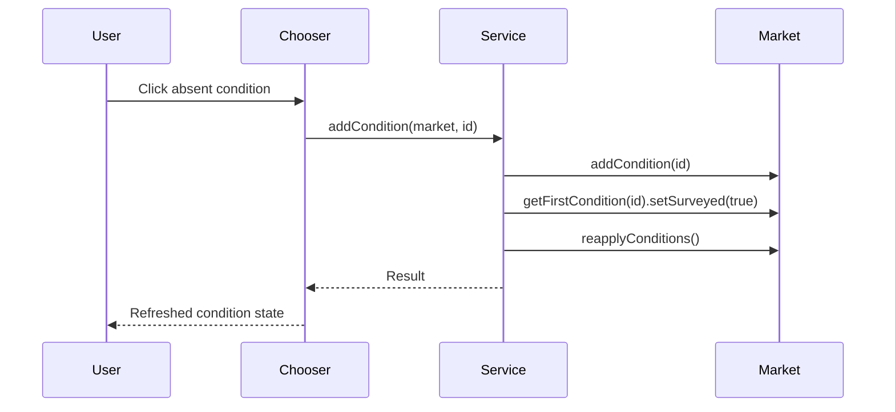

# Planetary Condition Editor Plan

## Index

- [Research Baseline](#research-baseline)
- [Step 1 - Mod Scaffold](#step-1---mod-scaffold)
- [Step 2 - Condition Service](#step-2---condition-service)
- [Step 3 - Editor Entry Point And Market Context](#step-3---editor-entry-point-and-market-context)
- [Step 4 - Condition Chooser UI](#step-4---condition-chooser-ui)
- [Step 5 - Condition Add Action](#step-5---condition-add-action)
- [Step 6 - Verification](#step-6---verification)
- [Step 7 - Release Automation](#step-7---release-automation)

## Research Baseline

Detailed research lives in
`docs/dev/research/planetary-condition-editor-reference.md`.

Decisions from that research:

- Do not add a hard library dependency for this feature yet.
- Do not depend on AshLib. It is outdated and not compatible with Starsector
  `0.98`; use it only as code reference.
- Use Starsector's public API for condition data and mutation:
  `getAllMarketConditionSpecs`, `getMarketConditionSpec`, `MarketAPI.addCondition`,
  `MarketAPI.removeCondition`, `MarketAPI.hasCondition`, `MarketAPI.getCondition`,
  `MarketAPI.getFirstCondition`, and `MarketAPI.reapplyConditions`.
- Treat LunaLib as a later settings option, not as part of the core condition
  editor.
- Treat MagicLib, LazyLib, BoxUtil, ParticleEngine, GraphicsLib, NebuLib, and
  RetroLib as reference or unrelated for this feature unless a later step finds
  a concrete need.
- Use Random Assortment of Things and AOTD/VOK as UI-architecture references:
  RAT has loose source for reflection helpers and UI tree crawling; AOTD/VOK has
  a useful interceptor/listener shape visible from its jar classes.

Implementation posture:

- Keep condition mutation isolated from UI code so it can be tested.
- Prefer public UI APIs for our own panels and dialogs.
- Use reflection only for discovering or attaching to existing Starsector UI
  panels, and keep that reflection behind small KMU-owned helpers.
- All KMU modded-code boundaries should fail closed instead of crashing the
  campaign UI: catch expected `RuntimeException` failures from Starsector or
  third-party mod APIs, return explicit failure results or empty safe state, and
  preserve enough error detail for logging or UI feedback.

## Step 1 - Mod Scaffold

Create the `KMU` mod identity, build layout, and runtime entry point.

Reason: the feature needs a stable mod id and a small runtime hook before any UI
can be attached. This step also establishes the repository release shape in
`docs/dev/release.md`: production code in `src/main/java`, tests in
`src/test/java`, and compiled runtime code in `jars/KMU.jar`.

Tests:

- confirm the production Java compiles into `jars/KMU.jar` against the local
  Starsector API jar;
- compile and run repository test classes in `src/test/java`;
- verify Gradle uses Java 17 and reads the mod version from `mod_info.json`.

## Step 2 - Condition Service

Implement KMU-owned Java services for listing condition specs and applying a
condition to a market.

Reason: the research found that Starsector's public condition APIs are enough.
This logic should not live inside the UI hook, because UI reflection will be the
fragile part and condition mutation should remain independently testable.

Implementation:

- create a condition spec query class that reads
  `Global.getSettings().getAllMarketConditionSpecs()`;
- filter to planetary specs with `MarketConditionSpecAPI.isPlanetary()`;
- expose the current market condition ids from `MarketAPI.getConditions()`;
- validate target condition ids with `Global.getSettings().getMarketConditionSpec(id)`;
- add only if absent, using `MarketAPI.addCondition(id)`;
- mark newly added conditions surveyed with
  `market.getFirstCondition(id).setSurveyed(true)` when available;
- call `MarketAPI.reapplyConditions()` after mutation;
- do not remove conflicts, incompatible conditions, or same-group conditions;
- do not check ownership;
- return structured failure results instead of allowing Starsector API
  exceptions to crash the UI action.

Tests:

- unit test candidate filtering with test doubles for condition specs;
- unit test duplicate prevention;
- unit test invalid condition handling;
- unit test that adding a valid absent condition calls add, surveyed, and
  reapply in that order;
- unit test repository and market adapter boundaries with dynamic proxies;
- unit test failure handling for repository and market API exceptions.

## Step 3 - Editor Entry Point And Market Context

Find or create a stable way to open the editor for the market the player is
inspecting.

Reason: the product goal is an in-context colony editor, but the research found
no clean public API for injecting controls into the vanilla colony or survey UI.
This step isolates market detection and UI attachment behind KMU-owned code.

Implementation:

- start with a KMU market-context abstraction that contains the `MarketAPI` and,
  when available, the discovered `UIPanelAPI`;
- support the player-present-at-market case through interaction dialog target
  and player fleet interaction target lookup;
- support the remote colony/outposts ledger case through
  `SectorAPI.getCurrentlyOpenMarket()`;
- keep ownership out of the detection logic;
- prefer opening a KMU custom dialog/panel through public APIs when possible;
- keep reflected `UIPanelAPI` discovery optional and behind
  `KmuMarketUiContext` for a later UI-injection step;
- if a vanilla screen button is required, implement a small reflection layer:
  - `KmuReflection`;
  - `KmuCoreUiLocator`;
  - `KmuMarketUiContext`;
  - `KmuMarketUiListener`;
  - `KmuMarketUiInterceptorScript`.

Reference patterns:

- RAT: `ArtifactUIScript.kt`, `MinimapUI.kt`, `UIExtensions.kt`,
  `ReflectionUtils.kt`, and `AtMarketListener.kt`.
- AOTD/VOK: `CoreUiInterceptor`, `ColonyUIListener`, `MarketUIListener`, and
  `SurveyPanelContextUI` as architecture reference only.

Tests:

- compile-time coverage for the market-context classes;
- unit test currently-open market, interaction-dialog target, and player-fleet
  interaction target resolution;
- unit test fail-closed behavior when one market context source throws;
- in-game smoke test while present at a colony;
- in-game smoke test from the outposts ledger;
- in-game smoke test on a non-player-owned colony.

## Step 4 - Condition Chooser UI

Add a `Planetary Conditions` editor surface and a scrollable chooser listing all
planetary condition specs.

Reason: the editor should be visual, discoverable, and usable with long modded
condition lists.

Implementation:

- build the chooser with Starsector `CustomPanelAPI` and `TooltipMakerAPI`;
- list every planetary condition spec returned by the condition service;
- show present entries with normal UI coloring;
- show absent entries with darkened UI coloring;
- include condition name, id, icon when available, and tooltip text;
- use spec-based tooltip fallback for absent conditions whose plugin tooltip
  requires a live market condition.

Tests:

- unit test chooser view-model construction from specs and current market ids;
- unit test chooser editor handoff from resolved `MarketAPI` to dialog delegate;
- in-game smoke test with vanilla and modded conditions loaded;
- confirm long lists remain scrollable and selectable.

## Step 5 - Condition Add Action

Wire each chooser entry to add its condition to the active market.

Reason: this is a utility/editor feature, so it should preserve deliberate
invalid test states and allow direct editing of non-player faction colonies.

Implementation:

- clicking an absent condition calls the condition service;
- clicking a present condition does not add a duplicate;
- after mutation, refresh the chooser state from the market;
- show a small message or visual refresh so the user can tell the click worked;
- leave removal for a later feature.

Tests:

- add two normally incompatible conditions and confirm both remain present after
  reapply;
- repeat on a non-player-owned colony;
- save, reload, and confirm the added condition remains.

## Step 6 - Verification

Compile the production jar and smoke test in game.

Reason: Starsector UI hooks rely on runtime behavior and, if vanilla panel
injection is used, internal classes. Runtime verification is required in
addition to compilation.

Tests:

- run `gradlew test jar` against the local Starsector API jar;
- open each target screen in game;
- add a condition;
- confirm condition color/state updates in the chooser;
- save and reload;
- confirm the condition persists.

## Step 7 - Release Automation

Add a GitHub Actions workflow that produces the packaged release zip.

Reason: releases should be repeatable and should not depend on manually mixing
source files, tests, generated classes, and runtime assets. The workflow should
build `jars/KMU.jar`, run tests, assemble `dist/KMU`, create
`KMU-<version>.zip`, and upload it as a workflow artifact. On version tags, it
should also attach the zip to a GitHub release.

Tests:

- trigger the workflow manually once and from a version tag;
- confirm the zip has `KMU/` as its top-level folder;
- confirm the zip includes `mod_info.json` and `jars/KMU.jar`;
- confirm the zip excludes `src/`, `docs/dev/`, tests, `.git`, and build caches.

Constraints: do not commit Starsector game jars or third-party mod jars solely
for CI. Any compile-only API inputs needed by the workflow must be supplied in a
documented private or permitted way.
