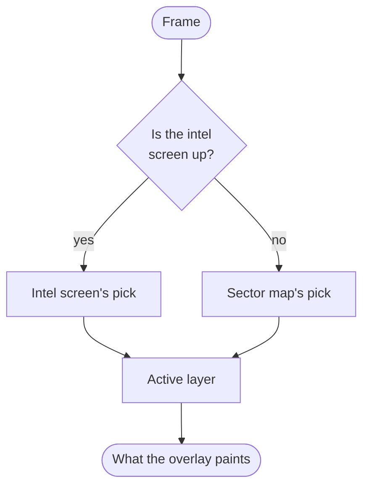

# Map layers (`maplayers`)

A map layer is one overlay over the campaign map. A control box floating over the map carries a
strip of tabs, one per layer, and exactly one layer is active at a time - the same model as the
map's own Sector / System tabs. Selecting a tab decides what, if anything, is painted over the
sector, and opens that layer's own controls beneath the tabs.

The box draws on both screens that show the sector map: the full map screen (M) and the map preview
(the "visor") embedded in the intel screen.

Part of Klark Morrigan's Utilities; see the
[mod README](../../../../../README.md) for project context.

## Index

- [The layers](#the-layers)
- [The one-way arrow](#the-one-way-arrow)
- [The vocabulary](#the-vocabulary)
- [Two screens, two picks](#two-screens-two-picks)
- [What is per screen](#what-is-per-screen)
- [Where each part lives](#where-each-part-lives)

## The layers

| Layer | Paints | Body |
| --- | --- | --- |
| **No Layer** | nothing - the map reads as vanilla | empty |
| **Political map** | the sector coloured by who controls each system | map-wide options, the view radio, the bloc spotlight picker, and the active view's own toggles |

No Layer leads the strip as a first-class tab rather than an off switch, so the strip always shows
what is and is not drawn and an empty map reads as a choice. The political map is the pick an
untouched save resolves to, so the overlay is up the first time the sector map opens. Each tab also
answers a LunaLib-rebindable shortcut, printed on the tab, on both screens the box draws; since the
picks are per-screen, a shortcut moves only the tab of the screen it was pressed on.

## The one-way arrow

Nothing under `kmu.maplayers.base` may import `kmu.maplayers.politicalmap`. `base` is the
substrate every layer sits on, so an import in that direction would make the framework depend on
one of its own layers - and a second layer could then only be written by reaching into the first
one's drawer, which is the state this tree was carved out of.

The compiler is happy either way round, so the rule is a build gate rather than a review
question: `enforcePackageLayering`, declared in [build.gradle](../../../../../build.gradle) and
implemented in Common-Java. It reads every source set, not just `src/main` - a suite reaching
across for a real political type is the shortest way to make it compile, and the sector-geometry
viewer under `src/utils` sits in `base.geometry` itself.

One arrow inside `base` is gated the same way, and for the same reason: `base/visibility` splits
into what may be shown of a colony (`colonies`) and which systems the map draws (`systems`), the
second composed out of the first. The reverse import is what would make "may this be shown" depend
on whether anything is being drawn, so each half is a package of its own - the gate closes a
package root, and a parent root closes its own children with it.

## The vocabulary

`base` and a layer deliberately use different words for the same thing, and the translation
happens at the boundary between them. That is what keeps the framework honest: if `base` said
"faction", a second layer could not use it without lying about what it paints.

Read this table left to right as "what the framework calls it" -> "what the political map calls
the thing it hands over".

| `base` says | political map says | Means |
| --- | --- | --- |
| **owner** | **holder** (`DominantHolder`, `HolderProvider`) | what a cell is attributed to; two cells fuse only if it matches. Opaque to `base` - a faction id under the factions view, an alliance id under alliances, a claimant under claims |
| **unowned** | factionless, uninhabited, decivilised | a cell no owner is attributed to. It never fuses, and draws its own lone outline. Unowned is not the same as empty: a view whose holding rule admits only some markets (claims, for the reasons its own package sets out) leaves settled systems unowned, so the factionless split is read from the pass's inhabited-system set, not from the absent owner |
| **cluster** (`StyledCluster`) | one body of a **territory** | the merged shape connected same-owner cells form, inside one traced border. A lone cell is a cluster of one |
| **cluster group** (`StyledClusterGroup`) | **territory** | everything one owner paints: its clusters, plus the paints they all share. "Territory" is the political word for *all* of a bloc's cells, which may be several disjoint clusters - so a territory is a cluster group, never a cluster |
| **cluster border** | national border, frontier | the inset ring around a cluster. `base` never calls it national - nothing about a border is political |
| **interior seam** | province line | the fused edge between two same-owner cells, drawn faint or not at all |
| **fill state** | held / contested / drawn-empty | how a cell inside one cluster paints: `SOLID`, `HATCHED`, `UNFILLED`. The layer decides which system is which; `base` only paints it |
| **`ElementPaintSelection`** | `FactionPaletteSlot` | the player's colour pick, held opaquely by the theme and *unresolved*: it names where to look, not a colour, since one theme serves every bloc. `base` asks only "is it absent" (paints nothing); how many options exist is the layer's business. `FactionPaletteChoice` is the settings-side wire format behind it, and is deliberately not an `ElementPaintSelection` - its "No color" would otherwise read as drawable |
| **shade** | **shade** | the concrete `Color` a selection resolves to once a bloc's palette is in hand. Never a synonym for the selection: `MapPalettes` is where the one becomes the other |

The right-hand column is a build gate too, for the reason the arrow above is one. A leaked import
stops compiling the day a package moves; a leaked noun in a Javadoc survives every move in silence,
and it is what a reader of `base` actually reads - so `enforcePackageVocabulary`, declared beside
the layering rule in [build.gradle](../../../../../build.gradle), fails the build when anything
under `base` says *territory*, *national border*, *contested fill* or *bloc*, in prose or in a
name. Faction, alliance and claim are left off that list on purpose: this file and the `geometry`
and `labels` READMEs name them as examples of what an opaque owner could be, which is the argument
for the opacity rather than a leak of it.

One word is forbidden mod-wide rather than only under `base`, and for a different reason:
*ground* is not a layering leak, it is simply unclear. It stood for a cell, a cluster's fill, a
whole territory and the receded backdrop in neighbouring sentences of the same file, while every
one of those words was available. Say what is meant instead.

The handful of files that may still say one of the political words are named in `build.gradle`
rather than marked in place, so an exemption is something a reviewer reads in the diff. All of them
name an identifier rather than make a claim about the framework - the `$kmu_map_filter_bloc*`
sector-memory keys, whose spelling is fixed by every save already holding it, and the political
class names the geometry viewer lists as pipeline stages it does not exercise.

Two words that are **not** synonyms, despite looking alike:

- A **cluster** is one connected component. A political **territory** may be several - a faction's
  homeland and its far-flung colony are two clusters under one territory, which is why each gets
  its own label rather than one name stranded between them. The two draw records keep that
  distinction rather than leaving it to the reader: geometry hangs off `StyledCluster`, one per
  body, and paint off the `StyledClusterGroup` around them, so a record covering several bodies
  cannot be mistaken for one body's.
- An **owner** is a render input; a **holder** is a computed political fact (dominant faction by
  market weight, or claimant, or alliance). They coincide only because the political map feeds one
  into the other.

## Two screens, two picks

The same map widget draws on the sector map and inside the visor, so "which layer is active" cannot
be one shared value: it would paint the sector map's pick onto the intel screen and ignore the tab
the player is looking at. Each screen holds its own `PersistedActiveLayerSelection` under its own
key, and `MapLayerRegistry.isActive` resolves which is live per frame from which screen is up.

Switching tabs on one screen leaves the other where it was. Both picks persist; a save holding no
pick, or one naming a layer no longer registered, resolves to the registered default.

## What is per screen

Only the box's own state. Everything the controls set is shared, so the two screens cannot disagree
about what the overlay means.

| State | Scope |
| --- | --- |
| Which tab is lit | per screen, persisted |
| Whether the box is folded to its rail | per screen, persisted |
| How far the body is scrolled | per screen, for the session |
| Political-map view, bloc spotlight, sort, columns, and every other control value | shared, persisted once |
| Appearance and sound settings | shared, in LunaLib |

## Where each part lives

- **`base/layer`** - the layer framework: `MapLayer` (id, tab label, body controls, default
  shortcut), `MapLayerRegistry` (roster, both screens' picks, save migrations), `NoLayer`. A layer is
  registered once for the process while what it draws with is one sector's, so it holds no renderer:
  it is asked for the one belonging to the installation being drawn, and the registry passes that
  installation through rather than resolving one of its own.
- **`base/installation`** - one sector's map machinery as a thing a caller can hold, since
  everything the layers draw is derived from one sector. `MapLayerInstallation` is that holder - its
  `MapLayerRefreshBoard` is what went stale in that sector, and nothing another sector rebuilds
  for, its `MovingSystems` is where that sector's systems were last seen, and its `MapHoverState` is
  what the cursor is over on that sector's map. It carries the sector itself beside them, for the
  stages that read the sector rather than a holder over it - the rebuild that cuts cells from its
  systems, the poll that walks them - since vanilla's map hook names no sector and a terrain surface
  reaches a location rather than one. Taking it from the installation rather than beside it is what
  stops a stage cutting cells from one sector while reading holders out of another.
  `MapLayerInstallations` indexes one per sector, replaces a sector's on a second install, releases
  it on removal, and discards every one on load - the load being the only point at which a previous
  save's can be stopped from outliving it, nothing else being told a sector went away. A seam
  vanilla hands no sector resolves the live sector's, which is where the global read standing in for
  a sector nobody passed down belongs. An uninstalled sector resolves to a detached installation
  rather than to null, the overlay being behind a switch a player can leave off - and that one is
  over no sector, so a stage reaching it finds nothing to read rather than falling through to the
  running game's. Each installation
  is indexed under its sector's hyperspace as well, since a render surface is terrain and reaches a
  containing location rather than a sector; that resolution answers with nothing where the location
  has none, a surface belonging to a sector nothing draws having no business painting through the
  holder every sector-less caller shares. What a *layer*
  derives from the sector - its renderer and the caches behind it - is held through
  `InstalledMachinery` instead of named here, so an installation owns those lifetimes without this
  package pointing at the layers downstream of it; releasing one releases them, which is what frees
  the GL buffers a cached label holds.
- **[The render surface](base/render/README.md)** - `MapLayerRenderer`, the seam a layer draws
  through - its overlay and the hover box over one cell of it - and the terrain that owns the map's
  render pass. It asks the active layer for a renderer and hands it the frame, so it names no layer;
  a layer that only switches (No Layer) supplies none, which is read as nothing to draw. Which
  sector it draws it finds through its own terrain entity, that being the one handle a plugin
  rebuilt from the save has. More than one terrain surface can paint one frame, so the per-frame
  work behind a layer is claimed rather than assumed: `MapFramePreparationClaim` grants it to the
  first surface of that sector to reach each frame, one claim per installation so two maps drawing
  in one frame each get their own. The
  cursor read is the exception, being taken per pass so the surface that drew last owns the answer.
  Where a second surface is a minimap its owner has parked off screen, the compatibility mode stops
  it rendering rather than arbitrating between the two passes it would otherwise contribute.
- **[Clusters](base/render/clusters/README.md)** - the shape work under that surface: turning shaped
  cells and opaque owner ids into borders, fills, and GL-ready runs. The cluster-border trace,
  the smoothing passes, the vertex packing, and the split fill that puts several fills inside one
  border - none of which interprets a key.
- **`base/visibility/systems`** - which star systems a layer draws at all: `MapVisibility` admits a
  system on either of two paths (reachable and drawn by the vanilla map, or inhabited) and hashes the
  admitted set into the fingerprint that says it moved; `MapVisibilityPass` is one reading of the
  sector answering that rule, and `DrawnSystemPositions` walks it for each drawn system's live
  hyperspace position. The rule takes the answers rather than the sector to read them from - a pass
  holds the colony index and hyperspace scan it composes them off - so a caller running several
  walks in one tick selects each system once between them and asks one thing which systems are
  drawn. Inhabited means
  somebody lives there - the colony set's habitation projection - so a system whose only market is an
  abandoned station is admitted by access alone, and a star-hidden one holding a derelict is not drawn
  at all. `MapVisibilityRules` pairs the colony rule that judges that with the force override a
  caller may admit a system outright by, so a layer can widen what is drawn without the rule knowing
  why it wanted to.
- **`base/visibility/colonies`** - what may be shown of a colony, which is the map's own framing
  and not the sector's. KMLib states which colonies a place holds; `ColonyKind` says what kind of
  place each one stands for, `ColonyVisibility` and `RevelationGate` say what may be shown of it,
  and `ColonyKnowledge` pairs that rule with the sector's record of what has been observed and
  publishes the two projections every surface reads - the known listing a box may name, and the
  habitation reading a cell is settled by. Each pass opens one and classifies each colony once
  through it. `ColonyKindLookup` folds those kinds by colony id for a reader that meets a colony as
  a row rather than as a colony, and `ColonyDiscoveryLookup` folds the entity's own found-or-not
  flag the same way for the same reader. `OpenlyKnownColonyLookup` folds a third such answer -
  whether a concealed colony is one the sector openly points at, off the entity ids and tag
  `OpenlyKnownColonyRegistry` is seeded with at start-up. That one excuses a word a hover box would
  otherwise say and reaches no gate: a landmark is concealed to every rule here, exactly as the base
  beside it is. Who would speak about what stands beside them is owner-aware and then some:
  `FactionAlliances` says which factions stand together, read through the `FactionAllianceSource`
  port a composition root registers with `FactionAllianceRegistry`, so a partner keeps a concealed
  base quiet exactly as its own faction does. It is a world fact rather than a rule, so it is folded
  per pass beside the observations rather than carried on `ColonyVisibility` - and read through a
  port so the rule never names the mod that maintains an alliance, nor changes with which map layer
  the player is looking at. The register behind the observations is `ColonySightings` over
  `SectorColonySightings`, written by `ColonySightingRecorder` as the player travels and by the
  political map's staleness poll for what a place's own inhabitants can see; `ColonySightingInstaller`
  stands both up on load.
- **[Cell geometry](base/geometry/README.md)** - the cells, edges, and clusters any painting layer
  is shaped out of, partitioned from the drawn systems and cached against them.
- **[Cluster-name overlay](base/labels/README.md)** - where a name is placed across a cluster and
  how it is drawn. What the name reads and what shade it takes arrive from the layer as functions
  of an owner, so the overlay names nothing itself.
- **[The theme records](base/theme/README.md)** - the player's appearance choices as inert value
  types, read once per rebuild, plus the `ElementStyleAdjustment` a rebuild lays over one of them
  to recede an element. The per-category tier is keyed on an open interface, so a layer brings its
  own categories and its own reader to populate them.
- **`base/hover`** - what the cursor is over, and what the map says back. The values are
  `MapHover` (the hovered cell and the cluster around it), `MapHoverState` (the holder the map
  render pass publishes to and the later UI passes read, since only that pass can invert a cursor
  pixel to a world point - one per sector, held by that sector's installation, a hover naming its
  system by bare id, and resolved off the running sector by the passes vanilla drives without naming
  one), and `HoverHighlight` (the loops and triangles one hover lights up). `MapHoverPublisher` is that pass: it takes the world point KMLib's `MapCursor`
  resolves, hit-tests it, and widens the hit to its cluster - all over `MapHoverTargets`, one
  frame's drawn cell shapes and the clusters they fuse into. What it owns is the sequencing and the
  parking: a cursor that cannot be trusted must clear the hover rather than leave the last frame's
  standing, and getting that wrong lights a cell the cursor is not on. The pixel-to-world inversion
  underneath is KMLib's. One park is not the pass's to write, and `MapHoverExpirer` is it: every
  guard above lives *inside* a pass, so the frames with no map pass at all park nothing, and the last
  cell any map resolved would be named for the rest of the session by a tooltip that draws from a
  campaign-wide listener rather than from the map. That script closes each frame's window, so a hover
  lasts exactly as long as some pass keeps publishing it - stated over publication alone, since a
  second reading of which screens may resolve a hover could only come to disagree with the passes. It also answers the *moment* the cursor reaches a cell, over KMLib's own
  `KeyedHoverArrival`: one latch for the tick the player hears and the line the trace prints, since
  both ask the same question and two would be two chances to disagree about when the cursor got
  somewhere. The latch is stepped only by a hit-test that actually ran: a frame with no draw lists
  or no readable transform clears the hover like any other park but leaves the last cell the cursor
  was *seen* on standing, since a missing input says nothing about where the cursor went - a park is
  a claim about the hover, and only sometimes a claim about the cursor. A pass the cursor cannot be
  located against at all parks the same way and is checked before any of it: a map another mod built
  drives the same hook with its own position and zoom, and unprojecting against that yields a
  confident wrong answer rather than a missing one, which no guard downstream would catch. Whether
  to allow it is the `Map - Compatibility` pair of hover permissions, which between them add the
  frames the vanilla hosts do not cover: one admits every pass there is and is off by default, since
  granted it is heard where no map is drawn at all; the other admits only those where the player is
  looking at the campaign world itself - no screen open and no dialog up, which is KMLib's
  `CampaignScreenView` to answer - and is on by default, being inert without a mod that docks a map
  surface there. Stated as permissions rather than as one restriction so the tab reads as a set; the
  narrower of the two is also what closes such a surface again without naming a mod, since a mod
  parks its panel on exactly the conditions that end game space. `MapHoverPermission` is that rule
  bound to the two live screen reads, and is what a running game holds: the hover pass and the
  tooltip box both take their answer from it, so a permission the player grants reaches the lit cell
  and the box naming it together rather than one without the other. It is what both of them hold,
  rather than a boolean each composes for itself, so that sharing is the compiler's to keep.
  What that tick sounds like is `MapHoverCues` beside it - the map's own sample and the player's own
  level, read live like the switches are, and no cue at all once that level reaches the bottom of
  its slider. The cell rather than the cluster is what the tick is keyed by, so it answers the same
  change the hover box does. `HoverHighlightGeometry` resolves the highlight geometry and
  `HoverHighlightRenderer` burns the halo and the wash, both over a `HoverHighlightSource` - the two
  questions only the layer that owns the clusters can answer: the loops the hovered cell might sit
  inside, and the shade its fill draws in. Both seams extend `PaintedCellShapes`, the frame's cell
  shapes themselves, so the halo can only trace an outline the cursor was actually hit-tested
  against - one supplier, not two that must agree. `MapHoverGates` is the settings side: hovering is
  switched at three tiers - a master over the whole map, a pair under it for the effects and the box
  separately, and a pair of the layer's own - and this answers for the two that reach every layer,
  which a layer ANDs its own into. So one layer's box can go dark while another's stays up, and one
  row still silences them all. `RandomAssortmentOfThingsCompatibilityMode` is the same tab's per-mod switch:
  whether the player has left that mod's compatibility mode on *and* the mod is installed with its
  own minimap replacing the campaign radar, which is KMLib's `CampaignMinimap` role to answer - the
  map surface `MapPresence` cannot report, since it stands in for the radar rather than opening as a
  screen, and answered for that mod in KMLib's own `rat` package. Both halves, ANDed, so an install
  without that minimap reads one boolean and behaves as it always did. Named for the mod because the
  switch is, while what it asks stays the mod-neutral question the role carries - so a second mod
  replacing the radar arrives as its own switch rather than folded under this one's name. It narrows
  what the general switches beside it allow and never widens it: which frames may answer the cursor
  at all is theirs, and the mode only confines - within a frame they already allow - to the surface
  that minimap occupies. Those are written for the mods nobody here has met, and a per-mod mode able
  to override them would make them unreliable as general switches. The one thing it does outside
  that hierarchy is not about the cursor at all: while the minimap is parked off screen it is
  [switched off](base/render/README.md#silencing-a-minimap-parked-off-screen), a surface nobody can
  see having no business rendering a sector map behind every screen the player opens.
- **`base/hover/cover`** - whether anything is drawn over the map where the cursor rests, which a
  layer asks before resolving a hover at all. A hover reads a cell out of map geometry, which knows
  nothing of what is composited on top, so without this it lights cells and floats boxes under
  whatever is covering them. `MapCover` is the role - one thing that can be over the cursor - and
  `MapCoverReader` holds the set and stops at the first that answers.

  Five are always in the set and live here: `HeldPointerMapCover` (a held left button, on which the
  pointer is pressing rather than pointing - it stands in for vanilla's own marker menu, which no
  geometry here can see; the class states why), `PauseMenuMapCover` (the campaign's pause menu,
  raised over the screen without taking it down, so the map keeps drawing behind it),
  `ModalDialogMapCover` (a confirmation prompt or picker a core screen raises in front of itself,
  which nothing the campaign publishes reports), `SidebarMapCover` (any host's panel, through
  `SidebarHosts`), and `VanillaChromeMapCover` (the map's own tab strip and control bar, stated as
  "outside the map surface" since the chrome widgets are a fact about one game build).

  The modal one sits ahead of the sidebar's deliberately: a modal stands the sidebar down, so the
  panel's own cover cannot answer for one. `ModalDialogMapCover` states what follows for its
  existence and `MapCoverReader` what follows for the order.

  Two more belong to optional mods, live with those mods' own integrations, and join the set only
  where the mod is installed - presence being the one condition that cannot move within a run, so
  the factory settles it once instead of asking a cover that could only ever answer no.
  `ConsoleMapCover` (`kmu.starsector.consolecommands`) is a text-entry console, which takes the
  whole screen and so reads no geometry at all. `RandomAssortmentOfThingsMinimapCover`
  (`kmu.starsector.rat`) is everywhere that is *not* a docked minimap, on the frames the mode from
  `RandomAssortmentOfThingsCompatibilityMode` is engaged and no vanilla map is showing; which surface that
  minimap is comes from `SingleEmbeddedMapReader`, the one walk it shares with the rule that
  switches a parked surface off and with the tooltip step-aside's search root, so the three cannot
  act on different answers.

  They are held in ascending cost - a polled mouse flag, then a published one-call read, then a
  settled flag, then arithmetic over a box this mod laid out, then the two that walk the live widget
  tree - so the order is the composition's and each cover states only its own reading. All but the last fail open: what cannot be
  established is not covering, since a read taken to refine the hover must not be able to switch it
  off. One set for every layer, not one per layer, because nothing about a cover is a layer's own -
  a layer holding its own could be given a cover its neighbour was not, which is how a console came
  to hide the sidebar while the map went on lighting cells behind it.

  The minimap cover is the exception on both counts, and deliberately. It is the only one that
  *opens* something up - it exists so a permission granted in game space confines to the one surface
  the player is actually pointing at, rather than answering over the whole campaign view - and so it
  is the only one that fails **closed**: on those frames nothing is pointable except that one box,
  so a walk that comes back with nothing, or with two maps, has to cover or the leak returns by way
  of the read meant to stop it. It reads a vanilla map's presence first and answers before touching a
  box, so a travelling panel cannot reach the `M` map or the intel visor even in principle; the box
  itself is read live every frame and never kept, since such a panel walks to its resting place over
  many frames. Named for the mod because the switch is - nothing it reads names one, `EmbeddedMap`
  being found structurally.
- **`base/tooltip`** - the box floating beside the cursor, in a later UI pass than the map's own.
  That pass is `CampaignUIRenderingListener`'s, which the engine drives for the whole campaign UI
  rather than for a map screen - so the box has a host wherever the campaign is drawn, game space
  included, and reaching a docked map surface cost a gate rather than a render host.
  `MapLayerCellTooltip` owns the gates every hover box shares (the settings tiers above any layer, a
  frame the cursor can be located against, stepping aside for the vanilla star
  tooltip) and draws whichever `MapHoverTooltip` the active layer's renderer injects - so a layer
  with none, a layer whose own tooltip switch is off, and a switch-only tab with no renderer at all
  show nothing for the same reason. The step-aside is rooted at whichever surface owns the frame,
  `ShownMapSurface` in `kmu.starsector.ui` - a tab-rooted walk cannot reach a docked map's tooltip,
  those being up on exactly the frames no tab is. How much detail the drawn box states is one shared fact rather
  than a per-layer one: `HoverTooltipDetailLevelState` carries the ordered `HoverTooltipDetailLevel` -
  four depths of the same account, from factions alone down to the patrol split - and the dispatcher
  hands it to the box it draws (`MapHoverTooltip.renderFor`), which reads its own content only that
  deep. A level is a cut rather than a choice of body: a layer composes the one tree it always
  composes and the blocks lay out as much of it as the level admits, so four depths cost no layer a
  second account of a system that could come to disagree with the first. The level never decides
  *which* box draws either - one box per layer, read to four depths - so the choice holds across
  hovers and layer switches without any layer holding a second body. What writes that level is
  `HoverTooltipDetailLevelInput`, a campaign input listener claiming F1 pre-core: each press advances
  one level, wrapping from the deepest back to the first, so the key that leads into detail also
  leads out of it. A render pass is
  handed no events and so can consume none, which is why reading the key and drawing its result
  are two passes agreeing through the holder. Both read one gate seam, `HoverTooltipGates` - the
  settings tiers above any layer, and a map on screen - rather than a copy each, so the key is
  claimed when and only when a box could be drawn and a condition added later reaches both passes.
  Behind that seam the press is claimed only where it would do something the player can see: the box
  under the cursor answers `MapHoverTooltip.isOfferingExpansionFor` for the hovered system, and a
  system with nothing more to state leaves the key alone. Asked per system rather than per box
  because that is where the answer lives - an unpopulated system has no colonies for a deeper tier
  to account for. Left unclaimed rather than advanced invisibly because the level is one shared fact:
  a press swallowed over a system with nothing to expand would silently decide how the next system
  that *does* differ opens. What the cursor is over is resolved once, by `HoveredBox`, and read by
  both passes - a chain spelled out twice is one edit away from the key acting on a frame the box
  does not draw. Vanilla keeps F1 everywhere else, and the listener runs below the sidebar's so a
  tab hotkey keeps the first claim on any key it is bound to. That
  map gate is host-blind and
  look-blind (KMLib's
  `MapPresence.isAnyMapShowing`), so the box draws wherever the layer paints: the sector map and the intel
  screen's map visor, in the schematic look and in Starscape alike. Which is what the
  listener needs, being called for the whole campaign UI and never told which
  screen is up. `SystemCellTooltip` is
  the shape a layer's box takes - the hovered system's name over the layer's own content, one look and
  one draw for both, the name set in the game's own title face over body-face rows so a KM hover
  reads as part of the interface rather than as text laid over it. The box opens with a heading block
  - the system name and any title lines read on from it - and the layer's own blocks follow beneath,
  so a verdict that settles the whole system heads the box while a status or an entry sits in it. A
  box taking part in the detail cycle ends on one more block: the key and what pressing it would do,
  drawn the way the game draws its own key hints - the key picked out in the shade vanilla highlights
  a shortcut with, the words about it in vanilla's grey, in vanilla's own smaller condensed face. What
  the deeper levels add is named by the layer, since only the layer knows what is down there, and it
  comes back beside the blocks rather than being asked for (`ComposedCellBody`): whether anything
  deeper is there turns on what the body found, so a layer that read its system to compose the blocks
  already holds the answer. Asked separately, the box would pay for that read a second time every
  frame the cursor rests on the cell - and the hint could describe a reading the body beside it no
  longer agrees with. The key handler asks through `resolveExpandedDetailName` instead, that being the
  one caller with nothing composed to take the answer from, and it asks once per press. Which way the
  offer reads is asked of nobody and follows from where the drawn level sits in the cycle - every
  press but the last opens the account further, and the last wraps back to the shallowest, which
  collapses it. The hint is not content: a box with nothing to say about the system stays undrawn
  rather than appearing as a lone offer to expand into nothing. How
  far apart those blocks stand is never a line's own request: KMLib parts one block from the next by
  one measurement, and a listing nested inside a block by a narrower one, so what sets two things
  apart is what they are rather than which line happens to open them. A layer states
  only *what* each block lists, as `CellTooltipEntry` / `CellTooltipEntryLine` values - an entry being
  a line over the entries beneath it, so how deep a listing goes follows the subject matter rather
  than the model. What those entries are to it is stated too, since depth alone cannot say: `grouping`
  gathers peers - a bloc and the factions in it are one answer at two granularities - while `nesting`
  carries the account of why the line above reads as it does. Both sit inset; only the second stands a
  step further under the box's voice, so an allied holder's markets read exactly as loudly as a lone
  holder's instead of being demoted by a level the account had nothing to do with. The demotion buys
  two things. A size: `SystemCellTooltip` asks KMLib for a fixed step per level, so a listing several
  levels deep gives the eye a cue agreeing with its indent, down to a floor the widget stops at.
  Asked for on the shared box rather than on the one layer that first listed anything that deep,
  since two layers demoting a line by different amounts is a difference a reader has no way to
  account for. And the detail cut: the level admits a line by its demotion alone
  (`CellTooltipEntryLevel.isAdmittedBy`), so an alliance's member factions survive the shallowest
  level - being the very content that level exists to show - while the markets beneath either of
  them do not. Cut on the indent instead, a listing would lose exactly what it was asked for.
  A line's number may itself be two things - a finding and the working it came out of, such as the
  rate one of a counted thing is worth over what the count came to. The line states the halves apart
  (`derivesValueFrom`) and the vocabulary greys the working against whatever colour the line speaks
  in, exactly as it golds a qualifier: run together in one string they could only be drawn in one
  shade, and the reader would take a value joined by a separator for a single number.
  Two further readings take that same quiet shade, and they are deliberately different sizes.
  `readsAsAside` says the whole line is a note *about* the list rather than one of the things in it -
  the arithmetic of a term its members share, stated once beneath them - so it quietens down to its
  name and only the number it arrives at stays a finding. `statesUncountedValue` is the narrower one:
  the line *is* one of the things listed and is named as loudly as its neighbours, but its number is
  one nothing earned - what an account recorded for it rather than anything it did. Drawn as loudly
  as the numbers around it, such a nought invites the one comparison it cannot bear.
  A line may also remark on the thing it names (`notedWith`) - something that is not a finding about
  it, such as how current what the box says about it is. That run takes the same quiet shade for the
  same reason the working does: the box parts what it has found from what it is saying about its own
  account, and a remark drawn in the qualifier's gold would invite the reader to weigh it against
  the numbers on the line rather than against the line's standing. It closes the line, past the
  qualifier, being the only run that is not about the thing on the line: set ahead of the gold, it
  would break a status away from the name it qualifies.
  A status is itself a small value (`CellTooltipQualifier`): the finding it always states, plus - for
  a line calling out the thing it *belongs to* rather than something about it - a word introducing
  that finding, a mark of what the finding names, and a word closing it with what kind of thing that
  is. One value rather than parts layered on separately, since applied apart they leave a line free
  to end on a connective introducing nothing or on a picture of something it never names. Only the
  finding is gold - the words either side are the box's own, and the closing one is a category rather
  than a name - so the plain status nearly every line carries (`qualifiedWith`) stays the single gold
  run it has always been.
  A finding may also sit inside the line's own name (`callsOutInLabel`), as a
  `CellTooltipLabelFinding` - the stretch of the label that says it, held as character positions
  since the name is the only copy of the name. It is drawn in the qualifier's gold where it stands,
  so a thing named after what it is states that finding once instead of ending on a word its name
  already carries. The stretches either side of it are joined runs
  (`LabelRun.isJoinedToPreviousRun`), which is what keeps the split name spelled as its author
  spelled it. At most one stretch per line: a second would cost the line model a list of parts where
  one part does.
  A line may instead withhold its name outright (`createRedactedLine`), carrying the shape of it as
  KMLib's `RedactedSpan` in place of the words. Such a line is listed rather than left out, so
  whatever the thing contributed to the block's arithmetic is accounted for on a line of its own
  instead of surfacing as a difference nothing explains, and the redaction takes the whole of the
  name's place - the mark still opens the line and the place, status and remark run on after it
  exactly as they do elsewhere, so it reads as one of the list with a part blocked out rather than as
  a shape of its own. A separate factory rather than a refinement, and word lengths rather than the
  name: what the line must not show never reaches it, so no later change is in a position to draw it.
  The two accounts of what a line is called are exclusive at construction - said or withheld, never
  both - and a line withholding its name cannot gild a stretch of it, there being no letters to match.
  A line may also state where it falls in an ordering (`indexedAt`), as a `CellTooltipIndexPlace` -
  the number the reader sees and, as one value with it, what that place decided
  (`CellTooltipIndexOutcome`). It runs on after the name in the quiet shade, ahead of any qualifier,
  because it identifies the line rather than saying anything about it. Where the ordering actually
  settled something between two otherwise-equal lines the place stops being an identifier and reads
  in vanilla's positive or negative shade instead, since at that moment the number *is* the reason
  one line beat another. Text and outcome travel as one value because neither is separately true, and
  carried apart they could drift - an outcome left behind by a re-numbered place would mark the wrong
  line as having won.
  `CellTooltipBody` walks that depth-first into a block, each entry becoming a nested block of its
  own line over its account - which is what lets KMLib set one entry's whole breakdown apart from the
  next entry at its tier rather than from its last line - carrying the indent and the demotion as
  one `CellTooltipEntryLevel`, and drops a block that resolved empty. It is the body under
  construction rather than a static over a list a layer holds, because every block needs both the
  running order and the depth: a layer that stated them per block could append one to the wrong list
  or hand four blocks a level and the fifth another, and a box that is two depths at once is a state
  the player cannot ask for. `CellTooltipRows` is the line
  vocabulary it lays them in, which reads the tier and the indent off that level rather than off a
  choice the block makes,
  plus the banner centred under the title. Everything a listed line *says* - its mark, its name picked
  apart where the name itself says a finding, its place in an ordering, what it calls out and what it
  remarks - is `CellTooltipLabels`, arriving at the row as the runs of one label. The seam is says
  against sits: the row decides where the line lands, how loudly it speaks and what fills its value
  column, and nothing else. The label is handed the tier's colour rather than choosing one, and hands
  back runs rather than a row, so nothing about what a line says commits it to the shape it says it on.
  Only the findings read gold (`CellTooltipLabels.buildFindingSpan`, which the banner's public
  `buildQualifierSpan` is the outward face of); a place identifies the line, a word introducing a
  status is the box's own connective, and a remark is the box talking about its own account, so all
  three stay quiet and a reader scanning for findings passes over them.
  A mark travels as a run at the head of the line carrying it
  on every shape, never in a leading column, so every line opens at the box's content edge and the
  indent alone says how deep a line sits: a column is one gutter shared down a flat stack, and a
  listing four levels deep would draw a mark several levels in inside the gutter the shallowest marked
  line widened, well left of the name it belongs to. What colour a mark draws in follows from what the
  mark is for, which the mark itself states (`CellTooltipMark.isInLineColour`, set by whichever of its
  factories composed it): a glyph standing in for the name beside it takes that name's own tier colour
  (`resolveMarkInLineColour`, or `resolveMarkForMapIcon` where the glyph is the one the sector map
  marks an entity by), so the two read as one thing, while a crest is a picture in its own right and
  keeps the colours of its own pixels (`resolveMarkAsAuthored`). Which of the two a mark is cannot be
  read off the sprite - the same artwork could be either - so whatever composes the line says it where
  the path is named, and the mark names no colour itself: which shade a tier speaks in is the block's
  to settle, and an asset authored to carry across the sector map is the loudest run on a line whose
  meaning is in the words. Absence is a null mark rather than a mark with nothing to load, and every
  factory answers it, so a caller resolving a mark it may not have never branches first. Its table
  shapes are the block's alone, so a body cannot author a look of its own. So two layers' boxes differ
  only in what they say.
- **`base/refresh`** - what says a cached overlay has gone stale, and the throttled poll that
  finds the changes the engine announces to nobody. `MapLayerSectorWatcher` owns the loop
  alone and asks a `MapLayerStalenessSource` what moved since it last asked, so which changes
  count, and which signal each one raises, stay the layer's answer - a signal being a
  `MapLayerRefreshSignal`, declared by the framework or by the layer that alone means anything by
  it. `MapLayerRefreshBoard` is what a signal is raised on, one per sector held by that sector's
  installation, since the stale set names systems by bare id; `MapLayerRefresh` resolves the running
  sector's for the seams vanilla hands no sector. The signals themselves, who declares which, and
  the four rebuild paths they drive are
  [the caching notes](../../../../../docs/dev/caching.md).
- **[The sidebar](base/sidebar/README.md)** - the control box: the per-screen hosts, placement,
  fold persistence, and how it is drawn over and routed ahead of the vanilla screens.
- **[Political map](politicalmap/README.md)** - the one layer that paints, its three views, and the
  draw pipeline behind them.
- **`MapLayers`** - the composition root, the single place every concrete layer, political-map view,
  specially treated entity and mod-supplied world fact is named and registered, so the framework
  below stays ignorant of which ones exist. The live alliance set is one such fact: it is wired past
  the same mod-enabled gate the alliances view is chosen behind, so an install without that mod
  reads a rule with nothing registered.
