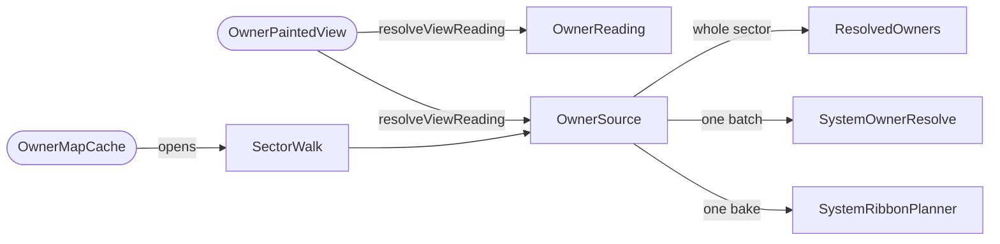

# Owner seams (`ownermap.owners`)

The two questions the owner-map tier asks a layer about its owners:
which systems each one holds,
and how each one looks.
Nothing else in the tier knows what an owner is.

Part of [the owner-map tier](../README.md),
in Klark Morrigan's Utilities (KMU);
see the [mod README](../../../../../../../README.md) for project context.

## Index

- [At a glance](#at-a-glance)
- [The walk](#the-walk)
- [Where owners come from](#where-owners-come-from)
- [One system at a time](#one-system-at-a-time)
- [The bands](#the-bands)
- [How an owner looks](#how-an-owner-looks)
- [What is not here](#what-is-not-here)

## At a glance

## The walk

A rebuild opens one `SectorWalk`:
the `SectorPassIndex` that walks each system once,
and the visibility rules the cells were cut under.
It names no colony rule and no owner.

The source is handed the walk rather than the sector,
so whatever it opens over it shares the traversal the cut already paid for.
The rules ride beside the index
because a source reading colonies has to read them under the rule that decided which systems got cells.
A source sampling the rules for itself could resolve owners for a sector the standing geometry was not cut for.

A walk is one rebuild's or one batch's,
and is discarded with it.

## Where owners come from

`OwnerSource.resolveOwners` answers everything a build reads the sector for,
as one `ResolvedOwners`:

- who owns each system;
- which owned systems draw hatched (`contestedSystemKeys`) or unfilled (`unfilledSystemKeys`);
- which systems anything stands in, whoever owns them;
- where the spotlit owner lives among the inhabited systems nobody owns.

One value because the five are one reading of the sector,
and because they are what a rebuild may keep.
A rebuild owed by a style pick alone paints over the owners the last one resolved
instead of asking the source again.

The inhabited set is independent of the owner map on purpose.
A rule that gives nobody a settled system leaves it unowned for reasons of its own,
and only that set tells such a system from empty space.

## One system at a time

An incremental refresh re-derives only the systems a change marked.
Asking the whole-sector answer once per marked system would cost more than the rebuild it replaces,
so the source opens a `SystemOwnerResolve` over the batch's own walk.
It answers three questions of one system:
who owns it,
whether anything stands in it,
and whether the spotlit owner is among what does.

The batch asks the source the standing build was resolved by,
never the view afresh.
That source carries the one sampling of the layer's live inputs every neighbour was painted under,
so a refreshed cell lands the owner a full rebuild of the same moment would.

## The bands

A presence band explains the fill it sits inside,
so it has to be counted by the rule that painted the cell.
The source answers that too:
`resolveRibbonPlanner` hands the bake its planner over the bake's walk,
once per bake.

## How an owner looks

`OwnerReading` answers each owner's shades,
name,
crest,
recede and category,
and the shades an unowned or receded cell is derived from.
`OwnerPalette` is the pair of shades,
and `SystemOwner` pairs an owner ID with its palette.

A view answers the reading and the source in one call,
`OwnerPaintedView.resolveViewReading`,
because the two have to agree about what an owner is:
a reading naming owners under one sampling of a live fold
while the source resolved the holding under another
would paint a fold the holding never made.

## What is not here

- The *answers*.
  A layer states its own source and reading.
  The layers painting holders build theirs through [`holders`](holders/README.md).
- The *categories* an owner draws in are `OwnerCategories`,
  in [`render/style`](../render/style/README.md).
- *Which systems seed a cell* is the substrate's `CellSeedRule`,
  which a layer hands the renderer it composes.
