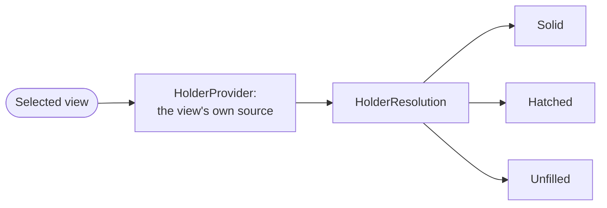

# Ownership resolution (`ownermap.owners.holders`)

Who paints each star system,
and how each owned system's fill is drawn.

Every owner-painted view reads each system's owner through one seam here.
So the render pipeline gets ownership from a single source,
and never names the resolver behind it.
That is what lets each view work out ownership its own way -
from what a bloc holds,
or from that plus systems it does not hold -
with no branch in the code that shapes,
borders,
and labels the result.

Part of [the owner-map tier](../../README.md),
in Klark Morrigan's Utilities;
see the [mod README](../../../../../../../../README.md) for project context.

## Index

- [At a glance](#at-a-glance)
- [The seam](#the-seam)
- [One system at a time](#one-system-at-a-time)
- [The three fill states](#the-three-fill-states)
- [What is not here](#what-is-not-here)

## At a glance

Each view picks one source.
The source returns one `HolderResolution`.
The resolution says who owns each system,
and which systems draw as a fill exception:

## The seam

"Seam" here means a single swap-in point.
A layer can offer several *views* of one map,
each working out ownership its own way,
but the code that actually draws the map should not have to care which view is running.
The seam is what keeps the two apart.

Each view hands the drawing code one object:
a `HolderProvider`.
Think of it as the answer to a single question -
*who owns each star system?* To let it answer,
the drawing code passes two inputs:

- the rebuild's own reading of the sector -
  a `HolderPass`,
  carrying which sector is being drawn,
  the grouping
  (whether factions stand alone or merge into blocs),
  the colony rules saying what the player may be shown of a colony
  and whether a decivilised world counts as somebody living in its system,
  and the one walk of each system every reader shares,
- which bloc,
  if any,
  the filter is currently highlighting.

The pass is opened where the rebuild begins and handed down,
so a provider that answers through two mechanics
reads each system once between them rather than once apiece.
It carries only what any owner-painted layer needs;
the rule that picks a winner from what it read
(weighing markets, say, or a relation between factions) is each provider's own,
which is what lets this one seam be implemented by layers that have no market weighting behind them at all.

The provider hands back one bundle:
a `HolderResolution`.
It lists the owner of every owned system,
and marks the few systems that are drawn as exceptions (the fill states below).
A system's owner and its fill are worked out together,
so they travel in the same bundle instead of being fetched twice.

Because the drawing code only ever sees this bundle,
a new way to work out ownership is just a new provider.
The drawing code does not change.

## One system at a time

A provider answers for the whole sector,
which is what a full rebuild wants and what an incremental refresh cannot afford:
a refresh re-derives only the systems an event marked,
and asking the whole sector once per marked system would cost more than the rebuild it replaces.
So a layer supplies a second answer beside its providers -
a `SystemHolderResolveSource`,
which opens a `SystemHolderResolve` over one sector and grouping for the batch.
The resolve answers one system at a time,
and hands back the `HolderPass` it read them through,
so every system in the batch is asked of one reading of the sector.

Both answers are the layer's.
This tier holds the questions,
and never which rule a layer answers them by.

## The three fill states

A bloc's footprint always traces as one border.
The fill is what varies per system inside it.
There are three states -
one default and two exceptions:

- **Solid** -
  the default.
  Any owned system not listed as an exception fills solid.
- **Hatched** (`contestedSystemKeys`) -
  a spotlit bloc's presence in a system it does not hold outright:
  "mine,
  but not only mine",
  drawn as a diagonal hatch.
  It states presence and nothing finer,
  so it reads the same whether a rival holds the system or nobody does -
  the alternative being a fourth state drawn for the handful of systems
  where a bloc's only colony is one no mechanic could weigh.
- **Unfilled** (`unfilledSystemKeys`) -
  held for border and label,
  but painting nothing inside the border.
  A view whose holder source extends a bloc's holdings with systems it does not hold draws those systems this way.

When both exception sets are empty,
the whole cluster is solid.
The render split reads that as a fast path,
so a view that never contests or unfills pays nothing for the split.

## What is not here

- The *sources* -
  the providers a layer's views pick,
  and the mechanics behind them -
  are that layer's own.
  This package names the question and never an answer to it.
- The *render split* that turns the three states into triangles,
  hatch,
  and skipped fills is [`render.clusters`](../../render/clusters/README.md).
  This package decides the states;
  it does not draw them.
- The *grouping* that folds a faction into its bloc is `ownermap.holding.HolderGrouping`,
  supplied by the view.
