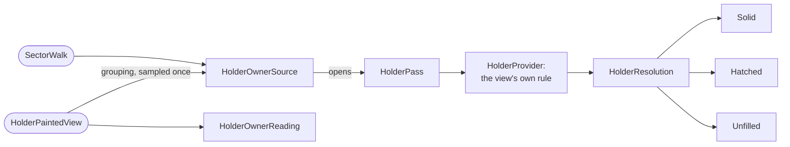

# Holder owners (`ownermap.owners.holders`)

The owner source of a layer painting holders:
blocs that hold a system through its colonies.
It answers the tier's [owner seams](../README.md) off one colony pass,
and leaves the layer to state only the rules that are its own.

Part of [the owner-map tier](../../README.md),
in Klark Morrigan's Utilities (KMU);
see the [mod README](../../../../../../../../README.md) for project context.

## Index

- [At a glance](#at-a-glance)
- [What a layer states](#what-a-layer-states)
- [One pass per walk](#one-pass-per-walk)
- [One system at a time](#one-system-at-a-time)
- [The three fill states](#the-three-fill-states)
- [What is not here](#what-is-not-here)

## At a glance

```mermaid
flowchart LR
    V([HolderPaintedView]) -->|grouping, sampled once| S[HolderOwnerSource]
    V --> R[HolderOwnerReading]
    W([SectorWalk]) --> S
    S -->|opens| P[HolderPass]
    P --> H[HolderProvider:<br/>the view's own rule]
    H --> HR[HolderResolution]
    HR --> Solid
    HR --> Hatched
    HR --> Unfilled
```

## What a layer states

A view painting holders implements `HolderPaintedView`
and states six parts:

- the grouping that folds factions into blocs;
- who stands together in a contest a band judges;
- its whole-sector holding rule, a `HolderProvider`;
- where its per-system rule is opened from, a `SystemHolderResolveSource`;
- how a band is counted, a `SystemRibbonPlanner` over one bake's inputs;
- how a bloc looks, an `OwnerReading` over a grouping.

`resolveViewReading` assembles them.
It samples the grouping once
and builds the reading and a `HolderOwnerSource` over that one sampling,
so the owners the source resolves and the names and shades the reading gives them describe one fold.
A view stating the two answers by hand would have to keep that discipline itself.

Every part is declared rather than defaulted:
each is one layer's rule,
and a default would put one layer's mechanic in front of every layer painting holders.

## One pass per walk

`HolderOwnerSource` opens a `HolderPass` over the walk the tier hands it:
the walk's own index,
the walk's visibility rule,
the layer's habitation knob,
and the grouping it was built under.
It asks every question about that walk off that one pass.

- **The holding** is the layer's `HolderProvider`, handed the pass and the spotlit bloc.
- **What stands where** is `OwnerMapInhabitation`, over the same pass.
- **Where the spotlit bloc lives** is `SpotlitBlocs`,
  asked only of the inhabited systems the holding left to nobody.
- **The band count** is the layer's planner, built over the same pass.

So the holder scan, the habitation scan and the band count read each system once between them,
and cannot disagree about a colony the habitation rule admits.
The pass is remembered per walk by identity,
which is what lets a bake in the same frame as the build count off the build's pass.

## One system at a time

A batch's walk is a later reading of the sector,
so the source opens a fresh pass for it
and opens the layer's `SystemHolderResolve` over that pass.
The resolve answers who holds a marked system.
Whether anybody lives there and whether the spotlit bloc does are answered off the same pass,
by the same projections the whole-sector scans used,
so a re-derived system cannot leave the map the rebuild put it on.

The holding rule is the layer's to keep in step with its whole-sector rule:
a resolve that lands a different bloc parts the refreshed cell from the rebuild around it.

## The three fill states

A bloc's footprint always traces as one border.
The fill is what varies per system inside it.
There are three states -
one default and two exceptions:

- **Solid** -
  the default.
  Any owned system not listed as an exception fills solid.
- **Hatched** (`contestedSystemKeys`) -
  a spotlit bloc's presence in a system it does not hold outright:
  "mine,
  but not only mine",
  drawn as a diagonal hatch.
  It states presence and nothing finer,
  so it reads the same whether a rival holds the system or nobody does -
  the alternative being a fourth state drawn for the handful of systems
  where a bloc's only colony is one no mechanic could weigh.
- **Unfilled** (`unfilledSystemKeys`) -
  held for border and label,
  but painting nothing inside the border.
  A rule that extends a bloc's holdings with systems it does not hold draws those systems this way.

When both exception sets are empty,
the whole cluster is solid.
The render split reads that as a fast path,
so a rule that never contests or unfills pays nothing for the split.

## What is not here

- The *rules* -
  the providers and resolves a layer's views state,
  and the mechanics behind them -
  are that layer's own.
  This package holds the assembly and never an answer.
- The *seams* the tier asks through are [`owners`](../README.md)'.
- The *render split* that turns the three states into triangles,
  hatch,
  and skipped fills is [`render.clusters`](../../render/clusters/README.md).
- The *colony pass* and the *grouping* are `ownermap.holding`'s.
