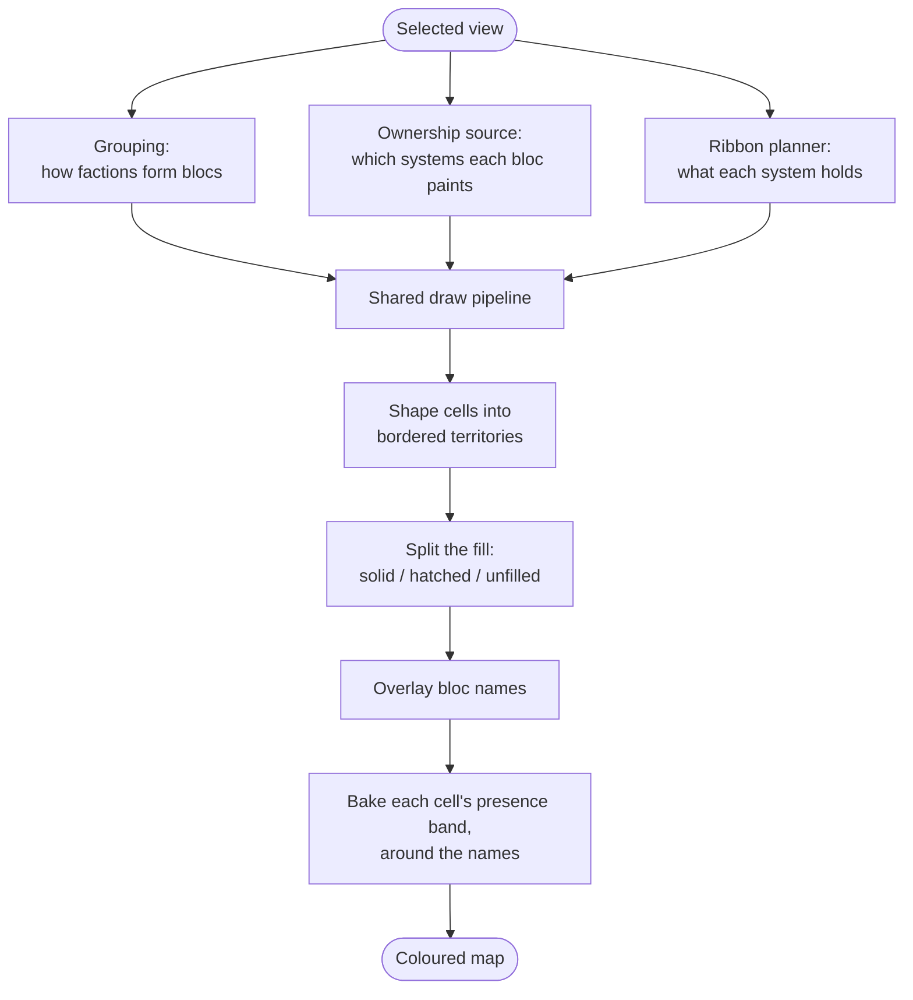

# Political map (`politicalmap`)

An overlay that colours the sector by who controls it.
Each bloc's territory shows as a filled,
bordered,
named cluster over the campaign map,
on the full map screen and on the intel screen's map preview alike.

The political map is one of the layers the tab strip offers;
picking its tab opens a view-selector radio in the body below.
The radio changes *what* "controls" means.
It does not change how the map is drawn.

Part of [map layers](../README.md);
see the [mod README](../../../../../../README.md) for project context.

## Index

- [What the player sees](#what-the-player-sees)
- [The views](#the-views)
- [Claim extensions](#claim-extensions)
- [How a view drives the pipeline](#how-a-view-drives-the-pipeline)
- [The ownership sources](#the-ownership-sources)
- [The claim mechanic](#the-claim-mechanic)
- [Where each part lives](#where-each-part-lives)
  - [Refresh](#refresh)
  - [Render orchestration](#render-orchestration)
  - [Hover tooltips](#hover-tooltips)
  - [The domination box](#the-domination-box)
  - [The status line and the colony vocabulary](#the-status-line-and-the-colony-vocabulary)
  - [The claims box](#the-claims-box)
  - [The presence ribbon](#the-presence-ribbon)
  - [Sidebar controls](#sidebar-controls)
- [When the map is rebuilt](#when-the-map-is-rebuilt)

## What the player sees

For each controlling bloc the overlay draws four things:

- a coloured cluster,
- a border around it,
- faint seams inside it,
- the bloc's name across it.

A system where somebody other than the bloc painting it also has colonies carries a fifth:
a banded stroke running inside that one cell,
a run per colony in the bloc's own colours,
so a cell reads as who is there and in what proportion without the fill having to be split.
A system its painter holds alone -
most of the sector -
bands too,
at one width a colony,
so its cell says how much is there without out-shouting the contested ones.

The tab body picks the view by radio,
and a filter picker below it can spotlight one bloc.
When a bloc is spotlighted,
the rest fade into a muted background.
The radio always lists the views in the same order:
**Factions**,
then **Alliances** (only with Nexerelin),
then **Claims**.

The controls read and write one shared set of values,
so the two screens the overlay draws on always agree on what is painted;
only which tab each screen has lit is its own.
The box those controls sit in -
where it anchors on each screen,
and how it folds away -
is [the sidebar](../base/sidebar/README.md).

## The views

A view is a small set of rules on top of one shared draw pipeline.
Each view answers four questions,
and the pipeline paints the answer without knowing which view asked:

- How do factions group into blocs?
- Which systems does each bloc paint?
- What is in a system,
  for the presence band inside each cell?
- How is each bloc styled and named?

| View | Groups by | Paints | Spotlight targets | Needs |
| --- | --- | --- | --- | --- |
| **Factions** | each faction on its own | held territory, per faction | any faction | always (default) |
| **Alliances** | allied factions fused per alliance | held territory, alliances as one bloc | alliances only | Nexerelin |
| **Claims** | each claiming faction on its own | claimed systems, per faction | any faction that claims a system or lives in one | always |

Notes on each:

- **Factions.** The plain case.
  Every faction is its own bloc.
  Only genuine independent space fades to the muted style.
  A bloc is named after its faction.
- **Alliances.** Allied factions merge into one coloured,
  named cluster per alliance.
  Unaligned factions keep their own border and name.
  Two toggles fade a non-allied faction:
  *Mute* dims it,
  *Desaturate* makes it read as backdrop.
  *Desaturate* starts on so the alliances read as the figure without a settings hunt;
  *Mute* starts off.
  Turn both off and a lone faction looks exactly as it does on the Factions view.
  A sector holding no alliance yet fades nothing whatever the toggles say -
  there is no figure for a backdrop to sit behind -
  so the view reads as the Factions view until the first alliance forms.
- **Claims.** Shows the vanilla "system claimed by faction" mechanic -
  the same claim the colony-survey panel warns about.
  Every claimed system is painted solid in its claimant's colours.
  There is no alliance grouping here.
  The spotlight list ranks by claim count and market size rather than by domination,
  and it takes one faction the general rule below would not reach:
  a claimant holding no colony anywhere lives nowhere and paints here all the same,
  so it is listed on the strength of its claims.
  Under the default claims-descending sort the rows greyed for claiming nothing form a tail below the claimants;
  sorting by name interleaves them.
  A claimant's systems already share one border and one colour with no filter on,
  so what spotlighting adds here is the contrast:
  the picked claimant keeps its full strength
  while every other claimant fades into the muted background.
  Systems the pick *lives in without claiming* keep their strength too -
  in the neutral,
  unclaimed paint they carry off filter,
  never the pick's colours -
  so a faction that claims nothing still shows where it is while showing that it claims none of it.
  Nothing hatches:
  a system has exactly one claimant,
  so no claim can be contested the way a held system can.
  Hovering a system explains its claim:
  who holds it,
  who stands in the holder's alliance,
  who is on good terms with it without standing in that alliance,
  who contests it,
  who is present but can never claim it,
  and whether the hold was won on market strength or imposed by decree.

## Claim extensions

The Factions and Alliances views do not only paint held cells.
A system a faction *claims* but does not *hold* joins that faction's territory drawn empty:
inside the border and under the faction's name,
but with no fill.
The Claims view instead paints those same claims solid.
Why a claim resolves this way is [the ownership sources](#the-ownership-sources);
how the empty fill is drawn is [cluster fills and borders](../ownermap/render/clusters/README.md).

## How a view drives the pipeline

Every view resolves ownership through one seam.
The pipeline reads who-paints-what from that one source,
and never branches on which view is active.

The bands come after the names rather than before them because they are laid *around* them:
a name is fitted inside the border its cluster's cells trace,
so it has no place until the cells are shaped,
and a band baked before that would run under a word.
Baked last,
each band carves the names' boxes out of its cell's ring and lays its runs along what is left -
or carves nothing,
where the player would rather have the whole band and let the name draw across it.
Either way the pass runs last,
so the ordering is what makes the choice available rather than what settles it.

What changes between views is only those three inputs;
from the seam on,
every view shapes,
fills,
bands,
and labels identically.
The sources themselves are [below](#the-ownership-sources);
the seam they answer and the three fill states are [ownership resolution](../ownermap/owners/holders/README.md).

The third input is the second one layer along:
a view's cells are painted by some mechanic,
and its bands have to be *counted* by that same mechanic or they contradict the fills they sit inside.
It carries no default on the view seam,
deliberately -
a default would name one mechanic's planner in front of every view,
including the ones that mechanic does not paint.
The contest-painted views answer it once between them on `DominancePaintedView`,
and the claims view answers with its own.

The spotlight list runs on the same principle one level down.
`OwnerPaintedView` asks a view for its picker -
the blocs on offer *and* its mechanic's vocabulary for ranking them -
so the metrics a view's rows carry can never drift from the modes offered to sort them by,
and the sidebar above passes the pair on without naming either.
The shared assembly then widens that vocabulary by one,
which the standing ranking below covers.
Factions and Alliances are painted by the same contest,
so `DominancePaintedView` answers that once for both
and leaves them only the one thing they differ on,
which is the Spotlight targets column above.
A view painted by another mechanic implements the seam directly
and pairs its own list with its own vocabulary rather than widening theirs.

A vocabulary states only its numbers,
the key and label each is offered under,
and the order ties break down them.
What a mode then is,
is `BlocMetricSortMode`;
how its declaration becomes a ranking -
the chosen metric first,
the rest of the chain behind it,
then the name and the bloc ID -
is `BlocSortModeComposer`.
So the numbers stay one layer's while the shape of the ordering,
and the tail that keeps a fully-level pair from reshuffling,
are the same under every view.

One number is not one layer's,
though:
a bloc's whole-sector colony size is the same sum off the same habitation projection whichever mechanic paints the map.
It is stated as a capability the metrics opt into,
`SizedBlocMetrics`,
and its mode is asked for from `SharedBlocSortModes` rather than declared twice.

Where a bloc stands with the player is not a metric at all.
It is read off the sector rather than folded over systems,
it is the same fact under every view,
and a bloc is one faction or several -
so it is a *range*,
the lowest and the highest of its members' standings,
with each end in the shade the game itself paints that relation.
`BlocStanding` names the three positions a bloc can hold:
measured between those two ends,
the player's own bloc -
the point the scale is measured from,
so it holds the top of it and draws no number -
and unreadable,
a bloc whose every member is an ID the sector cannot look up,
which belongs past everything that was read rather than ranked as though it were neutral.
Sealed over the three,
because the two that draw nothing sit at opposite ends
and one value standing for both would have to be asked a second question to learn which end it meant.
`BlocStandingReader` is the fold:
it recognises the player's own bloc through the painting grouping -
so a player faction inside an alliance is recognised as that alliance -
and otherwise folds the membership that grouping names,
passing over any member the sector cannot answer for.
Its sector reads sit behind one seam,
so the fold itself is plain arithmetic.

`BlocStandingSortMode` ranks by that,
and being outside both vocabularies is what shapes it.
It has no numeric chain of its own to fall through,
so it leads with the three positions as one scale -
the player's own bloc above everything measured,
an unreadable one below -
then the low end of the range,
then the high,
and then goes straight to `BlocSortModeComposer.appendSharedTail`,
which exists for a primary key the metric assembly cannot express.
The case ordering is part of that primary key,
so the player's bloc leads under the default direction and trails under the flip
rather than being the one row the direction control does not govern.
Its row draws the signed reputation,
one number where a bloc's members agree and both ends joined around a separator where they do not,
each in its own relation's colour.
The standing is read live at comparison and draw time:
the picker read is memoised against settings and grouping,
not reputation,
so a snapshot would hold the ranking still until some unrelated knob moved.

It is offered from the shared assembly rather than from either vocabulary,
which is the same boundary one layer up:
a vocabulary declares the numbers its own fold computed,
and the assembly is the one point every view's read passes through holding both the sector the standing is read off
and the grouping a bloc's membership is named by.
So each enum stays the layer's own half,
the standing joins it behind those numbers on every view,
and a save that stored it reopens on it whichever view is active -
the key being one across all three,
the way every other mode's survives a view switch.

What every picker lists is who *lives* somewhere the map draws,
which is the same reading of a system the cells are painted from and the bands counted from -
not who the layer's mechanic weighed.
So a faction whose only colony the economy never registered is offered,
and so is **Neutral**,
which is what a revealed decivilised world is owned by.
A bloc whose only holding is a derelict nobody lives on is not:
a spotlight lights territory,
and there is none to light.

A player who has switched *Decivilised systems - should draw territory* off has made such a world derelict-shaped for this purpose,
so the rule just stated carries Neutral out of the picker wherever those worlds were its only presence.
That is the rule applying rather than a loss to make up for:
switching it off is the statement that such a world is nobody's presence,
and there is then none to light.
Neutral stays listed wherever it holds something else - an economy-listed station among them.

A listed bloc that paints nothing on the layer greys,
and stays pickable:
it is listed because it is present,
greyed because there is nothing here to light.
What "nothing" counts as is the layer's own metric -
no claim on Claims,
no dominance weight on the two the contest paints -
so it is one rule read against whichever number that layer paints by.
The bloc's metrics carry the answer,
through `PaintingBlocMetrics`,
which a picker of painters opts into and any other picker leaves alone.

## The ownership sources

Three providers answer the [ownership seam](../ownermap/owners/holders/README.md),
all of them this layer's own and all in `holders`:

- **`DefaultHolderProvider`** -
  held systems from the live economy.
  No view resolves through it bare:
  the source below wraps it for the Factions and Alliances views,
  and the layer hands it to the tier as the holding the diagnostic overlays read.
  Off filter,
  each system goes to its single strongest owner,
  with no exceptions.
  Who may *be* that owner is settled with the tie-break,
  as `HolderRankingRules` off the pass:
  `neutral` -
  the placeholder vanilla hands every abandoned station,
  derelict and collapsed colony to -
  is barred from the contest,
  so it can neither take a system from a bloc that scores nor win a tie against one.
  Barred from winning is not barred from holding:
  where nothing else is present the ranking reopens,
  and a system only `neutral` lives in keeps its fill,
  border and label.
  The bar is on the candidate and never on the weight,
  so every score the map and the picker show is the one the weighting produced.
  Under a spotlight it switches to the presence-aware resolver:
  the chosen bloc stays drawn wherever it holds a colony -
  solid where it wins,
  hatched where it does not.
  Presence there is read off the colonies rather than off the weights,
  because every term of a weight is economy-fed:
  a bloc whose only foothold in a system is a station the economy does not list wins nothing and still lives there,
  so it draws hatched instead of dimming with the background the player picked it out of.
  The weights are left alone -
  widening *them* would put such a bloc into the ranking that hands out systems,
  and a spotlight must never move a fill.
- **`ClaimAugmentedHolderProvider`** -
  the Factions and Alliances views' source,
  through `DominancePaintedView`.
  It takes held systems from the source above,
  then folds in each claimed-but-unheld system as an *unfilled* extension of its claimant.
  The claim carries the same bloc key as that faction's held systems,
  so the geometry fuses held and claimed cells into one bordered cluster.
  A system already held keeps its solid fill:
  the held signal wins.
  Under a spotlight,
  a claim shares the fate of its bloc -
  the spotlit bloc's claims stay at full strength,
  every other bloc's claims fade with its held cells.
- **`ClaimsHolderProvider`** -
  the Claims view's source.
  Every claimed system is painted *solid* in its claimant's colours,
  with nothing held-derived.
  Under a spotlight the chosen bloc's claims stay at full strength and every other claimant's fade,
  the same trade the source above makes.
  A system has one claimant,
  so nothing is ever contested or unfilled here:
  the resolution has no exceptions and takes the solid fast path on or off filter.

Both claim-reading sources get their claims from `FilteredClaims`,
so which claims a spotlight moves is answered once rather than once per source.

An incremental refresh re-derives one system at a time through the tier's per-system seam,
which this layer answers with `DominanceSystemHolderResolve`,
also in `holders`:
the market contest asked of one system,
under one weighting rule sampled per batch,
so a single-system refresh lands the bloc the bulk pass would have.

## The claim mechanic

Claims are resolved by `SectorClaims`,
in `claims`.
It is the claim twin of `dominance`'s `SectorPolitics`.
Where `SectorPolitics` reads who *holds* a system,
`SectorClaims` reads who *claims* it,
then routes that claimant through the same grouping and palette.
So a claimed system and a held one of the same bloc end up equal,
and fuse downstream.

The claimant comes from KMLib's `ClaimReader` port -
the usual way KM code inverts a third-party read that only answers inside a running game.
What the two claim-reading sources hold is not a reader but a `ClaimReaderSource`:
a reader answers off the colonies behind it,
so one is opened over the pass being resolved and discarded with it.
A reader kept for the life of the game would go on answering off a sector that has since moved on,
and would walk every system again for colonies the pass has already read.
`PassClaimReaders.openClaimReaderOver`,
in `claims`,
is what opens one,
so the walk and the pass's own `ColonyKnowledge` travel together
and the claim half is always shown the sector the held half was.
The reader is handed that knowledge through KMLib's `KnownColonyReader` port
rather than naming the rule itself:
what may be told of a colony is the map's judgement,
and a library reader given one to invent would be answering a question nobody asked it.
Its vanilla binding mirrors `Misc.getClaimingFaction` step for step rather than calling it,
because one computation has to answer *who* claims a system for the fills here
and *why* for the claims layer's hover box.
Sharing it is what stops the fill and the box over it naming different claimants -
on the memory-flag override,
and on the iteration-order tie the mechanic settles equal scores by.

Step for step describes the *claimant*,
which is all the fill takes.
The standings the same read carries for the hover box go wider than vanilla scores,
in two directions,
and neither can be seen from here.
The player's colonies are scored,
forced non-territorial so they can never move the winner,
because a box that dropped them would report a system the player holds a colony in as one they have no presence in -
and a faction barred from claiming never becomes a claimant.
A colony the economy does not list at all is carried too,
as vanilla builds Galatia Academy,
because a box that dropped it would leave a station the player can see on the map out of the account of who holds the system -
and it is carried the way a concealed market is,
scored for nothing and counted toward nothing,
so it can neither become a claimant nor move the score of one.

Vanilla resolves a claimant two ways:
an explicit `$claimingFaction` memory flag,
or the top territorial market in the system.
The map shows exactly what the mechanic resolves and invents nothing.
A marketless system (unpopulated or decivilised) only resolves through the flag,
which is rare in practice.
So claims mostly attach to inhabited systems.

**Inhabited does not imply claimed**,
and the reasons are worth naming exactly,
because they are easy to get wrong.
`Misc.getClaimingFaction` walks `getEconomy().getMarkets(location)` and skips a market on three separate tests:

| Test | What it excludes |
| --- | --- |
| `curr.isHidden()` | pirate and Path bases, which `PirateBaseIntel` and `LuddicPathBaseIntel` both create with `setHidden(true)` |
| `curr.getFaction().isPlayerFaction()` | every player colony, before territoriality is even read |
| no `punitiveExpeditionData.territorial` | the Remnant, derelicts, scavengers, mercenaries, the Dweller, `neutral`, and the rest of the thirteen vanilla factions carrying no such block |

And the walk reads the *economy's listing*,
so a colony never registered with it -
as vanilla builds Galatia Academy -
is not seen at all,
whatever its owner.

A system that resolves nothing is left unheld.
That is the mechanic answering correctly,
not a gap to paper over here.
What must not follow from it is the *render* reading the missing holder as an empty system:
the factionless classification is made against the pass's inhabited-system set instead,
see [`render.style`](../ownermap/render/style/README.md).

## Where each part lives

This layer's rules are divided by *mechanic*,
not by view:
`dominance` is the market contest and `claims` is its peer,
the vanilla claim mechanic.
Each holds its rule,
its whole-sector stats and the sort modes over them,
its band ranking and its hover box.
The views and the holder sources sit beside the mechanics rather than inside one,
in `views` and `holders`:
they are this layer's answers to the tier's seams,
and they compose the mechanics -
the Factions and Alliances holding folds claims onto held dominance -
so shelving them under either mechanic would make that mechanic name the other.

| Package | What is in it |
| --- | --- |
| *(top level)* | the tab (`PoliticalMapLayer`), what it stands up on a sector (`PoliticalMapStanding`, `PoliticalMapInstaller`) |
| `views` | the three views (`FactionsView`, `AlliancesView`, `ClaimsView`), the contest-painted views' shared answers (`DominancePaintedView`), and the alliance-only body controls (`AllianceBodyControls`) |
| `holders` | the layer's answers to the tier's holder seams: the three [ownership sources](#the-ownership-sources) and `DominanceSystemHolderResolve` |
| `dominance` | the market contest: the pass, `SectorPolitics`, `FilteredPolitics`, `SystemDominance`, the tie-break and the ranking rules, `BlocCandidacy`, the stats and sort modes |
| `dominance/weighting` | what one colony is worth (`MarketWeights`, its breakdown and factors) and the rules it is weighed under, and the footprints folded from them (`KnownMarketFootprints`) |
| `dominance/standings` | one hovered system's ranked standings, per group and per faction |
| [`dominance/ribbon`](dominance/ribbon/README.md) | the band ranking on a cell the contest painted |
| `dominance/tooltip` | the [domination box](#the-domination-box) |
| `claims` | the claim mechanic: `SectorClaims`, `FilteredClaims`, `PassClaimReaders`, the stats and sort modes |
| [`claims/ribbon`](claims/ribbon/README.md) | the band ranking on a claims-layer cell |
| `claims/tooltip` | the [claims box](#the-claims-box) |
| `tooltip` | what both box families share: `PoliticalMapCellTooltip`, `CoreTerritoryHeading`, the contest wording, and the live-visibility claim read |
| `refresh` | what repaints the overlay while the campaign runs ([refresh](#refresh)) |
| `render` | the player's draw-order choices, read as the tier's band layout |

What sits in [`ownermap`](../ownermap/README.md) is what every mechanic shares:
the view seam itself,
the pipeline the seam feeds,
and the vocabulary both sides state their answers in.
That tier is not this layer's,
which is why it is a package of its own,
and the build keeps it from naming this one.

- **[Ownership resolution](../ownermap/owners/holders/README.md)** -
  the per-view ownership seam
  and the three fill states.
- **[Cluster fills and borders](../ownermap/render/clusters/README.md)** -
  how cells become each bloc's coloured cluster,
  border,
  seams,
  and split fill.
- **[Render style layer](../ownermap/render/style/README.md)** -
  the four categories this map divides the cells into,
  and how player settings become each territory's colours,
  widths,
  and opacities.
- **`ownermap/render/labels/anchor`** -
  what a cluster's name reads and what shade it draws in:
  the active view's name for the bloc,
  and the outer border its group inherits.
  Both are resolved here and handed to the framework's overlay,
  which places and draws them.

Everything above is drawn over the systems the framework's `base/visibility` admits,
shaped out of [cell geometry](../base/geometry/README.md),
styled against the [theme records](../base/theme/README.md),
named by the [cluster-name overlay](../base/labels/README.md),
and hovered through `base/hover` -
all of which belong to the framework rather than to this layer:
they work on an opaque owner,
and the views decide that the key names a bloc.

The supporting parts take a subsection each below:
this layer's `refresh`,
the render seams it answers,
the hover boxes,
the presence ribbon,
and the sidebar.

### Refresh

In `refresh`:
`PoliticalMapStalenessSource` -
what this layer counts as a change nobody fired an event for,
answered into the framework's poll -
and `PoliticalMapSectorWatcher`,
the script that runs that poll.
The watcher is this layer's own subclass of the substrate's abstract `MapLayerSectorWatcher`
because the engine removes transient scripts by exact class:
a script class shared between layers would let one layer's install or removal evict another's poll.

The staleness source's four baselines are the staleness of this layer's own picture and nothing else:
the sector-wide sweep that records what each system's own inhabitants can see is [the substrate's](../README.md),
the register it writes being shared by every map family rather than this one's.
The event listeners record that observation for the one system they name (`MarketPoliticsRefresh`),
the event being the moment the observation is worth dating rather than a poll cycle after it -
and a decivilisation is recorded on the `aboutToBe` phase,
since once the colony has died there is nobody left to date what it vouched for.
Where an event fires too late to read the system as it was -
an abandonment,
a Nex transfer -
the comment at that listener says so,
and the colony keeps the sighting it already had.

The listeners sit in `refresh/listeners`,
and `PoliticalMapInstaller` registers and removes all five together.
Four are driven by vanilla events.
The fifth,
`PoliticalMapMarketTransferListener`,
answers a colony changing hands,
which vanilla fires nothing for.
It implements KMU's own `kmu.starsector.listeners.MarketTransferListener` and names no Nexerelin type:
`kmu.mods.nexerelin.NexerelinMarketTransferRelay` -
one per sector,
installed by `KMU_ModPlugin.installMapLayers` through `NexerelinInvasionListenerInstaller` -
forwards Nexerelin's transfers to every `MarketTransferListener` on the sector's listener manager.
That keeps `kmu.maplayers` closed to optional-mod imports;
on an install without Nexerelin the listener is registered and never called.

Beside those sits `PoliticalMapRefreshSignal`,
the coarse changes only this layer can raise on the shared board,
alliance membership being the one.

### Render orchestration

The frame,
the order the sub-layers stack in and the incremental refresh are the tier's -
see [the owner-map tier](../ownermap/README.md#where-each-part-lives).
What this layer hands over are its answers to the tier's render seams
([what a layer supplies](../ownermap/README.md#what-a-layer-supplies)),
all of them where `PoliticalMapLayer` builds its renderer:

- **`PoliticalMapBandLayoutReader`**,
  in `render` -
  which side of the map's own nebulae each choosable sub-layer paints on,
  read per pass from the player's four **Nebula draw order** settings.
- **`SharedOwnerMapHoverGates`**,
  the tier's -
  whether the layer answers the cursor at all.
  This layer has no hover switches of its own,
  so it reads the one shared set of owner-map switches.
- **`SpotlightPreviewHighlightRenderer`**,
  the tier's -
  what hovering a row of the spotlight picker lights,
  built over this layer's ID and `KmuMod.MAP_STORE_NAMESPACE`,
  the namespace its picker stores its picks and reports its hover under.
- **`DefaultHolderProvider`** and **`DominanceSystemHolderResolve`**,
  in `holders` -
  the holding the diagnostic overlays read,
  and the per-system resolve an incremental refresh uses.

### Hover tooltips

What this layer says about the hovered system,
each view injecting the explanation of the mechanic its own fills were painted by into the framework's hover box:
`SystemDominationTooltip` -
the ranked standings behind a faction or alliance fill -
and `SystemClaimTooltip` -
the scored claim contest behind a claims fill,
its claimant over the factions standing in its own alliance,
those on good terms with it outside that alliance,
the rivals who could have taken the system and the factions present that never could.
The Factions and Alliances views each hold a domination box of their own,
bound to that view's grouping,
so the standings are ranked under the view that painted the fills beneath them
rather than under whichever view a shared read reports.
Both are written from `FactionTooltipLine` (a faction as something a block lists),
`TermTooltipLine`
(one term of a number, named and uncrested, whichever account is being broken down) and `FactionTooltipBanner`
(a faction as a verdict over the whole system),
`StandingRowResolver` (the ranked groups as entries),
and the core-territory heading (`CoreTerritoryHeading`) and status lines.

All of them sit on `PoliticalMapCellTooltip`,
which binds the two live reads every political box places blocs by
(the claim read for the whole layer, and the `BlocRelations` pair sampled per hover) and heads its boxes with the decree holding the system:
any box may have to say a system is held by decree,
and a decree resolved -
or drawn -
one way on one view and another way on the next would answer one hover two ways a keystroke apart.
A box whose own body already states the decree says
so (`isStatingCoreClaimInBody`) and goes without the heading,
so the one fact is met once rather than twice in a single hover.
Both reasons a box goes unheaded -
no decree at all,
and a decree the body states itself -
are settled inside `CoreTerritoryHeading` and answer alike,
so no call site can drop the heading by claiming there is no decree.

### The domination box

`SystemDominationTooltip` lists every faction holding the system over the colonies its score was summed from,
and each colony over the factors behind its weight,
down to a colony's patrol tiers.
It composes one account,
read to whatever depth was asked for,
and the blocks cut it:
who holds the system at the shallowest,
the colonies a tier down,
their factors a tier below again.
One tree read to four depths rather than four bodies,
so no two depths can describe one system differently.

Composition stops where the cut would,
this layer's deeper tiers being the expensive ones.
The account resolver is built only where the level shows a line of one
(`isAdmittingAccounts`, gated in `SystemStandingsTooltip`),
so the shallowest level makes no `readWeightBreakdownsByFaction`,
no unweighed-colony read and no `SystemColonyReading` walk at all -
the walk behind those being the most expensive thing a hover does,
and not one line off it drawn at that level.
Below it the same rule runs on inside `MarketWeightRowResolver`:
a colony's factors are worked out only from `MARKET_STATS`,
its patrol tiers only at `PATROL_DETAILS`.
What is *drawn* stays the cut's alone,
so the box a level shows is identical either way.

It sits on `SystemStandingsTooltip`,
which settles everything but that nesting -
one pass read from the active view,
the ranking,
the status line,
the headings and which of them a group falls under,
the lines naming the blocs and the member factions inside them.
What the box adds is one answer:
what to hang beneath a faction as the account of its score (`FactionAccountResolver`),
asked for once per paint and applied by `StandingRowResolver` where the standing
and the line named from it are both in hand,
so no faction's colonies can be listed under another's name.
Every box on the shape answers it rather than inheriting an empty one:
a box that hung nothing would draw the same thing at every level
while `F1` went on offering to open it up.

Beside it every box states how far that account reaches (`resolveDeepestAccountLevel`),
which is where the cycle wraps for this box:
the domination one fills the levels out at `PATROL_DETAILS`,
and the claims box beside it stops a tier higher.
`PoliticalMapCellTooltip` joins that constant with whatever its shape's own read found for the hovered system,
so a box states only the first and both shapes combine them the one way.

Where each ranked group is listed is `StandingBlockRouting`'s one answer,
taken per hover over the closed set of blocks `StandingBlock` names -
which carries each block's heading too,
so the order they read in is that declaration order
rather than a sequence of calls that could drift from it.
Why the blocks nest as they do is the routing's own doc;
what it costs is here.

The outer axis is `BlocCandidacy`,
read off the pass's own grouping so the box bars exactly who the fills bar -
and that is the one place the box and the fill part company.
A system whose only presence is `neutral` is still painted,
bordered and labelled for it,
while the box drops `Dominated by:` entirely and lists it under `Non-political:`.
Naming the placeholder as holding the system is the statement the block exists to stop making,
and saying nothing about who holds a system nobody political holds is the truer answer.

Below the holder the split is `ContestSides` -
the one placement every surface reporting a contest routes its blocks through,
over the `BlocAffiliation` the bands judge their contest by -
the live alliance set,
which every view of this layer answers `resolveContestGrouping()` with
and the box takes through an injected `HolderGroupingSource` sampled per hover -
so no two surfaces over one system can put a bloc on different sides of it,
and a box cannot disagree with the band beneath it about who is a rival.
The headline stays on the group the map painted the cell for rather than on its alliance,
which is what keeps the box an explanation of the cell beneath it -
what is taken from the alliances layer is the shape and never its grouping,
which would merge allied runs,
fills and rows.
Only the holder's allies are lifted out;
two rivals allied with each other stay contested,
the block stating relations to the group that holds the system.
It is naturally empty on the alliances layer,
where members are already one bloc,
and on an install with nothing grouping factions -
dropped there by the same rule that drops any other block standing over no entries.

What the block left standing against the holder is *called* is the one thing about it an install decides (`ContestWording`).
Where a mod transfers systems between factions,
those blocs really are competing for the one under the cursor and `Contested by:` reports something the player can watch play out;
where nothing transfers anything,
the sector's holdings are the ones it was generated with and stay that way,
so the same blocs are neighbours indefinitely and the block simply says `Present:`.
Which install this is comes from `NexerelinContestWording`,
bound at each box's composition root beside the alliance gate (`ContestWordingSource`) and sampled per hover -
the boxes stand in static fields,
so one resolved at construction could settle on the empty mod set of a game that has not stood its own up yet
and head every hover of the session that way.
Nothing else in the box moves with it:
which blocs land in the block, their order and their scores are all settled before the heading is drawn,
and the blocks above it name relations that hold whether or not anybody can act on them.

Inside that split,
disposition sorts what alliance left standing against the holder.
`BlocFriendliness` answers whether two blocs are on good terms -
every faction of the one above `RepLevel.NEUTRAL` toward every faction of the other,
read over both whole memberships
(`HolderGrouping.resolveMemberFactionIds`) rather than over who happens to stand in the hovered system,
so the same two blocs cannot come out friendly over one system and contesting over the next.
The threshold is the base game's own step from indifference to goodwill (`StarsectorFactionRelations`, KMLib),
which is what makes the block explicable:
a cut taken anywhere else in the scale is one the player is never shown.
What the four rules are is `StandingBlockRules`,
bundled because a friendliness read over one grouping beside an affiliation off another would place blocs under an alliance set no fill was resolved with.

A bloc its members do not agree about is not listed whole under either heading.
It folds into both instead,
each of its rows holding only the members on that side (`RoutedStanding`)
and stating a `StandingFraction` saying how far its heading reaches -
so the bloc stays one named thing under both
and nothing is orphaned from the grouping the map paints that territory by,
where a majority or a lead-member reading would put a heading over factions it is false of.
Which members split a bloc is read off those standing in the hovered system,
a side with nobody in it heading a row with nothing beneath it;
where they agree,
the whole-membership answer places the bloc,
so a bloc whose sour member holds nothing here still contests the system.
`HOLDER` and `ALLIED` never split,
being placed by membership rather than by relation,
and under the identity grouping every bloc is a singleton,
so nothing splits there at all.

One rule covers every fraction:
an alliance row counts its own members,
a faction row counts the holder's,
and both are counted over whole rosters so an alliance reads the same over every system it holds.
Which of the two a row states is `StandingRowResolver`'s call,
that being the one side knowing a group's kind -
a lone-faction group is that faction under another name and states the faction's reading.
Both ends of the range are omitted,
`0/total` and `total/total` saying exactly what the heading above already did,
which is why a faction against a lone holder never draws one
and the whole device belongs to the alliances view.

What the deeper levels offer the player is named there too,
once for the whole cycle:
"score contributions",
which the framework puts at the foot of the box beside the key that advances it.
Named here rather than by the framework because only this layer knows what is down there,
and once rather than per level because the account is the same thing at every press.
It is offered only where the system ranks somebody,
since the deeper tiers account for the colonies behind the standings
and a system ranking none gives them nothing to account for.
That is asked of the ranking and not of the status line above it,
the box reading the system through one `readRankedStandings`:
the line and the listing answer different questions of the same pass -
whether anybody *runs* the place,
against everybody the player may be *told* about -
so a system whose colonies have all collapsed is headed **Decivilised**
and still ranks whoever holds them,
and those colonies are exactly what a deeper level opens up.
Judged off the line,
that system -
the one whose whole account is the collapse -
is the one the detail is withheld on.

The parts come from the very arithmetic the scores were summed over
(`KnownMarketFootprints.readBreakdownByFaction`, which folds what `MarketWeights` works out per colony - the base size, station and patrol factors and the stability cut each takes, plus the grid a worth in size points is rounded onto),
so the lines always add up to the number the ordinary box and the fills show.
`MarketWeightRowResolver` decides which lines a colony breaks into
and `MarketFactorText` how one line's numbers read -
a rating as the player set it,
a weight on the grid the rest of the box counts in,
no cut that took nothing,
and a patrol tier's rate stated apart from the total it explains
so the box draws the arithmetic quieter than the finding.
Every colony line leads with the glyph the sector map marks that colony's entity with.
What that mark is for and why it takes the line's own colour
rather than the shade the map paints it are `CellTooltipMark.resolveMarkForMapIcon`'s,
stated there once for every surface that lists entities.
What is this layer's is where the glyph comes from:
name and glyph travel as one `EntityNameplate` (KMLib's `kmlib.starsector.entities`),
read on the walk that counted the colony
(`MarketWeightBreakdown.marketNameplate`, through `Markets.readNameplate`) rather than looked up again where the line is drawn,
the same rule every other part of the account is read under:
the box reads what the pass recorded,
so there is no second market lookup free to answer for a different one -
and no way for one colony's name to be drawn beside another's glyph,
the pair never being apart.

The station line beneath a colony takes one on the same terms
(`StationFactor.stationNameplate`, read through `EntityNameplates.readNameplate` where the connected-entity scan answered the token rather than beside the name, so the glyph can only be the station whose bonus is stated by it):
it is the one term of the account named for a thing on the map
rather than for a piece of arithmetic,
and the mark settles more there than a level up,
a system's stations being told apart on the map by their glyph as much as by their name.
Every other line beneath a colony stays unmarked -
a stability or a size has nothing on the map to point at.

Where that station shares the colony's name the line says which of the two it is about
(`MarketFactorText.formatMilitaryStationName`).
A colony on a station is one place to the player and two entries to the economy -
the colony and the military station defending it -
which vanilla names alike,
so the account states the same words at two levels for two different things.
Both conditions have to hold:
the colony must itself be a station
(`MarketWeightBreakdown.isStationMarket`, read on the same walk that counted it, and the same reading the dominance tie-break prefers planets by) and the two names must match.
A planet colony that happens to share its station's name is two places the player can see apart on the map,
so a clarifier there would answer a question they never had.
It reads in the line's own colour rather than the qualifier's gold:
the parentheses already say the run is an aside,
and the gold is reserved for findings -
the words a colony's own line calls out,
the claims box's `(core)` -
which a disambiguation is not.

That box lists one kind of colony no score above it accounts for:
one the economy does not list,
which the weight read has nothing to weigh.
It is the other half of the one colony set the weighed read selects from -
the colonies the economy does not list
(`KnownMarketFootprints.readUnweighedColoniesByFaction`),
carried as an `UnweighedColony` -
a nameplate,
the colony's own ID,
and the two facts its line calls out that no weight would carry:
what kind of place it is and whether it conceals itself -
rather than as a zeroed `MarketWeightBreakdown`.
Zero weight is not absence on this side,
a weightless colony still marking presence and painting its system unopposed,
so a value that could be summed into a footprint would leave the pass one forgotten branch away from painting a system for a faction the mechanic never counted,
and a name with a glyph cannot be summed into anything.
It is named at the foot of the faction's list,
led by the map's glyph like any other colony -
it being the only trace of such a colony the player has beside the name -
at nought in the quiet shade,
and breaks down into no factors -
the same sentence the claims box speaks for a market its own mechanic never weighed,
and for the same reason:
the colony is there and it moved nothing,
which is the whole of what the account has to say about it.

Every colony line,
weighed or not,
says how old the box's news of it is where nobody is looking at the colony as the box is drawn
(`ColonyObservationNotes`, run onto the line as a grey remark through `CellTooltipEntryLine.notedWith`).
In sight the name stands alone;
out of sight it carries `last seen 34 days ago (c206.05.12)`,
closing the line past whatever qualifier it calls out -
the remark is about the box's account rather than about the colony,
and set ahead of the gold it would break a word like `abandoned` away from the name it qualifies.
Two things count as looking at it,
being the two routes an observation is ever made by:
the player's fleet is in the system,
or the system's own inhabitants can see the colony -
the owner-aware reading the visibility rule itself uses.
The notes pose that live reading
and the register's recall in the shared triad's terms (`ObservationRecency.resolveRecency`) and hand one axis,
under the colony's own `last seen` lead-in,
to the shared `ObservationNotes`,
which owns when a date is due and what it reads as.
The remark matters most for the colonies a revelation gate admitted on the strength of an observation -
a derelict,
a concealed base -
which would otherwise be listed exactly as a colony the player is standing over.
No visibility rule reads the time:
the moment being shown turned on how recent an observation was,
a colony would blink out of a box the player was reading it in.
Which is also why the remark is matched to its line by the colony's own ID
(`MarketWeightBreakdown.marketId`, `UnweighedColony.marketId`) rather than by name -
vanilla names a station colony and its defending station alike.

A faction whose only colony in the system is one of these is listed all the same,
at a nought of its own.
Presence and weight are two questions,
so the ranking (`SystemStandings`) is handed both:
who is in the system
(`HolderPass.readKnownColonyFactionIds` - the owners of everything the box may name, so no two boxes over one cell can name different factions) beside each faction's footprint,
and anyone present with no footprint takes a `PresenceOnlyFactionStanding`,
the sealed other half of `FactionStanding`.
Presence is read as the wider set rather than as whatever the weighing left over,
so nothing a weighed read comes to exclude can drop a faction out of the listing
while the band goes on counting it.
Nothing about the fill moves:
holding is resolved off the footprints,
which such a faction raises none of,
so its nought can neither take a system nor tie for one.
The nought reads in the quiet shade at both tiers
(`statesUncountedValue` again, and `GroupStanding.hasWeighedMember` for the bloc line over it) -
a bloc counts as weighed where any one member was,
so an alliance holding one registered colony beside two unregistered ones keeps an aggregate somebody worked out.

### The status line and the colony vocabulary

The status line above that listing (`SystemStatusRow`) answers a different question of the same colony rule,
and the two are meant to part over one shape.
It asks habitation -
whether anybody lives here -
where the listing asks what the player may be told about,
so a system whose only market is an abandoned station is headed **Unpopulated** over a box that names the station's owner at nought.
That is the true reading of a system with one wreck in it
rather than the contradiction the two lines look like side by side:
nobody has ever been aboard a derelict,
and somebody has seen it.
The cell under the box reads habitation too,
so the line and the backdrop it is drawn over always agree.
The one shape habitation admits that nobody runs is the collapsed colony (`ColonyKind.UNGOVERNED_COLONY`),
which is why the line reads the kinds out of that projection rather than asking its emptiness:
a decivilised world is still populated -
drawn as settled rather than dropped as empty space -
and still headed **Decivilised**,
since what it lacks is a polity and not people,
and the status row keeps its capitalised **Decivilised** for the banner it is.

Both boxes then say what they have found out about the place on the line naming it
(`ColonyQualifier`, gold, one read for the two families so neither can call a world decivilised the other lists as living).
Five words,
in a fixed order:
`claim holder` -
the finding the claims box leads with -
then the kind -
`abandoned` for a derelict,
`decivilised` for a collapse -
then `undiscovered`,
`hidden` and `unlisted`.
A collapse and a derelict reach a listing identically,
unowned and off-economy and at nought,
and nothing else on either line would tell them apart;
the last three are the three separate ways a colony can be out of plain view,
and one shared read is what keeps both boxes stating all three.

Two of the five never join what stands above them.
`undiscovered` displaces `hidden` -
an undiscovered colony is concealed from the player by that alone -
and `unlisted` speaks only where nothing above it held,
or it would repeat itself on every derelict and every decivilised world,
both being off-economy by construction.
The suppression is by the condition holding rather than by where a word ends up being stated,
which is what lets a station already called *Abandoned Station* say its word inside its own name
and still suppress `unlisted` below.

That name is the second place a word can be stated.
Where the colony is already called one of the five,
the occurrence *in the name* is drawn in the qualifier's gold
(`CellTooltipEntryLine.callsOutInLabel`) and nothing is repeated at the end of the line -
so the one shape that most needs telling apart from an ordinary colony is not the one the box says nothing whatever about.
The resolution is untouched:
the same words in the same order,
and a gilded word has qualified in every sense,
drawn somewhere else.
At most one stretch is gilded,
the first the name carries,
and the rest close the line as usual -
so an *Abandoned Station* the player has not found gilds **Abandoned**
and still reads **undiscovered**.
What counts as the name saying a word is `KmlibStrings.findWholeWordIndex`,
and what is drawn is the name's own spelling of it.

`hidden` is withheld from a colony the sector openly points at -
Galatia Academy,
whose station is permanently visible
while the market hung on it is a stand-in vanilla never registers with the economy
and marks hidden to keep off the books,
so it wears the identical flag a pirate base does for an entirely different reason.
Nothing on either market parts them,
so the exemption is an identity:
`OpenlyKnownColonyRegistry` holds the entity IDs `MapLayers` seeds it with beside a tag another mod hangs on content of its own,
and `OpenlyKnownColonyLookup` folds the answer by colony ID off the box's own walk.
The Academy then falls through to `unlisted`,
which is the separation the word was wanted for.
The exemption excuses that one word and nothing else:
the Academy is a hidden colony to `ColonyVisibility` still,
gated still,
and admitted still only by Ancyra settling the system.

Each box fills in a small `ColonyQualifierFacts` from what it holds -
the claims box off `MarketClaimBreakdown`'s admission,
handing its own `claim holder` wording (`POLITICAL_MAP_TOOLTIP_CLAIM_HOLDER`) in as the finding that leads,
since the shared resolver is the tier's and names no mechanic;
the domination box off `MarketWeightBreakdown.isHiddenMarket` or the `UnweighedColony` -
and the kind,
the discovery answer and the landmark answer come off the box's own walk of the system
(`SystemColonyReading`, whose `readConcealmentOf` gathers its two answers with the account's own concealment fact),
no row of either box carrying any of them.

### The claims box

`SystemClaimTooltip` opens every faction the contest names into the markets it holds the system with
and each market into the terms its claim score is built from -
one account,
read to whatever depth was asked for and cut by the blocks,
on the same terms as the domination box.
It sits on `SystemClaimContestTooltip`,
which settles the one read behind it,
the claimant,
the decree marker,
and the five blocks,
and leaves open only what hangs beneath a faction
(`resolveAccountEntries`, answered by every box on the shape).
It is asked at all only where the level shows a line of one (`isAdmittingAccounts`),
so the shallowest level selects,
ranks and words no faction's markets;
below it `ClaimScoreRowResolver` works out a market's terms only from `MARKET_STATS`.

That is also where this box's cycle wraps (`resolveDeepestAccountLevel`).
Vanilla settles a claim on a colony's size,
its garrison and how many colonies the faction holds beside it -
no patrol enters the arithmetic anywhere -
so the level below has nothing for this box to put in it,
and `F1` collapses from the market stats instead of offering a tier that would redraw the box unchanged.

That account is handed the whole `ListedClaimContest` rather than the scored read alone,
so the colony rule it draws under is the one the listing above it was projected under:
read afresh per faction,
an account would be free to withhold a colony the line above it had just named,
and to answer two factions of one box under two different rules.
Both relations to the claim holder travel in that same value and for the same reason -
the `BlocAffiliation` the blocks are routed against,
placed by the same `ContestSides` split the domination box routes its own blocks through,
and the `BlocFriendliness` bound to the hovered sector's own relations.
The pair is sampled once per hover as `BlocRelations`,
by the shape both box families share (`PoliticalMapCellTooltip`):
the alliance set comes off the injected `HolderGroupingSource` at that moment -
one held for the session would file a faction under the alliance it left an hour ago -
and the disposition off the sector being hovered,
so neither box family can sample them differently from the other.

Two axes place a faction into those blocks,
and how it stands to the claim holder is the outer one:
`Allied with the claim holder:` takes everyone standing with the holder by alliance
and `Friendly with the claim holder:` everyone else above `RepLevel.NEUTRAL` with it,
both whatever their eligibility,
and the two eligibility blocks divide what neither took.
Where a relation heading leaves the box unable to say which kind a line is,
the line says it (`non-territorial`) -
declared with the block rather than decided per block,
since it follows from what that block's own heading already states.
The four are a closed set (`ClaimContestBlock`),
the claim family's own sibling to `StandingBlock`:
each constant carries its heading,
the standings it selects out of the one `ListedClaimContest`,
and whether its lines carry that qualifier,
so the order they read in is a declaration rather than a sequence of calls,
and a fifth block cannot be added to one family and silently skipped in the other.
The sets stay apart because the blocks are not the same blocks -
these name factions by how they stand to a claim and end on eligibility,
those name blocs by how they stand to a holder and end on candidacy.
The claim block itself is outside the set:
it names the claimant rather than selecting over standings,
and what it lists turns on what the banner above it said.
Why the relations outrank eligibility,
why disposition sorts inside alliance,
and why an install without Nexerelin needs no branch are all `SystemClaimContestTooltip`'s to state.
It is also where the layer's heading is declined for both of them:
the claim line names the decreed holder and marks the hold,
so these are the two boxes that state the decree themselves.

Two blocks the domination box has do not appear here,
and both absences are the claims layer pinning the identity grouping.
A standing is always a lone faction,
so no bloc can be of two minds,
nothing folds into two headings,
and no row states a fraction.
And the placeholder owner is never admitted to the claim mechanic,
so it arrives ineligible and `Non-territorial:` is already the true statement about it -
where the fills,
resolved per bloc and per candidate,
needed `Non-political:` to say as much.

`ClaimScoreRowResolver` decides those lines:
the faction's markets in the order the mechanic itself would settle them -
strongest first,
a tie falling to the earlier place in the economy's listing -
so the one representing the faction comes out on top by that order rather than by being put there.
Exactly one market in the whole box is called out,
as the `claim holder`:
the one that actually took the system.
Every faction is represented by its strongest,
but only one of those won anything,
and a marker on each would read as several holders of a system that can only have one;
over a decree it goes unsaid entirely,
since nothing any market scored settled the matter.

Every market line leads with the glyph the sector map marks that market's entity with,
scored or not,
on the same terms the domination box's colony lines take one:
read off the breakdown the market arrived in
(`MarketClaimBreakdown.marketNameplate`, resolved by `VanillaClaimBreakdownReader` through `Markets.readNameplate`) rather than looked up again where the line is drawn,
so no second market lookup can answer for a different colony,
and drawn in the market name's own colour rather than the map's.
The term lines beneath a market carry no mark -
a size or a garrison bonus has nothing on the map to point at.

Every market also states where the economy lists it,
as a quiet `[n]` run after its name
(`MarketClaimBreakdown.listingPosition`, numbered across the system's owned markets rather than within one faction's):
the contest is settled on a strictly greater score,
so a tie -
between two of one faction's markets or between two factions' best -
falls to whichever the economy reached first,
and nothing else in the box says which that was.
Where a tie the mechanic actually consulted is drawn,
the place stops being a bare identifier and reads in vanilla's positive or negative shade -
the market reached first having won it,
the rest having lost.
Which ties those are is `ClaimTieOutcomes`,
judged over the whole contest exactly as vanilla's single `max` walk compares:
the two points that walk consults the order at are
which market stands for its faction and which faction claims the system,
so a tie at either is marked and equal scores anywhere else are not.
Two kinds of market carry a score yet never compete and are never marked -
a hidden one,
which the walk skips outright,
and one the economy does not list,
which the walk never reaches.
A non-territorial faction's markets are marked only inside their own faction:
they can never take the lead,
so a tie against the claimant is not judged,
while the tie deciding which of them stands for the faction still is.
Under a decree the claimant tie goes unjudged too,
the system having been settled before a market was weighed.

What the player has discovered silences no mark.
A mark answers why two markets on one score are ordered as they are,
and both sides of a judged tie are markets the contest weighed -
which the list carries whatever the player knows of them (`ListedClaimMarkets.isListedMarket`) -
so the ordering a mark is about is always in front of the reader,
within a faction and between two.

A market the mechanic never weighed is listed at nought,
whichever of the first two it is
(`MarketClaimBreakdown.isScoredOnItsOwnAccount`, the one question the box asks of the pair):
it brought nothing to the contest however large it is,
and printing the score it would have carried would sort a market that took no part above the one that took the system.
It is listed rather than dropped
because it is a colony the player can see on the map in a faction's colours,
and for a hidden one because it is also among the markets the presence term counts;
it breaks down into no terms,
nothing having been computed for it.
The nought reads in the quiet shade
(`statesUncountedValue` - only the number quietens, the market being named as loudly as its neighbours, unlike the `readsAsAside` the bonus line takes):
it is the contest's statement about the market rather than anything the market scored,
and in the list's own colour it would pass for a score competed with and lost on.
Which of the two it was is said after the name rather than beside the number -
`hidden` or `unlisted`,
in the shared vocabulary above -
those being findings about the place instead of statements about what the contest made of it.

Every market line carries the same last-seen remark the domination box's colony lines take,
on the same terms and matched to its line by the same kind of identity (`MarketClaimBreakdown.marketId`).
It reaches further on this list than on that one,
for the reason `SystemClaimTooltip` gives.
The remark,
the kind and the discovery answer travel together as one value (`SystemColonyReading`),
folded once for the whole box off the very walk of the system the status line comes from:
all three are read per row and none can be answered from a claim score or a dominance weight,
so resolved where an account is built they would read the system
once for every faction the contest lists.
The domination box takes the same value on the same terms.
That value also lays what it knows onto the line
(`SystemColonyReading.describeColony`, taking the findings the account holds and applying them beside its own date),
and the date is reachable no other way.
Both are due on the same lines for the same reason -
a row naming a colony says what the arithmetic could not -
so an account free to reach them apart is one that can lay a finding and forget the date,
and which it forgot is invisible:
a line missing its date reads exactly like a colony somebody is standing over.

The unlisted colony is vanilla's own doing:
Galatia Academy is built as a real market on a real station and deliberately never registered,
so the mechanic's economy walk never sees it
and a box reading the economy alone reports that station as nobody's.
The contest is read over `Colonies` -
KMLib's shared colony set,
which covers both listings and
which is also what keeps the condition-only market every surveyed rock carries out of the account -
and the sibling count and every other term stay on the economy's own half of it,
since admitting an unregistered colony there would raise a real one's score above what the game scores it at
and could hand the system to a different faction.

A faction holding nothing but unweighed colonies takes a `PresenceOnlyClaimStanding` at nought
rather than dropping out of the contest,
and the box lists it like any other.
Every block below the claim,
the claimant's own line,
the account beneath each of them and the `F1` hint read every standing
rather than the weighed half (`ListedClaimContest.selectFrom`),
because a block says how a faction stands to the claim
and not what kind of record the contest gave it:
routing by record kind would file a pirate base's owner beside a Remnant station's,
which are ineligible and eligible respectively.
A territorial faction holding only zero-claim colonies did enter the running by the mechanic's own gate and scored nothing there,
which is what the rival block plus a nought says exactly -
`Contested by:` or `Present:` depending on the install,
the wording being the one thing about that block an install moves.
That nought reads in the quiet shade
(`statesUncountedValue`, the same treatment an unweighed market line takes):
it is the contest's statement about a faction it never weighed
rather than a score competed for and lost.
The claimant's line takes the same nought
where a decree holds a system its faction is present in through unweighed colonies alone,
in place of the blank column a claimant holding nothing there gets.

A market on a colony nobody has found is listed all the same wherever the contest counted it into a number the account states:
its effect is on screen already -
the claim,
the faction's score,
the count of markets the faction was paid a point each for -
and the row is what makes those account for themselves.
Two ways in,
then.
A market the contest **weighed** always qualifies.
A market it merely **counted as a sibling** qualifies under an account that goes on to state that count,
which is a weighed standing's;
under a presence-only standing there is no count on screen,
so there is nothing for such a row to account for.

What is left off is the market the player knows nothing of that reaches neither
(`ListedClaimMarkets.isListedMarket`, over `MarketClaimBreakdown.isKnownToPlayer`, `isScoredOnItsOwnAccount` and `isCountedTowardSiblings`):
the sibling count walks the economy's listing,
so the market failing all three is the unregistered colony the walk never reached at all.
It accounts for nothing on screen,
so a row for it would be disclosure and nothing else,
and the dev reveal is what states even those in full.

The knowledge half is the same rule the faction and alliance tabs fog by,
so all three agree on what the player knows.
What that flag carries is the composed answer rather than the entity's own:
the player has discovered the market **and**,
for the shapes a bare fog would leak,
somebody has seen it where it stands.
Both halves of that are load-bearing here,
because a listed row may be a concealed colony as well as an undiscovered one -
which is why such a row says **hidden**
where the entity has been found and `undiscovered` where it has not,
the qualifier displacing one with the other.

Such a row is drawn with its name blocked out.
Whether a row may name its market,
and what stands in where it may not,
is `RedactedMarketLines` -
the sibling of `ListedClaimMarkets`,
asked straight after it over the same market,
and held apart for the same reason:
a market being listed and a market being named have no rule in common.
In the name's place stands one filled block per word,
as long as the word ran (`RedactedSpan`),
so the shape says how many words there were and how long each was and nothing about which letters.
The name itself never reaches the line -
only the lengths,
derived off the nameplate and dropped there,
since a value carrying text nothing draws is a value some later change will draw;
a market with no name at all is refused outright rather than blocked out to nothing,
which would draw as a glyph over blank space.
The line opens on vanilla's `graphics/fx/question_mark.png` rather than the map's own glyph:
every other market line opens on an image run,
so a line opening on its name would be set apart twice over by the one fact about it,
and the map's glyph says what sort of place the colony is -
the very thing being withheld.
It reads in the line's own colour like any other market glyph
(`CellTooltipMark.resolveMarkInLineColour`).

What such a row keeps is everything that is not the name,
and that part is the account's (`ClaimScoreRowResolver`):
the listing place,
the tie outcome that place settled,
and the word for why the box cannot name it -
off the same walk of the system every other row's words come from,
so the finding is stated as loudly here as anywhere.
A claimant standing on such a colony reads `claim holder, undiscovered`,
the map already painting that system in its holder's colours.
What the row gives up besides the name is the value column and the breakdown beneath -
unless it is the market its faction stands on,
where the score is stated because the faction's own line above already carries it
and withholding it there would hide nothing while leaving the block's arithmetic unaccountable,
or unless the contest never scored it,
where the nought is stated because that nought is the contest's own statement
rather than anything the row withholds.
It is ranked on its real score all the same,
so its neighbours bound what it scored to within a point or two:
the box declines to *state* a number for a place the player has not found,
and does not go on to pretend the contest ran in some other order.

A second rule decides the factions above the markets,
asked of a standing as a whole rather than line by line:
a faction is kept where at least one of its colonies is known or was weighed,
and left off entirely where none is
(`ListedClaimContest.selectFrom`, calling `ListedClaimMarkets.isFactionNamingMarket` rather than restating it - the box states outcomes over the very colonies it decides, so a second copy of the rule beside it would be free to disagree).
It is the tighter of the two and deliberately so:
the sibling count cannot name a faction,
being the account's own working,
stated beneath a market that faction was already weighed on.
The two live in one class,
the row rule written as this one plus its extra term,
so the nesting holds by construction -
a market only the count reaches earns a row under a faction some other market already put on the box,
and never a box of its own.
Naming a faction over an account with nothing in it would tell the player exactly what the fog is keeping back -
and `F1` is offered only where a standing survives that filter (`hasListedStanding`),
so the key is never advertised over a box the fog has emptied.
Both boxes ask that through one read of the contest
(`SystemClaimContestTooltip.readListedContest`):
the hint offers an account of exactly the factions the body lists,
so answering the two apart would let a box advertise a key that does nothing.

A weighed standing therefore always survives,
however little of the system has been explored:
the market carrying it is scored on its own account,
so it has a row -
redacted where nobody has found the colony -
and dropping the faction would report the contest as something other than what decided it.
The disclosure that follows is deliberate.
A rival scored on a colony nobody has found is named,
placed in the economy's listing and given its score,
so a player hovering an unexplored system can read that somebody holds something in it;
what the fog takes is the colony's identity,
not the fact that a faction is there.
What the filter still removes is the faction present through concealed or unlisted colonies alone,
none of which anybody has seen:
the contest never weighed it,
so no number on screen is short of it and there is nothing but a name to state.

Closing the list is the presence term,
which is the faction's rather than any one market's,
since the mechanic gives every market of a faction the same point per other market it holds there:
stated once beneath the very markets its count can be checked against,
and worked out from that count
(`Same-faction market bonus   (3 markets) - 1 = +2`, the subtraction being the market being scored, which is not its own sibling) rather than as a bare result nobody can check.
That line is working throughout bar the points it arrives at,
so it reads in the quiet shade name and all.
That the count can be checked against the lines above it is the listing rule's doing rather than a coincidence:
every market the count counts is one the rule draws,
blocked out where nobody has found it,
so the term never stands over a list short of what it counted.
It is withheld for the one market that can contradict it -
an unlisted colony on the list,
which the mechanic never counted and
which sits among the very lines the count invites the reader to check it against,
where the term would read as short by a market on screen.

The resolver shares the entry model
and the block vocabulary with the domination pair but not their number grammar -
a claim score is a small whole number of points with no grid behind it,
so no rating-to-weight change is stated.

### The presence ribbon

The band's plan,
its gate and its draw are the tier's:
the [plan and its gate](../ownermap/ribbon/README.md)
and the [ring geometry and the draw](../ownermap/render/ribbon/README.md).
What this layer supplies is where a band's order comes from,
which is each painting mechanic's own business
and keeping it there is what makes one band mean one thing on every view:
[held cells](dominance/ribbon/README.md),
ranked off the very footprints the fill was ranked from,
and [claims-layer cells](claims/ribbon/README.md),
ranked off the contest over the system -
the cells no claim covers among them,
since the claim walk never sees a hidden or player-owned market
and a band is the only thing that reports those systems.
Which of the two answers for a cell is the view's own call,
made through the same seam it picks its holder source and its hover box by.

### Sidebar controls

The body controls are the tier's `ownermap/sidebar`
([the owner-map tier](../ownermap/README.md#where-each-part-lives)):
the shared sub-options,
the view selector,
the recede toggles (`RecedeControl`)
and the memo behind the spotlight picker (`SelectableBlocCache`).
The box they sit in and the picker itself are reached through [the sidebar](../base/sidebar/README.md)
(the picker is KMLib's,
bound to this mod's save slots there).
What stays here is this layer's answers:
`PoliticalMapLayer` lays its body out -
the shared sub-options,
the view selector,
the spotlight picker paired with the filter recede,
then the selected view's own controls -
and `AllianceBodyControls`,
in `views`,
holds the Alliances view's Mute and Desaturate toggles,
shown only while that view is selected.

The class that names and orders the views is `kmu.maplayers.MapLayers`,
also one level up;
how a layer is picked and what each screen remembers is [map layers](../README.md).

## When the map is rebuilt

Nothing above is redrawn from scratch per frame.
The overlay holds its cells,
its territories,
and its labels,
and a frame's normal cost is a few int compares against the revisions each was built against.
A colony changing hands re-shapes that system and its neighbours;
a settings or toggle change restyles over the standing cells;
only a change to the *set* of drawn systems rebuilds the partition.

[The caching notes](../../../../../../docs/dev/caching.md) own that model in full -
the signals,
the caches,
and the four rebuild paths.
