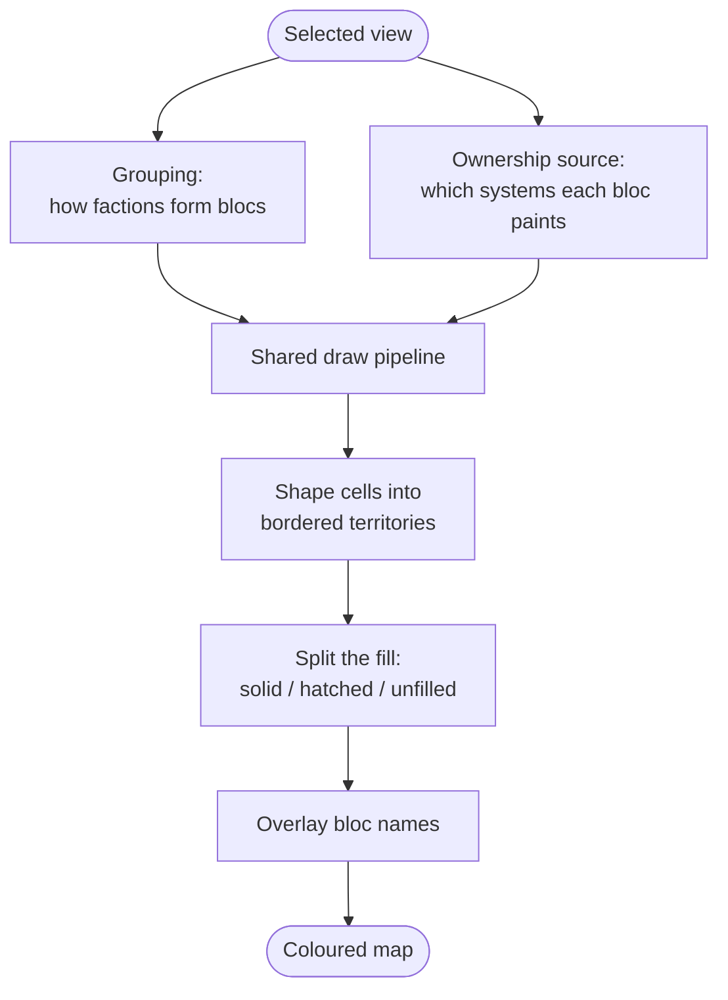

# Political map (`politicalmap`)

An overlay that colours the sector by who controls it. Each bloc's territory shows as a filled,
bordered, named region over the campaign map, on the full map screen and on the intel screen's
map preview alike.

The political map is one of the layers the tab strip offers; picking its tab opens a
view-selector radio in the body below. The radio changes *what* "controls" means. It does not
change how the map is drawn.

Part of [map layers](../README.md); see the
[mod README](../../../../../../README.md) for project context.

## Index

- [What the player sees](#what-the-player-sees)
- [The views](#the-views)
- [Claim extensions](#claim-extensions)
- [How a view drives the pipeline](#how-a-view-drives-the-pipeline)
- [Where each part lives](#where-each-part-lives)
- [When the map is rebuilt](#when-the-map-is-rebuilt)

## What the player sees

For each controlling bloc the overlay draws four things:

- a coloured region,
- a border around it,
- faint seams inside it,
- the bloc's name across it.

The tab body picks the view by radio, and a filter picker below it can spotlight one bloc. When a
bloc is spotlighted, the rest fade into a muted background. The radio always lists the views in
the same order: **Factions**, then **Alliances** (only with Nexerelin), then **Claims**.

The controls read and write one shared set of values, so the two screens the overlay draws on
always agree on what is painted; only which tab each screen has lit is its own. The box those
controls sit in - where it anchors on each screen, and how it folds away - is
[the sidebar](../base/sidebar/README.md).

## The views

A view is a small set of rules on top of one shared draw pipeline. Each view answers three
questions, and the pipeline paints the answer without knowing which view asked:

- How do factions group into blocs?
- Which systems does each bloc paint?
- How is each bloc styled and named?

| View | Groups by | Paints | Spotlight targets | Needs |
| --- | --- | --- | --- | --- |
| **Factions** | each faction on its own | held territory, per faction | any faction | always (default) |
| **Alliances** | allied factions fused per alliance | held territory, alliances as one bloc | alliances only | Nexerelin |
| **Claims** | each claiming faction on its own | claimed systems, per faction | none | always |

Notes on each:

- **Factions.** The plain case. Every faction is its own bloc. Only genuine independent space
  fades to the muted style. A bloc is named after its faction.
- **Alliances.** Allied factions merge into one coloured, named region per alliance. Unaligned
  factions keep their own border and name. Two toggles fade a non-allied faction: *Mute* dims it,
  *Desaturate* makes it read as background ground. With both off, a lone faction looks exactly as
  it does on the Factions view.
- **Claims.** Shows the vanilla "system claimed by faction" mechanic - the same claim the
  colony-survey panel warns about. Every claimed system is painted solid in its claimant's colours.
  There is no alliance grouping here, and no spotlight.

## Claim extensions

The Factions and Alliances views do not only paint held ground. A system a faction *claims* but
does not *hold* joins that faction's territory drawn empty: inside the border and under the
faction's name, but with no fill. The Claims view instead paints those same claims solid. Why a
claim resolves this way is [ownership resolution](base/politics/ownership/README.md); how the empty
fill is drawn is [territory fills and borders](base/render/territories/README.md).

## How a view drives the pipeline

Every view resolves ownership through one seam. The pipeline reads who-paints-what from that one
source, and never branches on which view is active.

What changes between views is only the two inputs, the grouping and the ownership source; from the
seam on, every view shapes, fills, and labels identically. The sources themselves and the three
fill states are [ownership resolution](base/politics/ownership/README.md).

## Where each part lives

- **[Ownership resolution](base/politics/ownership/README.md)** - the per-view ownership seam, the
  three sources, the three fill states, and the claim mechanic.
- **[Territory fills and borders](base/render/territories/README.md)** - how cells become each
  bloc's coloured region, border, seams, and split fill.
- **[Render style layer](base/render/style/README.md)** - the four categories this map divides the
  ground into, and how player settings become each territory's colours, widths, and opacities.
- **`base/render/labels/anchor`** - what a cluster's name reads and what shade it draws in: the
  active view's name for the bloc, and the outer border its group inherits. Both are resolved here
  and handed to the framework's overlay, which places and draws them.

Everything above is drawn over the systems the framework's `base/visibility` admits, shaped out of
[cell geometry](../base/geometry/README.md), styled against the
[theme records](../base/theme/README.md), named by the
[cluster-name overlay](../base/labels/README.md), and hovered through `base/hover` - all of which
belong to the framework rather than to this layer: they work on an opaque owner, and the views
decide that the key names a bloc.

The rest of `base` carries the supporting parts: `politics` (grouping and the held/claim resolvers),
`refresh` (the economy-event listeners, `PoliticalMapStalenessSource` - what this layer counts
as a change the engine fired no event for, answered into the framework's poll - and
`PoliticalMapRefreshSignal`, the coarse changes only this layer can raise on the shared board,
alliance membership being the one),
`render/hover` (`PoliticalMapHoverHighlightSource` - this layer's answers to the three
questions the framework's highlight asks about the cell under the cursor: the extent this frame
painted there, the owner's border loops it might sit inside, and the shade its ground draws in),
`tooltip` (`SystemDominationTooltip` - what this layer says about the hovered system, the ranked
standings behind the fills, which the faction and alliance views inject into the framework's hover
box and the claims view does not, plus the standing, territory, and status lines it is written from),
and `sidebar` - the last being this layer's own body
controls, not the box they sit in, which is [the sidebar](../base/sidebar/README.md) one level up. The class that names and orders the views is `kmu.maplayers.MapLayers`, also one level
up; how a layer is picked and what each screen remembers is [map layers](../README.md).

## When the map is rebuilt

Nothing above is redrawn from scratch per frame. The overlay holds its cells, its territories, and
its labels, and a frame's normal cost is a few int compares against the revisions each was built
against. A colony changing hands re-shapes that system and its neighbours; a settings or toggle
change restyles over the standing cells; only a change to the *set* of drawn systems rebuilds the
partition.

[The caching notes](../../../../../../docs/dev/caching.md) own that model in full - the signals, the
caches, and the four rebuild paths.
