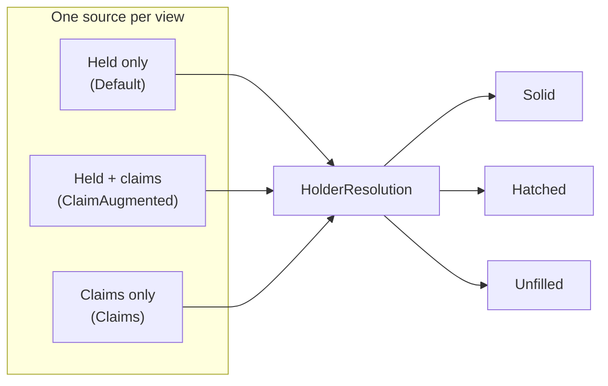

# Ownership resolution (`base.politics.holders`)

Who paints each star system, and how each owned system's fill is drawn.

Every political-map view reads its territory through one seam here. So the render pipeline gets
ownership from a single source, and never names the resolver behind it. That is what lets one view
paint held economy, another paint held-plus-claims, and a third paint pure claims - with no branch
in the code that shapes, borders, and labels the result.

Part of Klark Morrigan's Utilities; see the
[mod README](../../../../../../../../../README.md) for project context.

## Index

- [At a glance](#at-a-glance)
- [The seam](#the-seam)
- [The three fill states](#the-three-fill-states)
- [The three sources](#the-three-sources)
- [The claim mechanic](#the-claim-mechanic)
- [What is not here](#what-is-not-here)

## At a glance

Each view picks one source. The source returns one `HolderResolution`. The resolution says who
owns each system, and which systems draw as a fill exception:

## The seam

"Seam" here means a single swap-in point. The map can be drawn in three modes - Factions,
Alliances, and Claims (the code calls these *views*). Each mode works out ownership differently, but
the code that actually draws the map should not have to care which mode is running. The seam is what
keeps the two apart.

Each view hands the drawing code one object: a `HolderProvider`. Think of it as the answer to a
single question - *who owns each star system?* To let it answer, the drawing code passes two
inputs:

- the rebuild's own reading of the sector - a `HolderPass`, carrying which sector is being drawn,
  the grouping (whether factions stand alone or merge into alliances), how far the dev reveal
  lifts the fog, and the one walk of each system every reader shares,
- which faction or alliance, if any, the filter is currently highlighting.

The pass is opened where the rebuild begins and handed down, so a provider that answers through
two mechanics - held territory *and* claims - reads each system once between them rather than
once apiece. It carries only what any owner-painted layer needs; the rule that picks a winner from
what it read (market weights, a claim, later a diplomatic relation) is each provider's own, which
is what lets this one seam be implemented by layers that have no dominance behind them at all.

The provider hands back one bundle: an `HolderResolution`. It lists the owner of every owned
system, and marks the few systems that are drawn as exceptions (the fill states below). A system's
owner and its fill are worked out together, so they travel in the same bundle instead of being
fetched twice.

Because the drawing code only ever sees this bundle, a new way to work out ownership is just a new
provider. The drawing code does not change.

## The three fill states

A bloc's footprint always traces as one border. The fill is what varies per system inside it. There
are three states - one default and two exceptions:

- **Solid** - the default. Any owned system not listed as an exception fills solid.
- **Hatched** (`contestedSystemIds`) - a spotlit bloc's presence in a system it does not hold
  outright: "mine, but not only mine", drawn as a diagonal hatch. It states presence and nothing
  finer, so it reads the same whether a rival holds the system or nobody does - the alternative
  being a fourth state drawn for the handful of systems where a bloc's only colony is one no
  mechanic could weigh.
- **Unfilled** (`unfilledSystemIds`) - held for border and label, but painting nothing inside the
  border. This is how a claimed-but-unheld system looks on the faction and alliance layers.

When both exception sets are empty, the whole cluster is solid. The render split reads that as a fast
path, so a view that never contests or unfills pays nothing for the split.

## The three sources

- **`DefaultHolderProvider`** - held territory from the live economy. Off filter, each system
  goes to its single dominant owner, with no exceptions. Under a spotlight it switches to the
  presence-aware resolver: the chosen bloc stays drawn wherever it holds a colony - solid where it
  wins, hatched where it does not. Presence there is read off the colonies rather than off the
  weights, because every term of a weight is economy-fed: a bloc whose only foothold in a system is
  a station the economy does not list wins nothing and still lives there, so it draws hatched
  instead of dimming with the background the player picked it out of. The weights are left alone -
  widening *them* would put such a bloc into the ranking that hands out systems, and a spotlight
  must never move a fill. This is the source the pipeline was carved out of.
- **`ClaimAugmentedHolderProvider`** - the faction and alliance default. It takes held territory
  from the source above, then folds in each claimed-but-unheld system as an *unfilled* extension of
  its claimant. The claim carries the same bloc key as that faction's held systems, so the geometry
  fuses held and claimed cells into one bordered territory. A system already held keeps its solid
  fill: the held signal wins. Under a spotlight, a claim shares the fate of its bloc - the spotlit
  bloc's claims stay at full strength, every other bloc's claims fade with its held cells.
- **`ClaimsHolderProvider`** - the Claims view's source. Every claimed system is painted *solid*
  in its claimant's colours, with nothing held-derived. Under a spotlight the chosen bloc's claims
  stay at full strength and every other claimant's fade, the same trade the source above makes. A
  system has one claimant, so nothing is ever contested or unfilled here: the resolution has no
  exceptions and takes the solid fast path on or off filter.

Both claim-reading sources get their claims from `FilteredClaims`, so which claims a spotlight moves
is answered once rather than once per source.

## The claim mechanic

Claims are resolved by `SectorClaims`, in the sibling `base.politics` package. It is the claim twin
of `SectorPolitics`. Where `SectorPolitics` reads who *holds* a system, `SectorClaims` reads who
*claims* it, then routes that claimant through the same grouping and palette. So a claimed system
and a held one of the same bloc end up equal, and fuse downstream.

The claimant comes from KMLib's `ClaimReader` port - the usual way KM code inverts a third-party
read that only answers inside a running game. What the two claim-reading sources hold is not a
reader but a `ClaimReaderSource`: a reader answers off the colonies behind it, so one is opened
over the pass being resolved and discarded with it. A reader kept for the life of the game would
go on answering off a sector that has since moved on, and would walk every system again for
colonies the pass has already read. Its vanilla binding mirrors `Misc.getClaimingFaction`
step for step rather than calling it, because one computation has to answer *who* claims a system
for the fills here and *why* for the claims layer's hover box. Sharing it is what stops the fill
and the box over it naming different claimants - on the memory-flag override, and on the
iteration-order tie the mechanic settles equal scores by.

Step for step describes the *claimant*, which is all this package takes. The standings the same read
carries for the hover box go wider than vanilla scores, in two directions, and neither can be seen
from here. The player's colonies are scored, forced non-territorial so they can never move the
winner, because a box that dropped them would report a system the player holds a colony in as one
they have no presence in - and a faction barred from claiming never becomes a claimant. A colony the
economy does not list at all is carried too, as vanilla builds Galatia Academy, because a box that
dropped it would leave a station the player can see on the map out of the account of who holds the
system - and it is carried the way a concealed market is, scored for nothing and counted toward
nothing, so it can neither become a claimant nor move the score of one.

Vanilla resolves a claimant two ways: an explicit `$claimingFaction` memory flag, or the top
territorial market in the system. The map shows exactly what the mechanic resolves and invents
nothing. A marketless system (unpopulated or decivilised) only resolves through the flag, which is
rare in practice. So claims mostly attach to inhabited systems.

**Inhabited does not imply claimed**, and the reasons are worth naming exactly, because they are
easy to get wrong. `Misc.getClaimingFaction` walks `getEconomy().getMarkets(location)` and skips a
market on three separate tests:

| Test | What it excludes |
| --- | --- |
| `curr.isHidden()` | pirate and Path bases, which `PirateBaseIntel` and `LuddicPathBaseIntel` both create with `setHidden(true)` |
| `curr.getFaction().isPlayerFaction()` | every player colony, before territoriality is even read |
| no `punitiveExpeditionData.territorial` | the Remnant, derelicts, scavengers, mercenaries, the Dweller, `neutral`, and the rest of the thirteen vanilla factions carrying no such block |

And the walk reads the *economy's listing*, so a colony never registered with it - as vanilla builds
Galatia Academy - is not seen at all, whatever its owner.

A system that resolves nothing leaves this package's holding empty for it. That is the mechanic
answering correctly, not a gap to paper over here. What must not follow from it is the *render*
reading the missing holder as an empty system: the factionless classification is made against the
pass's inhabited-system set instead, see [`render.style`](../../render/style/README.md).

## What is not here

- The *render split* that turns the three states into triangles, hatch, and skipped fills is
  [`render.territories`](../../render/territories/README.md). This package decides the states; it
  does not draw them.
- The *scored contest* behind a claim - the rivals who could have taken the system, and the factions
  present that never could - is KMLib's claim breakdown, read by the claims layer's hover box rather
  than by anything that paints. This package needs the winner alone.
- The *grouping* that folds a faction into its alliance bloc is `base.dominance.HolderGrouping`,
  supplied by the view.
- The *resolves* the sources delegate to all live in `base.politics` (no separate README; see the
  source), paired off filter and on: `SectorPolitics` / `FilteredPolitics` for held territory, and
  `SectorClaims` / `FilteredClaims` for claims.
- The *views* that pick a source, and the view-selector, are described in the
  [political map guide](../../../README.md), one level up under `politicalmap`.
