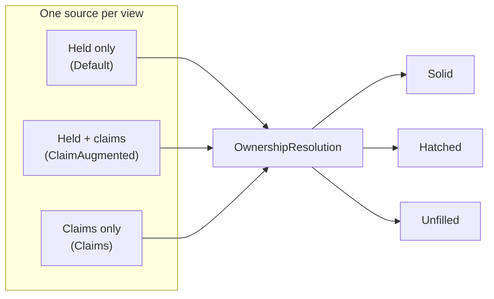

# Ownership resolution (`base.politics.ownership`)

Who paints each star system, and how each owned system's fill is drawn.

Every political-map view reads its territory through one seam here. So the render pipeline gets
ownership from a single source, and never names the resolver behind it. That is what lets one view
paint held economy, another paint held-plus-claims, and a third paint pure claims - with no branch
in the code that shapes, borders, and labels the result.

Part of Klark Morrigan's Utilities; see the
[mod README](../../../../../../../../../README.md) for project context.

## Index

- [At a glance](#at-a-glance)
- [The seam](#the-seam)
- [The three fill states](#the-three-fill-states)
- [The three sources](#the-three-sources)
- [The claim mechanic](#the-claim-mechanic)
- [What is not here](#what-is-not-here)

## At a glance

Each view picks one source. The source returns one `OwnershipResolution`. The resolution says who
owns each system, and which systems draw as a fill exception:

## The seam

"Seam" here means a single swap-in point. The map can be drawn in three modes - Factions,
Alliances, and Claims (the code calls these *views*). Each mode works out ownership differently, but
the code that actually draws the map should not have to care which mode is running. The seam is what
keeps the two apart.

Each view hands the drawing code one object: an `OwnershipProvider`. Think of it as the answer to a
single question - *who owns each star system?* To let it answer, the drawing code passes three
inputs:

- the sector (the galaxy being drawn),
- the grouping (whether factions stand alone or merge into alliances),
- which faction or alliance, if any, the filter is currently highlighting.

The provider hands back one bundle: an `OwnershipResolution`. It lists the owner of every owned
system, and marks the few systems that are drawn as exceptions (the fill states below). A system's
owner and its fill are worked out together, so they travel in the same bundle instead of being
fetched twice.

Because the drawing code only ever sees this bundle, a new way to work out ownership is just a new
provider. The drawing code does not change.

## The three fill states

A bloc's footprint always traces as one border. The fill is what varies per system inside it. There
are three states - one default and two exceptions:

- **Solid** - the default. Any owned system not listed as an exception fills solid.
- **Hatched** (`contestedSystemIds`) - a spotlit bloc's contested systems: "mine, but contested",
  drawn as a diagonal hatch.
- **Unfilled** (`unfilledSystemIds`) - held for border and label, but painting nothing inside the
  border. This is how a claimed-but-unheld system looks on the faction and alliance layers.

When both exception sets are empty, the whole region is solid. The render split reads that as a fast
path, so a view that never contests or unfills pays nothing for the split.

## The three sources

- **`DefaultOwnershipProvider`** - held territory from the live economy. Off filter, each system
  goes to its single dominant owner, with no exceptions. Under a spotlight it switches to the
  presence-aware resolver: the chosen bloc stays drawn wherever it owns a market - solid where it
  wins, hatched where a rival wins. This is the source the pipeline was carved out of.
- **`ClaimAugmentedOwnershipProvider`** - the faction and alliance default. It takes held territory
  from the source above, then folds in each claimed-but-unheld system as an *unfilled* extension of
  its claimant. The claim carries the same bloc key as that faction's held systems, so the geometry
  fuses held and claimed ground into one bordered territory. A system already held keeps its solid
  fill: the held signal wins. Under a spotlight, a claim shares the fate of its bloc - the spotlit
  bloc's claims stay at full strength, every other bloc's claims fade with its held ground.
- **`ClaimsOwnershipProvider`** - the Claims view's source. Every claimed system is painted *solid*
  in its claimant's colours, with nothing held-derived. It reads no filter, so the resolution has no
  exceptions and takes the solid fast path.

## The claim mechanic

Claims are resolved by `SectorClaims`, in the sibling `base.politics` package. It is the claim twin
of `SectorPolitics`. Where `SectorPolitics` reads who *holds* a system, `SectorClaims` reads who
*claims* it, then routes that claimant through the same grouping and palette. So a claimed system
and a held one of the same bloc end up equal, and fuse downstream.

The claimant comes from KMLib's `ClaimReader` port, an adapter over `Misc.getClaimingFaction` - the
usual way KM code inverts an un-mockable third-party static. Vanilla resolves a claimant two ways:
an explicit `$claimingFaction` memory flag, or the top territorial market in the system. The map
shows exactly what that call reports and invents nothing. A marketless system (unpopulated or
decivilised) only resolves through the flag, which is rare in practice. So claims mostly attach to
inhabited systems.

## What is not here

- The *render split* that turns the three states into triangles, hatch, and skipped fills is
  [`render.territories`](../../render/territories/README.md). This package decides the states; it
  does not draw them.
- The *grouping* that folds a faction into its alliance bloc is `base.dominance.OwnershipGrouping`,
  supplied by the view.
- The *held resolve* and *filter resolve* the default source delegates to are `SectorPolitics` and
  `FilteredPolitics`, in `base.politics` (no separate README; see the source).
- The *views* that pick a source, and the view-selector, are described in the
  [political map guide](../../../README.md), one level up under `politicalmap`.
